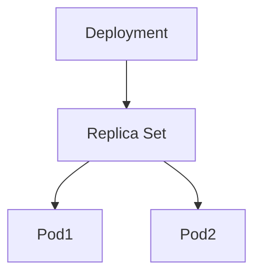
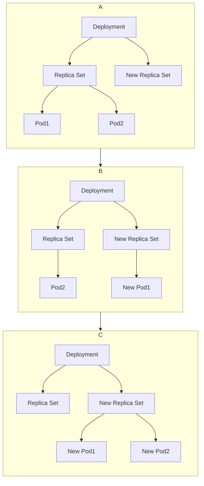
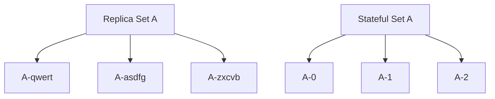

# 容器， Docker 与 K8s

我们知道 K8s 利用了容器虚拟化技术。而说到容器虚拟化就要说 Docker 。可是，容器到底是什么？ Docker 又为我们做了些什么？我们又为什么要用 K8s ？

### 关于容器虚拟化

> 要把一个不知道打过多少个升级补丁，不知道经历了多少任管理员的系统迁移到其他机器上，毫无疑问会是一场灾难。 —— Chad Fowler 《Trash Your Servers and Burn Your Code》

"Write once, run anywhere" 是 Java 曾经的口号。 Java 企图通过 JVM 虚拟机来实现一个可执行程序在多平台间的移植性。但我们现在知道， Java 语言并没能实现他的目标，会在操作系统调用、第三方依赖丢失、两个程序间依赖的冲突等各方面出现问题。

要保证程序拉下来就能跑，最好的方法就是把程序和依赖打包到一起，然后将外部环境隔离起来。容器虚拟化技术就是为了解决这个。

与常说的虚拟机不同， Docker 等各类容器是用隔离名称空间的方式进行资源隔离的。 Linux 系统的内核直接提供了名称空间隔离的能力，是针对进程设计的访问隔离机制，可以进行一些资源封装。

| 名称空间     | 隔离内容                      | 内核版本 |
| :----------- | :---------------------------- | :------- |
| Mount        | 文件系统与路径等              | 2.4.19   |
| UTS          | 主机的Hostname、Domain names  | 2.6.19   |
| IPC          | 进程间通信管道                | 2.6.19   |
| PID          | 独立的进程编号空间            | 2.6.24   |
| Network      | 网卡、IP 地址、端口等网络资源 | 2.6.29   |
| User         | 进程独立的用户和用户组        | 3.8      |
| Cgroup       | CPU 时间片，内存分页等        | 4.6      |
| Time \<- New! | 进程独立的系统时间            | 5.6      |

值得注目的是， Linux 系统提供了 Cgroup 名称空间隔离的支持。通过隔离 Cgroup ，可以给单独一个进程分配 CPU 占用比率、内存大小、外设 I/O 访问权限等。再配合 IPC 、 PID 等的隔离，可以让被隔离的进程看不到同一实体机中其他进程的信息，就像是独享一整台机器一样。

由于容器虚拟化技术直接利用了宿主机操作系统内核，因此远远要比虚拟机更轻量，也更适合用来给单个程序进行隔离。但也同样由于依赖了宿主机内核，在不同的架构、不同种类的操作系统间容器可能不能移植。

### 关于 Docker

在介绍 K8s 之前，我们要先搞清楚 Docker 是什么。或者说，我们平时说的“ Docker ”是什么？

我们平时说的 Docker ，可能是以下几个东西：

- Docker Engine: 在宿主机上跑的一个进程，专门用来管理各个容器的生命周期、网络连接等，还暴露出一些 API 供外部调用。有时会被称为 Docker Daemon 或是 dockerd 。
- Docker Client: 命令行中的 `docker` 命令，其实只会跟 Docker Server 通信，不会直接创建销毁一个容器进程。
- Docker Container: 宿主机上运行的一组被资源隔离的进程，在容器中看来像是独占了一台虚拟的机器，不需要考虑外部依赖。
- Docker Image: 是一个打包好的文件系统，可以从一个 Image 运行出复数个 Container 。 Image 内部包含了程序运行所需的所有文件、库依赖，以及运行时的环境变量等。
- Docker 容器运行时: 是 Docker Engine 中专门管理容器状态、生命周期等的那个组件，原来名为 libcontainer 。[《开放容器交互标准》](https://en.wikipedia.org/wiki/Open_Container_Initiative)制定后， Docker 公司将此部分重构为 [runC 项目](https://github.com/opencontainers/runc)，交给 Linux 基金会管理。而 Docker Engine 中与运行时进行交互的部分则抽象出来成为 [containerd 项目](https://containerd.io/)，捐献给了 CNCF 。

我们平时在 linux 机上运行 `yum install docker` 之类的命令，安装的其实是 Docker Engine + Docker Client 。（而在 Windows 或 MacOS 上安装的 Docker Desktop 其实是一个定制过的 linux 虚拟机。）下面说的 Docker 的功能其实都是指 Docker Engine 的功能。

而 Docker 提供给我们的功能，除了最基础的运行和销毁容器外，还包括了一些容器网络编排、重启策略、文件路径映射、端口映射等功能。

而我认为 Docker 最大的贡献，还是容器的镜像与镜像仓库。有了镜像与镜像仓库，人们就可以把自己的程序与执行环境直接打包成镜像发布，也可以直接拿打包好的镜像来运行容器进行部署，而不需要额外下载或是安装一些东西，也不需要担心程序会与已经跑起来的其他程序冲突。

### 为什么要用 K8s ？

其实 Docker 有一个很强大的工具叫 docker-compose ，可以通过一个 manifest 对多个容器组成的网络进行编排。那为什么我们还需要 K8s 呢？换句话说，有什么事是 Docker 不能做的？而 K8s 设计出来的目标是为了解决什么问题？

首先， Docker 做不到以下的功能：

1. **Docker 不能做跨多主机的容器编排。** docker-compose 再方便，他也只能编排单台主机上的容器。对跨主机的集群编排无能为力。（实际上，用了 Docker-Swarm 后是可以多主机编排的，但一来 Docker-Swarm 出现的比 K8s 晚，而来 Docker-Swarm 功能不如 K8s ，因此用的人很少，我们下面就默认 Docker-Swarm 不存在了。）
2. **Docker 提供的容器部署管理功能不够丰富。** Docker 有一些简单的容器重启策略，但也只是简单的失败后重启之类的，没有完整的应用状态检查等功能。同时，版本升级、缩扩容等策略选择的余地也不多。
3. **Docker 缺乏高级网络功能。** 要让 Docker 的容器间进行网络通信，也只能是说把容器放到同一个网络下，然后再通过各自的 Hostname 来找到对方。但实际上，我们更会想要一些负载均衡、自定义域名、选择某些容器端口不暴露之类的功能。

and more...

总的来说， Docker 更关注单台主机上容器怎么跑，而对部署管理的功能则支持不多。而最大的痛点，就是 Docker 对多主机的集群部署支持的实再很差。然而，为了实现多区可用、负载均衡等功能，多主机集群的容器编排又是必不可少的。

K8s 的出现，主要就是为了解决多主机集群上的容器编排问题。

1. **K8s 可以进行多主机调度。** 用户只需要描述自己需要运行怎样的应用， K8s 就可以自己选择一个合适的节点进行部署，用户不需要关心自己的应用部署到哪个节点上。
2. **K8s 中一切皆资源。** K8s 有完善的抽象资源机制，用户几乎不需要知道磁盘、网络等任何硬件信息，只需要对着统一的抽象资源进行操作。
3. **K8s 能保证较强的可用性。** 除了能跨多主机调度实现多区可用外， K8s 还提供了很完善的缩扩容机制、健康检查机制以及自动恢复机制。

可以说， K8s 是容器编排工具的主流选择。

### K8s 与 Docker 的关系

K8s 与 Docker 关系很复杂，是一个逐渐变化的过程。

一开始 K8s 是完全依赖于 Docker Engine 进行容器启动与销毁的。后来[容器运行时接口（CRI）](https://kubernetes.io/blog/2016/12/container-runtime-interface-cri-in-kubernetes/)、 [CRI-O 标准](https://github.com/cri-o/cri-o)、开放容器交互标准（OCI）等标准逐渐建立，可替代 Docker Engine 的工具越来越多， K8s 中已经完全可以不使用 Docker Engine 了。

[《凤凰架构》](http://icyfenix.cn/)一书中有下面这样一张图来描述 K8s 与 Docker Engine 的关系：


《凤凰架构》书中[这一章节](http://icyfenix.cn/immutable-infrastructure/container/history.html#%E5%B0%81%E8%A3%85%E9%9B%86%E7%BE%A4%EF%BC%9Akubernetes)详细介绍了 K8s 与 Docker 的历史，我这里就不再赘述。

# 部署一个 Pod

上面说了一堆概念，我们接下来实际上会怎样应用 K8s 。

### Pod 示例

> Pod 是可以在 Kubernetes 中创建和管理的、最小的可部署的计算单元。
> Pod 是一组容器；Pod 中的内容总是一同调度，在共享的上下文中运行。 Pod 中包含一个或多个应用容器，这些容器相对紧密地耦合在一起。在非云环境中，在相同的物理机或虚拟机上运行的应用类似于在同一逻辑主机上运行的云应用。
> —— Kubernetes 官方文档

Pod 是 K8s 的最小部署单位。

因为 K8s 将硬件资源都抽象化了，用户不需要知道自己的应用部署到哪台机上。但是有些场景下两个主进程之间又必须相互协作才能完成任务，如果两个进程不确定会不会部署到同一个节点上会变得很麻烦。因此才需要 Pod 这种资源。

下面是一个 Nginx Pod 的示例（这是 K8s manifest 文件，可以用 `kubectl apply -f <filepath>` 进行部署）：

```yaml
metadata:
  name: simple-webapp
spec:
  containers:
    - name: main-application
      image: nginx
      volumeMounts:
        - name: shared-logs
          mountPath: /var/log/nginx
    - name: sidecar-container
      image: busybox
      command: ["sh","-c","while true; do cat /var/log/nginx/access.log; sleep 30; done"]
      volumeMounts:
        - name: shared-logs
          mountPath: /var/log/nginx
  volumes:
    - name: shared-logs
      emptyDir: {}
```

可以看到， Pod 中可以包含多个容器，这组容器总是以一定的逻辑一起部署，且总是部署在同一个节点。对 K8s 操作时，不能说只部署 Pod 中一个特定的容器，也不能说把 Pod 中一个容器部署在这个节点，另一个容器部署在另一个节点上。

在上面这个例子中，我们看到 Pod 中除了 Nginx 容器以外还有一个 Sidecar 容器负责将 Nginx 的 access.log 日志输出到控制台。两个容器可以通过 mount 同一个路径来实现文件共享。这种场景下，单独跑一个 Sidecar 容器没有意义，而我们也不会希望两个容器部署在不同的节点上。 **两个容器同生共死** ，这样的模式被称为 **Sidecar 模式** 。 Jaeger Agent ，或是 Service Mesh 中常见的 Envoy Sidecar 都可以通过这种模式部署，这样业务容器中就可以不考虑 tracing 或是流量控制相关的问题。

此外，由于同一个 Pod 中的容器默认共享了相同的 network 和 UTS 名称空间，不管是在 Pod 的内部还是外部来看，他们一定程度上就像是真的部署在同一主机上一样，有相同的 Hostname 与 ip 地址，在一个容器中也可以通过 localhost 来访问零一个容器的端口。

另外 Pod 中可以定义若干个 initContainer ，这些容器会比 `spec.containers` 中的容器先运行，并且是顺序运行。下面是通过安装 bitnami 的 Kafka Helm Chart 得到的一个 Kafka Broker Pod （有所简化）:

```yaml
apiVersion: v1
kind: Pod
metadata:
  name: kafka-0
  namespace: kafka
spec:
  containers:
  - name: kafka
    image: docker.io/bitnami/kafka:3.1.0-debian-10-r52
    command:
    - /scripts/setup.sh
    volumeMounts:
    - name: scripts
      mountPath: /scripts/setup.sh
      subPath: setup.sh
    - name: shared
      mountPath: /shared
  initContainers:
  - name: auto-discovery
    image: docker.io/bitnami/kubectl:1.23.5-debian-10-r1
    command:
    - /scripts/auto-discovery.sh
    volumeMounts:
    - name: shared
      mountPath: /shared
    - name: scripts
      mountPath: /scripts/auto-discovery.sh
      subPath: auto-discovery.sh
  volumes:
  - name: scripts
    configMap:
      defaultMode: 493
      name: kafka-scripts
  - name: shared
    emptyDir: {}
```

可以看到，在 `kafka` pod 启动前会先启动一个名为 `auto-discovery` 的 initContainer ，负责获得集群信息等准备工作。准备工作完成后，会将信息写入 `/shared` 目录下，然后再启动 `kafka` 容器 Mount 同一目录，就可以获取准备好的信息。

**这样运行容器进行 Pod 初始化就叫 initContainer 模式** 。每个 initContainer 会运行到成功退出为止，如果有一个 initContainer 启动失败，则整个 Pod 启动失败，触发 K8s 的 Pod 重启策略。


# 部署更多 Pod

### Replica Set

可是上面说了这么多，还只是单个 Pod 的部署，但我们希望能做多副本部署。

其实，只要把 Pod 的 manifest 改一下 `metadata.name` 再部署一次，就能得到一模一样的两个 Pod ，就是一个简单的多副本部署了。（必须改 `metadata.name` ，不然 K8s 会以为你是想修改同一个 Pod ）

可是这样做会有很多问题：

- 要复制一下还要改名字多麻烦啊，我想用同一份模板，只定义一下副本数就能得到对应数量的 Pod 。
- 缩容扩容还要对着 Pod 操作很危险，我想直接修改副本数就能缩容扩容。
- 如果其中一些 Pod 挂掉了不能重启，现在是什么都不会做。我希望能自动建一些新的 Pod 顶上，来保证副本数不变。

为了实现这些需求，就出现了 Replica Set 这种资源。下面是实际应用中一个 Replica Set 的例子：

```yaml
apiVersion: apps/v1
kind: ReplicaSet
metadata:
  labels:
    app: gateway
  name: gateway-9dc546658
spec:
  replicas: 2
  selector:
    matchLabels:
      app: gateway
  template:
    metadata:
      labels:
        app: gateway
      name: gateway
    spec:
      containers:
        name: gateway
        image: xxxxxxxx.amazonaws.com/gateway:xxxxxxx
        ports:
        - containerPort: 50051
          protocol: TCP
        readinessProbe:
          initialDelaySeconds: 5
          tcpSocket:
            port: 50051
        startupProbe:
          failureThreshold: 60
          tcpSocket:
            port: 50051
      affinity:
        podAntiAffinity:
          preferredDuringSchedulingIgnoredDuringExecution:
          - podAffinityTerm:
              labelSelector:
                matchLabels:
                  app: gateway
              topologyKey: topology.kubernetes.io/zone
            weight: 80
```

我们可以看到， `spec.template` 中就是我们要的 Pod 的模板，在 metadata 里带上了 `app:gateway` 标签。而在 `spec.replicas` 中定义了我们需要的 Pod 数量， `spec.selector` 中描述了我们要对带 `app:gateway` 标签的 Pod 进行控制。把这份 manifest 部署后，我们就会得到除名字以外几乎一摸一样的两个 Pod ：

```yaml
apiVersion: v1
kind: Pod
metadata:
  generateName: gateway-9dc546658-
  labels:
    app: gateway
    pod-template-hash: 9dc546658
  name: gateway-9dc546658-6c9qs
  ownerReferences:
  - apiVersion: apps/v1
    blockOwnerDeletion: true
    controller: true
    kind: ReplicaSet
    name: gateway-9dc546658
    uid: 6633f89c-377c-4c90-bd08-3be5bc7b21bd
  resourceVersion: "49793842"
  uid: f927db88-a39a-4623-852d-4f150a6d853b
spec:
  containers:
    name: gateway
    image: xxxxxxxx.amazonaws.com/gateway:xxxxxxx
    ports:
    # 后续省略

---
apiVersion: v1
kind: Pod
metadata:
  annotations:
    kubernetes.io/psp: eks.privileged
  creationTimestamp: "2022-08-09T08:51:25Z"
  generateName: gateway-9dc546658-
  labels:
    app: gateway
    pod-template-hash: 9dc546658
  name: gateway-9dc546658-8trcs
  ownerReferences:
  - apiVersion: apps/v1
    blockOwnerDeletion: true
    controller: true
    kind: ReplicaSet
    name: gateway-9dc546658
    uid: 6633f89c-377c-4c90-bd08-3be5bc7b21bd
  resourceVersion: "49793745"
  uid: 0918e3ed-2965-4237-8828-421a7831c9ed
spec:
  containers:
    image: xxxxxxxx.amazonaws.com/gateway:xxxxxxx
    name: gateway
    ports:
    # 后续省略
```

可以看到，创建出来的 Pod 自动生成了两个后缀（ `6c9qs` 与 `8trcs` ），带上了 Replica Set 的信息（在 `metadata.ownerReferences` ），其他部分基本一模一样。如果其中一个 Pod 挂掉了， K8s 会帮我们从模板中重新创建一个 Pod 。而且由于我们在 Pod 模板定义了 affinity ， K8s 还会按照我们的要求自动筛选合适的节点。例如在上面 Replica Set 的例子中，创建出来的 Pod 就会尽量部署在不同的节点上。

> **K8s 中对 Pod 的生存状态检查机制**
> 
> 除了线程直接错误退出以外，还有出现死锁等等各种可能性使得容器中的应用不能正常工作。这些情况下虽然是不健康状态，但容器却不一定会挂掉。因此 K8s 提供了一些探针检查的机制来判断 Pod 是否健康。
> K8s 主要提供了三种探针：
> 1. **存活探针（ liveness probe ）** : Pod 运行时 K8s 会循环执行 liveness probe 检查容器是否健康。如果检查失败， K8s 会认为这个容器不健康，就会尝试重启容器。
> 2. **就绪探针（ readiness probe ）** : 程序可能会有一段时间不能提供服务（比如正在加载数据等）。这时可能既不想杀死应用，也不想给它发送请求，这时就需要 readiness probe 。如果 readiness probe 检查失败， K8s 就会将这个 Pod 从 Service 上摘下来，直到 readiness probe 成功重新加入 Service 。
> 3. **启动探针（ startup probe ）** : 有些程序会有非常长的启动时间，会有较长时间不能提供服务。这时如果 liveness probe 失败了导致重启毫无必要，此时就需要 startup probe 。 startup probe 只会在容器启动时检查直到第一次成功。直到 startup probe 成功为止， liveness probe 与 readiness probe 都不会开始执行检查。
> 
> 而检测方式主要有：
> 1. httpGet: 对指定的端口路径执行 HTTP GET 请求，如果返回 2xx 或 3xx 就是成功。
> 2. tcpSocket: 尝试与容器的端口建立连接，如果不能成功建立连接就是失败。
> 3. exec: 在容器内执行一段命令，如果退出时状态码不为 0 就是失败。
> 4. grpc (New!): K8s 1.24 新出的检查方式，直接用 [GRPC Health Checking Protocol](https://github.com/grpc/grpc/blob/master/doc/health-checking.md) 对 GRPC Server 进行检查。

此外， Replica Set 还提供了简易的缩容扩容功能。 kubectl 中提供了 scale 命令：

```bash
kubectl scale replicaset gateway --replicas=10
```

执行上述命令，就可以将名为 gateway 的 Replica Set 对应的副本数扩容到 10 份。当然，你也可以直接修改 Replica Set 的 `spec.replicas` 字段来实现缩容扩容。

然而， Replica Set 的功能还是有限的。实际上， Replica Set 只关心跟它的 selector 匹配的 Pod 的数量。而至于匹配的 Pod 是否真的是跟 template 字段中描述的一样， Replica Set 就不关心了。因此如果单用 Replica Set ，更新 Pod 就会变得究极麻烦。

### Deployment

为了解决 Pod 的更新问题，我们需要有 Deployment 这种资源。实际上， Replica Set 的主要用途是提供给 Deployment 作为控制 Pod 数量，以及创建、删除 Pod 的一种机制。我们一般不会直接使用 Replica Set 。

下面是实际应用中一个 Deployment 的例子：

```yaml
apiVersion: apps/v1
kind: Deployment
metadata:
  labels:
    app: gateway
  name: gateway
spec:
  replicas: 2
  revisionHistoryLimit: 10
  selector:
    matchLabels:
      app: gateway
  template:
    metadata:
      labels:
        app: gateway
      name: gateway
    spec:
      containers:
        name: gateway
        image: xxxxxxxx.amazonaws.com/gateway:xxxxxxx
        ports:
        # 下略
```

可以看到 Deployment 的 manifest 跟 Replica Set 很像。但实际上， Deployment 不会直接创建 Pod ，而是创建出一个 Replica Set ，再由 Replica Set 来创建 Pod ：




比如在上面的例子中，名为 gateway 的 Deployment 创建后，就会有如下 ReplicaSet 和 Pod ：

```sh
# Replica Set:
$ kubectl get rc -l app=gateway
NAME                 DESIRED   CURRENT   READY   AGE
gateway-9dc546658    2         2         2       5d3h

# Pod:
$ kubectl get po -l app=gateway
NAME                      READY   STATUS    RESTARTS   AGE
gateway-9dc546658-6c9qs   1/1     Running   0          5d3h
gateway-9dc546658-8trcs   1/1     Running   0          5d3h
```

可以看到，gateway Deployment 创建了一个 Replica Set ，然后随机给了它一个 `9dc546658` 后缀。然后 gateway-9dc546658 这个 Replica Set 又根据 template 中创建了两个 Pod ，再在自己名字的基础上加上两个后缀 `6c9qs` 与 `8trcs` 。

接下来就是 Deployment 的重点了： Replica Set 只会根据 template 创建出 Pod ，而不管匹配的 Pod 到底是不是跟 template 中描述的一样。而 **Deployment 则会专门关注 template 的内容变更。**

假如我们现在更新了 Deployment 的 template 中的内容提交给 K8s ， Deployment 就会感知到 template 被修改了， Pod 需要更新。
感知到更新之后， Deployment 就会创建一个新的 Replica Set 。然后逐渐将旧的 Replica Set 缩容到 0 ，并同时将新的 Replica Set 扩容到目标值。最后，所有旧版本的 Pod 将会被更新成新版本的 Pod 。如下图所示：



整个过程完成后， Deployment 还不会将旧的 Replica Set 删除掉。我们注意到 Deployment 的声明中有这么一个字段： `revisionHistoryLimit: 10` ，表示 Deployment 会保留历史中 最近的 10 个 Replica Set ，这样在必要的时候可以立刻将 Deployment 回滚到上个版本。而超出 10 个的 Replica Set 才会被从 K8s 中删除。

```sh
# 实际中被 scale 到 0 但还没被删除的 Replica Set
$ kubectl get rs -l app=gateway
NAME                 DESIRED   CURRENT   READY   AGE
gateway-5c4cdf957d   0         0         0       5d4h
gateway-5c56f6d487   0         0         0       17d
gateway-65857cfc78   0         0         0       10d
gateway-6bddbdd85f   0         0         0       16d
gateway-6cc9bb5b4c   0         0         0       13d
gateway-6f4664bc65   0         0         0       17d
gateway-7bd667cb79   0         0         0       9d
gateway-7d658d57f5   0         0         0       13d
gateway-84df97d4c8   0         0         0       6d4h
gateway-9998f4689    0         0         0       13d
gateway-9dc546658    2         2         2       5d4h
```

### Stateful Set

Deployment 中默认了我们不关心自己访问的是哪个 Pod ，因为各个 Pod 的功能是一样的，访问哪个没有差别。

实际上这也符合大多数情况：试想一个 HTTP Server ，如果其所有数据都存放到同一个的数据库中，那这个 HTTP Server 不管部署在哪台主机、不管有多少个实例、不管你访问的是哪个实例，都察觉不出有什么差别。而有了这种默认，我们就能更放心地对 Pod 进行负载均衡、缩扩容等操作。

但实际上我们总会遇到需要保存自己状态的 Pod 。比如我们在 K8s 里部署一个 Kafka 集群，每个 Kafka broker 都需要保存自己的分区数据，而且还要往 Zookeeper 里写入自己的名字来实现选举等功能。如果简单地用 Deployment 来部署， broker 之间可能就会分不清到底哪块是自己的分区，而且由 Deployment 生成出来的 Pod 名字是随机的，升级后 Pod 的名字会变，导致 Kafka 升级后名字与 Zookeeper 里的名字不一致，被以为是一个新的 broker 。

Stateful Set 就是为了解决有状态应用的部署而出现的。下面是 用 bitnami 的 Kafka Helm Chart 部署的一个 Kafka Stateful Set 的例子：

```yaml
apiVersion: apps/v1
kind: StatefulSet
metadata:
  labels:
    app.kubernetes.io/name: kafka
  name: kafka
spec:
  replicas: 3
  selector:
    matchLabels:
      app.kubernetes.io/name: kafka
  serviceName: kafka-headless
  template:
    metadata:
      labels:
        app.kubernetes.io/name: kafka
    spec:
      containers:
      - name: kafka
        image: docker.io/bitnami/kafka:3.1.0-debian-10-r52
        command:
        - /scripts/setup.sh
        ports:
        - containerPort: 9092
          name: kafka-client
          protocol: TCP
        volumeMounts:
        - mountPath: /bitnami/kafka
          name: data
  volumeClaimTemplates:
  - apiVersion: v1
    kind: PersistentVolumeClaim
    metadata:
      name: data
    spec:
      resources:
        requests:
          storage: 10Gi
      storageClassName: gp2
```

可以看到其实 Stateful Set 类似 Deployment ，也可以通过 replicas 字段定义实例数，如果更新 template 部分， Stateful Set 也会以一定的策略对 Pod 进行更新。

而其创建出来的 Pod 如下所示：
```sh
$ kubectl get po -l app.kubernetes.io/name=kafka
NAME      READY   STATUS    RESTARTS   AGE
kafka-0   1/1     Running   1          26d
kafka-1   1/1     Running   3          26d
kafka-2   1/1     Running   3          26d
```

与 Replica Set 创建出来的 Pod 相比名字上会有很大差别。 Stateful Set 创建出来的 Pod 会固定的以 `-0` 、 `-1` 、 `-2` 结尾而不是随机生成：



这样一来，更新时将 Pod 更换之后，新的 Pod 仍能够跟旧的 Pod 保持相同的名字。此外，与 Deployment 相比， Stateful Set 更新后同名的 Pod 仍能保持原来的 IP ，拿到同一个持久化卷，而且不同的 Pod 还能通过独立的 DNS 记录相互区分。这些内容后面还会详细介绍。

> **宠物与牛（ Cattle vs Pets ）的比喻**
> 
> Deployment 更倾向于将 Pod 看作是牛：我们不会去关心每一个 Pod 个体，如果有一个 Pod 出现了问题，我们只需要把他杀掉并替换成新的 Pod 就好。
> 
> 但 Stateful Set 更倾向于将 Pod 看作是宠物：弄来一直完全一模一样的宠物并不是容易的事，我们对待这些宠物必须小心翼翼。我们要给他们各自一个专属的名字，替换掉一只宠物时，必须要保证它的花色、名字、行为举止都与之前那只宠物一模一样。

### Daemon Set

不管是 Deployment 还是 Stateful Set ，一般都不会在意自己的 Pod 部署到哪个节点。而假如你不在意自己 Pod 的数量，但需要保证每个节点上都运行一个 Pod 时，就需要 Daemon Set 了。

需要保证每个节点上有且只有一个 Pod 在运行这种情况，经常会在基础结构相关的操作中出现。比如我需要在集群中部署 fluentd 采集 log ，一般来说需要在 Pod 里直接挂载节点磁盘上的文件路径。这种时候如果有一个节点上没有运行 Pod ，那个节点的 log 就采集不到；另一方面，一个节点上运行多个 Pod 毫无意义，而且可能还会导致 log 重复等冲突。

这种需求下简单地使用 Replica Set 或是 Stateful Set 都是不能达到要求的，这两种资源都只能通过亲和性达到“尽量不部署在同一个节点”，做不到绝对。而且当节点数有变更时还需要手动更改设置。

下面是一个用 fluent-bit helm chart 部署的 fluent-bit Daemon Set 的例子：

```yaml
apiVersion: apps/v1
kind: DaemonSet
metadata:
  labels:
    app.kubernetes.io/instance: fluent-bit
    app.kubernetes.io/name: fluent-bit
  name: fluent-bit
  namespace: fluent-bit
spec:
  selector:
    matchLabels:
      app.kubernetes.io/instance: fluent-bit
      app.kubernetes.io/name: fluent-bit
  template:
    metadata:
      labels:
        app.kubernetes.io/instance: fluent-bit
        app.kubernetes.io/name: fluent-bit
    spec:
      containers:
      - image: cr.fluentbit.io/fluent/fluent-bit:1.9.5
        volumeMounts:
        - name: varlibdockercontainers
          mountPath: /var/lib/docker/containers
          readOnly: true
        - name: etcmachineid
          mountPath: /etc/machine-id
          readOnly: true
      volumes:
      - name: varlibdockercontainers
        hostPath:
          path: /var/lib/docker/containers
          type: ""
      - name: etcmachineid
        hostPath:
          path: /etc/machine-id
          type: File
```

Selector 之类的都是一样的了，而 Daemon Set 不能指定 replicas 。另外可以看到一个比较刺激的地方： Volume 里使用了 `hostPath` 这种 Volume ，在 Pod 里直接指定了宿主机磁盘上的路径。

K8s 认为经过抽象后， Pod 不应该去关心自己在哪台宿主机上，一般来说是不推荐在 Pod 里直接访问宿主机路径的（不过也没有强制禁止）。不过 Daemon Set 是个特例，由于 Daemon Set 生成的 Pod 与节点强相关， K8s 十分推荐在且仅在 Daemon Set 的 Pod 中访问宿主机路径。

### Job 与 CronJob

Replica Set ， Stateful Set ， Daemon Set 的 Pod 中运行的一般是持续运行的程序，因此这些 Pod 运行终止后会有相应的机制重启这些 Pod 。而 Job 与 Cron Job 这两种资源则专门负责调度不会持续运行的程序。

下面是 《Kubernetes in Action》 书中的一个例子：

```yaml
apiVersion: batch/v1
kind: Job
metadata:
  name: pi
spec:
  completions: 5
  parallelism: 2
  template:
    spec:
      containers:
      - name: pi
        image: perl:5.34.0
        command: ["perl",  "-Mbignum=bpi", "-wle", "print bpi(2000)"]
      restartPolicy: Never
```

可以看到，这个 Job 描述了一个会输出 PI 小数点后 2000 位的 Pod 模板。这个 Job 部署后，一共会以这个模板跑完 5 个 Pod ，其中最多并行跑 2 个，并在其中一个成功终止后再跑剩下的 Pod 。可以通过调整 `completions` 与 `parallelism` 字段调整并行与穿行数量。

顺带一提，在 Job 定义中一般不会出现 selector ，但其实 Job 有 selector 字段，一般会由 K8s 为每个 Job 生成一个 uuid 作为 selector 。

另外，可以通过部署 CronJob 这种资源来定时执行 Job 。下面是 《Kubernetes in Action》 书中关于 CronJob 的例子：

```yaml
apiVersion: batch/v1beta1
kind: CronJob
metadata:
  name: pi
spec:
  schedule: "0 0 * * *"
  jobTemplate:
    spec:
      template:
        spec:
          containers:
          - name: pi
            image: perl:5.34.0
            command: ["perl",  "-Mbignum=bpi", "-wle", "print bpi(2000)"]
          restartPolicy: Never
```

这个例子中， CronJob 会在每天的 0 点创建一个只运行一个 Pod 的 Job 。 CronJob 不会直接创建 Pod ，而是创建一个 Job ，再由 Job 创建 Pod （就像 Deployment 与 Replica Set 的关系）。另外， CronJob 创建的 Job 会限制 `completions` 与 `parallelism` 都只能等于 1 。

> 关于资源的名称空间
> 
> 在 K8s 中，各资源都是不能重名的。不能部署两个都叫 `gateway` 的 Pod ，资源之间有可能因为名字冲突而导致部署不成功。（部署一个叫 `gateway` 的 Pod 和一个叫 `gateway` 的 Deployment 倒是可以，因为 `gateway` 不是他们两个的全名，他们的全名分别叫 `pod/gateway` 及 `deployment/gateway` 。）
> 另外我们已经知道 Deployment 等资源一般会通过标签等来管理自己创建的资源，那两份不相关的应用完全有可能会撞标签，这时候部署逻辑就有可能会出问题。
> 
> K8s 中提供了名称空间这种资源，用于进行资源隔离。K8s 中大部分资源都从属于一个且仅从属于一个名称空间， Deployment 等资源一般只能控制在同一名称空间下的资源，而不会影响其他名称空间。
> 
> 另外，也有一些资源是名称空间无关的，比如节点 `Node` 。


