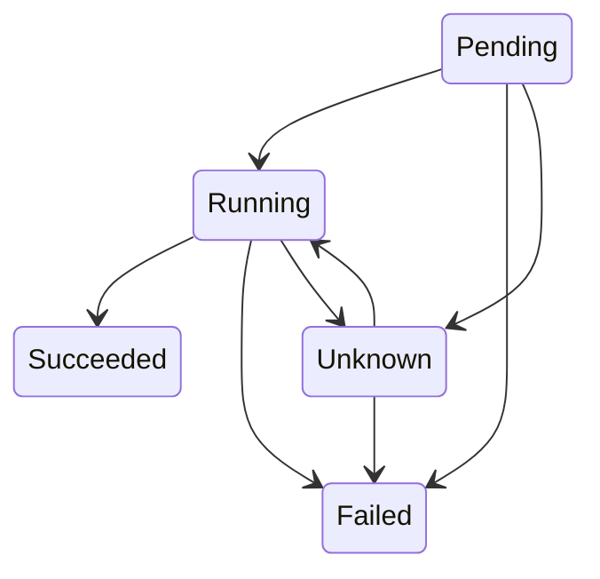
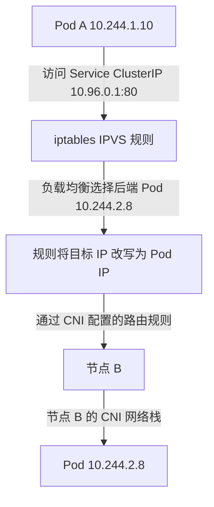
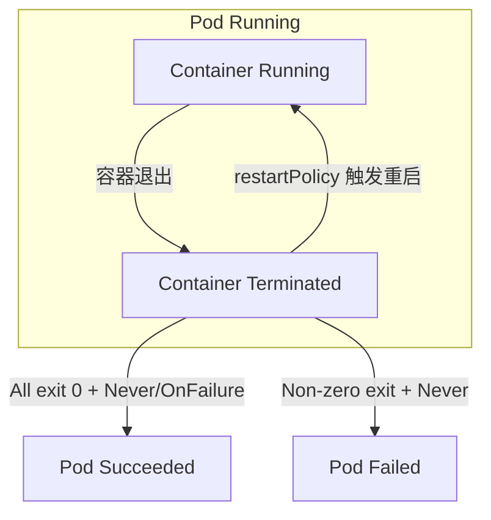
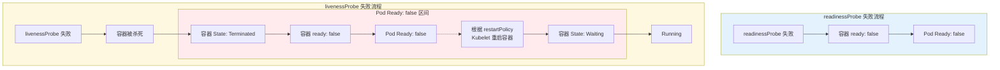

所谓 "Pod 的生命周期"，一般是指 Pod 资源上 Phase 字段——从 `Pending` 阶段开始，如果至少有一个主容器成功启动则进入 `Running` 阶段，然后根据 Pod 中是否有容器以失败终止，进入 `Succeeded` 或 `Failed` 阶段。[^podLifecycle]

然而，与 Pod 基础行为相关的除了 Pod Phase 外，有一些 Pod 的 Condition 也很重要。单纯从 Pod Phase 角度进行切入似乎太过片面，很难对 Kubernetes 中的 Pod 形成全面的认知。如果 Pod 中只有一个容器失败退出会怎么样？ Deployment 更新时到底会在什么时机增加新版本 Pod 的副本、减少旧版本 Pod 的副本？

这篇文章从与官方文档[Pod Lifecycle | Kubernetes](https://kubernetes.io/docs/concepts/workloads/pods/pod-lifecycle/)不同的角度讲解 Pod 的生命周期。我们先引入四个概念—— Container State 、 Pod Phase 、 Container Ready 、 Pod Ready ，并围绕这四个概念与生命周期、调度、流量等领域的关系变化流程，讨论 Pod 生命周期流转过程之间的变化。

[^podLifecycle]: [Pod Lifecycle | Kubernetes](https://kubernetes.io/docs/concepts/workloads/pods/pod-lifecycle/)

## 四个概念

### Container State

Kubernetes 里容器的 state 指 containerStatuses 数组中对应容器的 state 字段。有三种 State ： waiting 、 running 、 terminated 。

```yaml
kind: Pod
...
status:
  containerStatuses:
    # 示例 1：容器当前处于 Waiting 状态（例如镜像拉取失败）
    - name: my-container-1
      ready: false
      restartCount: 3
      state:
        waiting:
          reason: "ImagePullBackOff"
          message: "Failed to pull image 'myregistry/app:v1': context deadline exceeded"
      # 其他字段（image, imageID, containerID 等）省略

    # 示例 2：容器当前处于 Running 状态
    - name: my-container-2
      ready: true
      restartCount: 0
      state:
        running:
          startedAt: "2025-03-15T10:30:00Z"

    # 示例 3：容器当前处于 Terminated 状态（例如正常退出或崩溃）
    - name: my-container-3
      ready: false
      restartCount: 1
      state:
        terminated:
          exitCode: 0
          reason: "Completed"
          message: "Container finished successfully"
          startedAt: "2025-03-15T09:00:00Z"
          finishedAt: "2025-03-15T09:05:00Z"
...
```

| 状态             | 含义                          |
| -------------- | --------------------------- |
| **Waiting**    | 容器尚未开始执行（拉取镜像、应用 Secret 数据） |
| **Running**    | 容器正常执行中                     |
| **Terminated** | 容器执行完毕或失败（包含退出码、起止时间）       |

Kubernetes 中 Container State 与 RunC 中容器的状态、 CRI 容器状态并不是简单一一映射，但有近似的对应关系：

| Kubernetes State | runc / OCI 底层状态               | CRI 中间状态                  | 典型对应场景与逻辑                                                                                                      |
| :--------------- | :---------------------------- | :------------------------ | :------------------------------------------------------------------------------------------------------------- |
| **`Waiting`**    | `无容器` / `created` / `stopped` | `CONTAINER_CREATED` 或 不存在 | 镜像拉取中、InitContainer 未完成、重启退避中、或容器已 `created` 但依赖未就绪。此时底层可能根本没创建进程，或进程处于暂停/待启动状态。                               |
| **`Running`**    | `running`                     | `CONTAINER_RUNNING`       | 容器主进程已在运行，且 `StartedAt` 已被记录。K8s 要求至少成功启动过一次，且未被探针标记为致命失败。                                                     |
| **`Terminated`** | `stopped` (已退出)               | `CONTAINER_EXITED`        | 进程已终止。K8s 会进一步解析退出原因：`Completed`(exit 0)、`OOMKilled`、`Error`(exit≠0)、`ContainerStatusUnknown` 等，并附带精确的时间戳与信号值。 |

> 💡 注：OCI 规范还定义了 `paused` 状态，但 Kubernetes **不将其暴露给 API**。节点排空（Drain）、快照（Checkpoint）或网络插件初始化时的暂停，均由 `kubelet` 内部消化，对外仍表现为 `Running` 或 `Waiting`。

runc/OCI 底层容器状态由 CRI 运行时（如 containerd、CRI-O 等）封装后，由 Kubelet 综合计算，上传到 API Server 。

### Pod Phase

Kubernetes 中 Pod 的 Phase 指 `status.phase` 字段。

```yaml
kind: Pod
...
status:
  phase: Running   # 或其他值
  # 其他 status 字段...
```

共有五种 Phase：

| 相位            | 描述                             |
| ------------- | ------------------------------ |
| **Pending**   | Pod 已被集群接受，但容器尚未就绪（等待调度、镜像下载中） |
| **Running**   | Pod 已绑定节点，至少一个容器正在运行（所有容器已创建）  |
| **Succeeded** | 所有容器成功终止，不再重启                  |
| **Failed**    | 所有容器终止，至少一个失败退出                |
| **Unknown**   | Pod 状态无法获取（节点通信故障）             |

Pod Phase 的变化是单向的： 从 Pending 到 Running ，再到 Succeeded 或 Failed ，单向变化不会回头。

Unknown 算是一个例外的临时状态，通常出现在 Node 失联时， ApiServer 不能确定 Pod 的状态。当 Node 通信恢复时， Pod 有可能恢复回 Running 状态。



Pod Phase 主要由 Kubelet 汇总 Container State 后计算并上报给 API Server 。（ Unknown 例外，由 **Node Lifecycle Controller** 设置。）

`kubelet` 并非简单地将容器状态"投票"或"拼接"成 Pod Phase，而是通过内置的状态机算法（源码位于 `pkg/kubelet/status/generate.go` 的 `GeneratePodStatus` / `computePodPhase`）**综合多维度信息**计算得出：

1. **所有 InitContainer 状态**：是否全部成功完成（`Terminated` + exitCode=0）
2. **所有 Container 状态**：`Waiting` / `Running` / `Terminated` 分布
3. **容器退出码 & 信号值**：判断是正常退出、OOM、还是异常崩溃
4. **`RestartPolicy`**：`Always` / `OnFailure` / `Never` 决定了终止后是否允许重启
5. **Pod Conditions**：`PodScheduled`、`Initialized`、`ContainersReady`、`Ready` 等

```go
// 简化版 Kubelet 计算逻辑，供文档参考
func computePodPhase(pod *v1.Pod, containerStatuses []v1.ContainerStatus) v1.PodPhase {
    // 1. 未调度或 InitContainer 未全部成功
    if pod.Spec.NodeName == "" || !allInitContainersSucceeded(containerStatuses) {
        return v1.PodPending
    }

    // 2. 所有常规容器均已终止
    if allContainersTerminated(containerStatuses) {
        if allExitZero(containerStatuses) && (pod.Spec.RestartPolicy != v1.RestartPolicyAlways) {
            return v1.PodSucceeded
        }
        if anyNonZeroExit(containerStatuses) && !shouldRestart(pod) {
            return v1.PodFailed
        }
    }

    // 3. 至少一个容器正在运行或重启中 → Running
    if anyContainerRunningOrRestarting(containerStatuses) {
        return v1.PodRunning
    }

    // 4. 兜底：容器已创建但未运行，或处于退避/拉取中
    return v1.PodPending
}
```

### Container 是否 Ready

容器是否 ready 指的是 Pod 的 containerStatus 数组中，对应容器的 ready 字段布尔值。主要由容器的 readiness 探针来控制。

```yaml
kind: Pod
...
status:
  containerStatuses:
    - containerID: docker://abcd...
      ready: true
...
```

- 容器没变为 Running 前，一直为 `ready: false` 。
- 如果没有定义 readiness 探针，容器 Running 时自动变为 `ready: true` 。
- 如果有定义 readiness 探针， readiness 探针启动前仍为 `ready: false` 。容器 Running 后（或 startup 探针、 `initialDelaySeconds` 等前提条件通过后）启动 readiness 探针。
	- readiness 探针判定成功期间（ 探针连续成功 ≥ successThreshold ），容器为 `ready: true`
	- readiness 探针判定失败期间（ 探针连续失败 ≥ failureThreshold ），容器为 `ready: false`

### Pod 是否 Ready

Pod 是否 Ready 指的是 Pod 的 conditions 数组中 `type: Ready` 项的 `status` 字段。 Pod 是否 Ready 由多个条件同时决定， Pod 内容器都 ready 时 Pod 才可能 ready 。

```yaml
kind: Pod
...
status:
  conditions:
    - type: Ready
      status: true
    - type: ContainersReady
      status: true
...
```

| 字段                    | 含义                               | 判断依据                                                                                                                                                    |
| --------------------- | -------------------------------- | ------------------------------------------------------------------------------------------------------------------------------------------------------- |
| **`ContainersReady`** | Pod 内**所有普通容器**是否都已就绪（通过各自的就绪探针） | 仅取决于 `.status.containerStatuses[].ready` 字段：所有容器该字段均为 `true` 时，`ContainersReady` 为 `True`；否则为 `False`。                                                  |
| **`Ready`**           | Pod 整体是否**可以接收 Service 流量**      | 基于多个条件的"逻辑与"： `PodScheduled` = `True` && `NodeReady` = `True` && `Initialized` = `True` && `ContainersReady` = `True` && **所有自定义 `ReadinessGates`** 都满足 |

### 四个概念的关系

四个概念之间有明显关系：

- Pod Phase 、 Pod Ready 的判定分别要对 Pod 内所有容器的 Container State 与 Container Ready 进行汇总。
- 只有当 Container State 为 Running 时， Container Ready 才可能为 true ；只有当 Pod Phase 为 Running 时， Pod Ready 才可能为 true 。

## 调度与流量接入

前面我们介绍了四个核心概念：Container State、Pod Phase、Container Ready、Pod Ready。那么这些概念在 Kubernetes 实际运行过程中，是如何发挥作用的呢？让我们跟随 Pod 的创建、删除、流量接入等典型场景，看看这些状态字段是如何流转的。

### 创建、删除一个 Pod 发生了什么

#### 创建流程

| 步骤 | 事件 | Pod Phase | 容器 State | ready | 说明 |
|------|------|-----------|-----------|-------|------|
| **T0** | 创建 Pod 资源 | `Pending` | `Waiting` | `false` | kubectl 或 Controller 向 API Server 创建 Pod |
| **T1** | Scheduler 调度 | `Pending` | `Waiting` | `false` | Scheduler 计算节点，写入 `spec.nodeName` |
| **T2** | Kubelet 创建容器 | `Pending` | `Waiting` | `false` | Kubelet 与 CRI Runtime 交互，开始创建容器 |
| **T3** | 容器启动 | `Running` | `Running` | `false` | 镜像拉取完成，主容器进程启动 |
| **T4** | CNI 配置网络 | `Running` | `Running` | `false` | CRI Runtime 调用 CNI 插件，Kubelet 更新 `status.podIP` |
| **T5** | 容器 Ready | `Running` | `Running` | `true` | 容器启动完成，探针通过 |
| **T6** | Pod Ready | `Running` | `Running` | `true` ✅ | Kubelet 设置 `ContainersReady` 和 `Ready` 条件 |

#### 删除流程

| 步骤 | 事件 | Pod Phase | 容器 State | ready | 说明 |
|------|------|-----------|-----------|-------|------|
| **T0** | 发送删除请求 | `Running` | `Running` | `true` | API Server 设置 `deletionTimestamp` ⚠️ 此时仍接收流量 |
| **T1** | preStop 执行 | `Running` | `Running` | `false` ⚠️ | Kubelet 执行 preStop hook（如有） |
| **T2** | 从 EndpointSlice 移除 | `Running` | `Running` | `false` | EndpointSlice Controller 检测到变化，停止接收新流量 |
| **T3** | 发送 SIGTERM | `Running` | `Running` | `false` | 向容器主进程发送终止信号 |
| **T4** | 容器退出 | `Running` | `Terminated` | `false` | 容器进程退出 ⚠️ Phase 仍为 Running（宽限期内） |
| **T5** | Pod Phase 变化 | `Succeeded/Failed` | `Terminated` | `false` | Kubelet 根据退出码和 restartPolicy 计算最终 Phase |
| **T6** | Pod 删除 | （资源消失） | （资源消失） | （资源消失） | Pod 资源从 API Server 删除 |

#### 关键角色职责

| 组件 | 核心职责 | 关注的状态字段 | 何时退出职责 |
|------|----------|---------------|-------------|
| **Scheduler** | 将 Pending Pod 绑定到节点 | 只看 `spec` 中的资源需求，**不关心**容器状态 | Pod 绑定到节点后立即退出 |
| **Kubelet** | 与 CRI/CNI 交互，管理容器生命周期，上报状态 | **全权负责**：Container State → Pod Phase/Conditions 的计算 | Pod 删除完成后退出 |
| **CRI Runtime** | 容器的创建、启动、停止 | 底层容器状态（OCI 状态） | 容器退出后清理资源 |
| **CNI 插件** | 为 Pod 分配 IP、配置网络路由 | 无（纯网络层） | Pod 删除时释放 IP |

> 💡 注：Scheduler 是"一锤子买卖"——它只负责把 Pod 分配到节点，之后的容器启动、探针检查、状态上报等，全部由 Kubelet 接管。这也是为什么 Pod 调度成功（Phase 变为 Running）后，仍可能因为镜像拉取失败、探针失败等原因无法真正提供服务。

### Service 流量接入

Service 是 Kubernetes 中抽象访问后端 Pod 的机制。那么流量是如何从 Service 流转到具体 Pod 的呢？

#### 流量接入规则的创建流程

1. **用户创建 Service 资源**
   ```yaml
   apiVersion: v1
   kind: Service
   metadata:
     name: my-service
   spec:
     type: ClusterIP
     selector:
       app: my-app
     ports:
       - port: 80
   ```
   → **kube-apiserver 在创建过程中自动分配 ClusterIP**（从 `--service-cluster-ip-range` 范围中选取）

   > [!warning] 谁在分配 ClusterIP ？
   >
   > 在 Kubernetes v1.11 之前的版本中，ClusterIP 确实是由 `kube-controller-manager` 的 Service Controller 负责分配的。这导致了**竞态条件**和**启动顺序依赖**问题：
   >
   > - API Server 创建 Service 后，需要等待 Controller 检测到变化
   > - Controller 从 IP 池中分配后，再通过 API 更新 Service 对象
   > - 这个异步过程可能延迟，甚至出现 IP 分配失败
   >
   > **Kubernetes v1.11+ 已彻底改变这一行为**：ClusterIP 分配被移到 `kube-apiserver` 中，在 Service `CREATE` 请求期间**同步原子性分配**。这消除了启动依赖，保证了分配的即时性和一致性。


2. **EndpointSlice Controller 监听 Pod 变化**
   - 监听所有 Pod 的状态变化
   - 当检测到满足 Service selector 条件（`app: my-app`）且 `Ready` 为 true 的 Pod 时，将其加入 `EndpointSlice`
   - 如果 Pod 的 `Ready` 变为 false（如 preStop 执行、探针失败），立即从 `EndpointSlice` 中移除
   ```yaml
   EndpointSlice:
   - addresses: ["10.244.1.5", "10.244.2.8"]  # Pod IP 列表
     conditions:
       ready: true
   ```

3. **KubeProxy 在各节点监听 Service 和 EndpointSlice**
   - 将 Service 的 ClusterIP 和后端 Pod IP 列表转化为节点本地的 iptables 或 IPVS 规则
   - 当有流量访问 ClusterIP 时，规则将其负载均衡到后端 Pod

#### 流量访问流程



#### 关键控制点

| 控制点 | 决定因素 | 影响 |
|--------|----------|------|
| **是否加入 Service 后端** | Pod 的 `Ready` 条件 | 只有 `Ready: true` 的 Pod 才会被加入 EndpointSlice |
| **何时移除流量** | Kubelet 设置容器 `ready: false` | preStop 执行时立即触发，**早于**容器退出 |
| **流量路由方式** | KubeProxy 配置（iptables/IPVS） | 决定负载均衡算法（轮询、最少连接等） |

> [!info]
> Kubernetes 1.21+ 已默认启用 **EndpointSlice**，取代了旧的 `Endpoints` 架构。EndpointSlice 支持更大规模的后端（单个对象最多 1000 个端点），且更新更高效。流量路由的核心逻辑不变：**只有 Ready 的 Pod 才能接收流量**。

### Deployment 更新版本

Deployment 的滚动更新是 Kubernetes 最常见的操作之一。那么在更新过程中，新旧版本的 Pod 是如何交替的？什么时候增加新副本、什么时候减少旧副本？

#### 更新流程状态流转

1. **用户发起更新**
   ```bash
   kubectl set image deployment/my-app app=new-image:v2
   ```
   → Deployment Controller 检测到 `spec.template` 变化

2. **创建新 ReplicaSet**
   → 新 ReplicaSet 副本数从 0 开始

3. **创建新版本 Pod**
   → 新 Pod 按前述"创建流程"进入 `Running` 状态

4. **等待新 Pod Ready**
   → Deployment Controller **持续检查新 ReplicaSet 中 Pod 的 Ready 状态**
   → **只有当新 Pod 的 `Ready` 为 true 时**，才认为该副本"可用"

5. **调整副本数（核心逻辑）**
   - 增加新 ReplicaSet 副本数（创建更多新 Pod）
   - 当新副本数达到预期，开始减少旧 ReplicaSet 副本数（删除旧 Pod）
   - 删除旧 Pod 时，按前述"删除流程"执行优雅终止（preStop → SIGTERM → 等待退出）

6. **更新完成**
   → 新 ReplicaSet 副本数 = 期望值，旧 ReplicaSet 副本数 = 0

#### 更新策略控制

| 策略字段             | 作用              | 示例                             |
| ---------------- | --------------- | ------------------------------ |
| `strategy.type`  | 更新方式            | `RollingUpdate`（默认）、`Recreate` |
| `maxSurge`       | 新副本数最多超出期望值多少   | `25%`：4 个副本时，最多创建 1 个额外副本      |
| `maxUnavailable` | 更新期间最多允许多少副本不可用 | `25%`：4 个副本时，最多 1 个副本不可用       |

#### 状态流转示意图

```
旧版本 ReplicaSet (replicas=3)
  ├─ Pod-1: Running, Ready=true  ← 仍在提供服务
  ├─ Pod-2: Running, Ready=true
  └─ Pod-3: Running, Ready=true

更新触发 ↓

新版本 ReplicaSet (replicas=1)  ← 先创建 1 个新副本
  └─ Pod-4: Pending → Running → Ready=true  ✅

旧版本 ReplicaSet (replicas=3)  ← 等待新副本 Ready 后
  ├─ Pod-1: Terminating  ← 开始删除
  ├─ Pod-2: Running, Ready=true
  └─ Pod-3: Running, Ready=true

新版本 ReplicaSet (replicas=3)  ← 逐步增加到目标副本数
  ├─ Pod-4: Running, Ready=true
  ├─ Pod-5: Running, Ready=true
  └─ Pod-6: Running, Ready=true

旧版本 ReplicaSet (replicas=0)  ← 旧副本全部删除
  （无）
```

> [!info]
> Deployment Controller 的核心逻辑是 **"确保有足够的 Ready 副本后，才删除旧副本"**。这保证了更新过程中服务的连续性——只要 `maxUnavailable` 设置合理，永远有足够多的 Ready Pod 处理流量。

### 各组件的职责

以下表格总结了各个组件在 Pod 生命周期管理中的职责：

| 组件                                      | 核心职责                                                                                                                                                                                                                             | 关注的状态字段                                                                                               | 管理粒度                     | 决策依据                                 | 控制范围                                       |
| --------------------------------------- | -------------------------------------------------------------------------------------------------------------------------------------------------------------------------------------------------------------------------------- | ----------------------------------------------------------------------------------------------------- | ------------------------ | ------------------------------------ | ------------------------------------------ |
| **Scheduler**                           | 1. 监听 `Pending` 状态的 Pod<br>2. 根据资源需求选择合适的节点（调度）<br>3. 将 `spec.nodeName` 写入 Pod 资源                                                                                                                                                | `spec.nodeName`（未设置时为 `Pending`）                                                                      | **Pod**                  | Pod 的资源需求（CPU、内存、亲和性等）               | 仅负责调度，写入 `spec.nodeName` 后立即退出，**不关心**容器状态 |
| **Kubelet**                             | 1. 与 CRI Runtime 交互，创建/启动/停止容器（`Terminated` → `Running`）<br>2. 执行各类探针（liveness、readiness、startup）<br>3. 执行生命周期钩子（preStop、postStart）<br>4. 计算并上报 Pod 状态（Phase、Conditions）<br>5. 杀死不健康容器（SIGTERM → SIGKILL）<br>6. 更新容器的 `ready` 状态 | **全权负责**：<br>- Container State → Pod Phase<br>- Container Ready → ContainersReady<br>- 综合计算 Pod Ready | **Pod**                  | 容器的实际运行状态（容器进程是否退出、探针结果、重启策略）        | 容器整个生命周期，从创建到最终删除                          |
| **CRI Runtime**<br>(如 containerd、CRI-O) | 1. 容器镜像的拉取与管理（`Waiting` 原因之一）<br>2. 容器的实际创建与销毁（OCI 指定状态）<br>3. 向 kubelet 报告容器状态                                                                                                                                                  | 底层 OCI 状态：<br>- `running`<br>- `stopped`<br>- `created`                                               | 容器底层进程（由 Kubelet 管理）     | Kubelet 的调用指令                        | 容器进程本身，不关心 Pod 概念                          |
| **CNI 插件**                              | 1. 为 Pod 分配 IP 地址（`status.podIP`）<br>2. 配置网络命名空间、路由规则                                                                                                                                                                            | 无（纯网络层，不设置 Kubernetes 状态字段）                                                                           | Pod 网络命名空间               | Kubelet 的 CNI 调用请求                   | 网络配置，与 Pod 生命周期独立（删除时释放 IP）                |
| **EndpointSlice Controller**            | 1. 监听 Pod 状态变化<br>2. 将 `Ready: true` 的 Pod 加入 `EndpointSlice`<br>3. 当 Pod `Ready: false` 时立即从 `EndpointSlice` 移除<br>4. 负责 Service 流量的后端列表管理                                                                                      | `Pod.status.conditions[Ready]`                                                                        | **Pod**                  | Pod 是否就绪（`Ready` 条件为 `True`）         | Service 流量路由的可见性，只影响"能否接收流量"               |
| **Service Controller**                  | 1. **Kubernetes v1.11+**：在 Service `CREATE` 期间由 **kube-apiserver** 原子性分配 ClusterIP<br>2. **Kubernetes v1.11 之前**：异步分配 ClusterIP（已过时）                                                                                             | `spec.type=ClusterIP` 时的 `spec.clusterIP`                                                             | Service 资源               | Service 创建请求                         | Service IP 池的分配                            |
| **Deployment Controller**               | 1. 监听 `spec.template` 变化，触发滚动更新（创建新 ReplicaSet）<br>2. 检查新版本副本的 `Ready` 状态（**核心：只有新副本 `Ready: true` 时才增加副本数**）<br>3. 根据 `maxSurge`、`maxUnavailable` 控制新旧副本交替节奏                                                                    | `Pod.status.conditions[Ready]`                                                                        | **ReplicaSet** → **Pod** | ReplicaSet 中有多少个 `Ready` 的副本（而非容器状态） | 确保更新过程中永远有足够的 `Ready` 副本                   |
| **Node Lifecycle Controller**           | 1. 监测 Node 心跳<br>2. 当 Node 失联超时，将失联节点上所有 Pod 的 Phase 设为 `Unknown`（**唯一**由该 Controller 设置 `status.phase` 的情况）<br>3. Node 恢复通信后，由 Kubelet 同步真实状态                                                                                   | `Pod.status.phase = Unknown`                                                                          | **Node** → **Pod**       | Node 心跳超时、恢复                         | 临时标记不可达状态，非持久状态                            |


1. **Scheduler 的"一锤子买卖"**：只看 `spec` 中的资源需求，一旦写入 `spec.nodeName` 就退出。**完全不关心**容器是 `Waiting`、`Running` 还是 `Terminated`，也不关心探针是否通过。这意味着调度成功 ≠ 服务可用。

2. **Kubelet 的"全能管家"**：**唯一**负责将容器底层状态（Container State）计算为 Pod 层状态（Pod Phase、Conditions）的组件。它综合多维度信息（容器退出码、重启策略、探针结果、网络配置等），是状态流转的核心。

3. **Controller 的"只认 Pod，不认容器"**：Deployment、EndpointSlice、StatefulSet 等控制器的**决策粒度都是 Pod 对象**。它们：
   - 根据 Pod 的 `Ready` 条件决定是否将其加入流量后端
   - 根据新版本 **Pod** 的 `Ready` 情况决定何时删除旧副本
   - **不会逐个检查容器的 `state` 或 `ready` 状态**


### 为什么说 Pod 是调度与流量接入的最小单位

在 Pod 的生命周期中，Container State 和 Pod Phase 之间存在明显的"信息鸿沟"：

- **Scheduler 只看 Pod Phase**：它判断 Pod 是否为 `Pending`，如果是，则进行调度。它**完全不关心**容器是 waiting、running 还是 terminated，也不关心探针是否通过。

- **Controller 只看 Pod**：Deployment、StatefulSet、EndpointSlice Controller 等，它们的管理粒度都是 **Pod 对象**，而不是容器。它们根据 Pod 的 Phase 和 Conditions（Ready）做决策，**不会逐个检查容器状态**。

- **流量路由只看 Pod Ready**：KubeProxy 和 EndpointSlice 只关心 Pod 的 `Ready` 条件，不关心具体哪个容器的探针失败。

这种设计使得 Kubernetes 的各组件职责清晰：

```
容器层 (Container State)
    ↓ 汇总计算
Pod 层 (Pod Phase + Ready)  ← 各 Controller 和 Scheduler 的决策依据
    ↓ 进一步抽象
Service/Deployment 层  ← 用户视角的抽象
```

**Pod 内所有容器的 State 综合体现到 Pod Phase，容器的 Ready 综合体现到 Pod 的 Ready，这两个聚合后的状态才成为调度和流量控制的核心依据。** 这就是为什么说 **Pod 是调度与流量接入的最小单位**。

## restartPolicy

`restartPolicy` 定义在 Pod 上（容器可以覆盖），作用在 **容器** 上，决定容器退出时如何处理容器（是否重启）。

| 策略              | 适用场景    | 行为                             | 典型资源                                           |
| --------------- | ------- | ------------------------------ | ---------------------------------------------- |
| **`Always`**    | 长期运行的服务 | 容器退出后立即重启，无限重试                 | Deployment, ReplicaSet, DaemonSet, StatefulSet |
| **`OnFailure`** | 一次性任务   | 容器退出码非 0 时重启，成功退出（exit 0）后不再重启 | Job（默认）                                        |
| **`Never`**     | 手动控制重启  | 容器退出后不重启，由上层控制器决定是否重建          | Job（替代方案）                                      |

容器重启由 `kubelet` 执行，调用 CRI Runtime 实现。

> [!warning] **Job 的限制**
>
> Job 的 `restartPolicy` 不能被设为 `Always`。因为 Job 旨在完成一次性任务，如果容器无限重启，将永远无法完成任务。

### 容器重启退避

如果 `restartPolicy` 为 `Always` 或 `OnFailure` 容器不断失败， `kubelet` 会不断让容器进行重启。

重启过程遵循**指数退避策略**（Exponential Backoff）：

- 第 1 次失败：等待 10 秒后重启
- 第 2 次失败：等待 20 秒后重启
- 第 3 次失败：等待 40 秒后重启
- ...（最长等待时间 300 秒）

这种机制防止容器频繁崩溃导致资源浪费。如果容器成功运行满 10 分钟，退避计时器将重置为 0 。

### 容器退出与 Pod Phase

> [!info] 容器退出
> 容器的主进程退出，容器 state 变为 `Terminated`。由容器主进程的退出码是否为 0 决定是否成功退出——`OnFailure` 是否重启。

就算 Pod 内的容器失败退出重启，**Pod 的 Phase 依然为 Running** —— 只有当所有容器都退出、且在 `restartPolicy` 的影响下容器不再重启时，Pod 才会进入 `Succeeded` 或 `Failed`。



> [!info]
> 即使容器因 restartPolicy 反复退出重启， Pod Phase 仍为 Running 。

### Job 上的 backoffLimit 与容器的重启退避

Job 资源上有 `backoffLimit` 字段，用于限制 Job 在失败前的重试次数。当容器失败次数达到 `backoffLimit` 时，Job 将标记为失败。

```yaml
apiVersion: batch/v1
kind: Job
metadata:
  name: pi-with-retry
spec:
  backoffLimit: 3  # 最多重试 3 次
  template:
    spec:
      containers:
      - ...
      restartPolicy: OnFailure
      ...
```

Job 的 `backoffLimit` 字段与 Pod 内容器的重启毫无关系： Job 的 `backoffLimit` 字段用于统计 Job 资源产生的最终落入 `Failed` Phase 的 Pod 的个数。

Job 重试也不会将 Pod “原地重启”，而是创建一个新的 Pod —— Pod 进入 Failed 或 Succeeded 后，不会再回到 Running 。

> [!info]
> Job 资源由 Job Controller 控制。正如前面所说， Controller 多数情况下都只关心 Pod 的状态，而不会去关心 Pod 中一个容器的状态。

## Probe

Probe（探针）定义在**容器**上，用于检查容器的健康状态。当探针检查失败/成功时，Kubernetes 会执行相应操作。

探针由 Kubelet 执行，探针成功/失败时也由 Kubelet 负责操作容器/修改 Pod 资源状态。

### 三种探针类型

| 探针类型     | 英文名              | 作用时机       | 失败时的行为                                                                                                                                    | 成功时的行为                                                                                                                              |
| -------- | ---------------- | ---------- | ----------------------------------------------------------------------------------------------------------------------------------------- | ----------------------------------------------------------------------------------------------------------------------------------- |
| **启动探针** | `startupProbe`   | 容器启动初期检查   | Kubelet 杀死容器并根据 `restartPolicy` 重启，并更新 Pod 资源上的 `containerStatuses` 。                                                                     | Kubelet 开始执行 `livenessProbe` 与 `readinessProbe`                                                                                     |
| **存活探针** | `livenessProbe`  | 容器运行期间持续检查 | Kubelet 杀死容器并根据 `restartPolicy` 重启，并更新 Pod 资源上的 `containerStatuses` 。                                                                     | 无（ `livenessProbe` 成功期间， Kubelet 认为容器健康存活，不做干预）                                                                                     |
| **就绪探针** | `readinessProbe` | 容器运行期间持续检查 | Kubelet 修改 Pod 资源，将容器 Ready 与 Pod Ready 改为 `false` ，直至再次判定成功。EndpointSlice Controller 监听到 Pod 的状态变化，将 Pod 从 Service 后端摘除，不再接收 Service 流量。 | Kubelet 修改 Pod 资源，将容器 Ready 与 Pod Ready 改为 `true` ，EndpointSlice Controller 监听到变化后重新将 Pod 添加到 EndpointSlice ，Pod 重新可以接受 Service 流量。 |

> [!info] 所谓失败时、成功时
> 这里所谓的探针失败时、成功时，不是指探针一次执行的成功或失败，而是指符合以下要求：
> - 成功时：探针连续成功次数达到 `successThresold`
> - 失败时：探针连续失败次数达到 `failureThreshold`

readinessProbe 与 livenessProbe 的检查结果都会直接或间接影响容器的 `ready` 状态和 Pod 的 `Ready` 条件：

- **`readinessProbe` 失败** → 容器 `ready: false` → Pod `Ready: false`
- **`livenessProbe` 失败** → 容器被杀死 → 容器 State 进入 `Terminated` → 容器 `ready: false` → Pod `Ready: false` → 根据 `restartPolicy` Kubelet 重启容器 → 容器 State 进入 `Waiting`  → `Running`



> [!info] Kubelet 如何杀死容器
> Kubelet 杀死容器**遵循一个标准的两阶段流程：先优雅终止，后强制停止**。具体的处理流程如下：
> 
> - **第一阶段：优雅终止（发送 `SIGTERM` 信号）**
>     - `kubelet` 决定要杀死容器后，**优雅终止宽限期**开始倒计时。这个宽限期由 Pod 的 `terminationGracePeriodSeconds` 字段控制，默认值为 30 秒。
>     - `kubelet` 会**首先向容器的主进程（PID 1）发送 `SIGTERM` 信号**。
>     - 这是一个请求优雅终止的信号，允许应用进行最后的清理工作，如完成正在处理的请求、关闭连接、保存状态等。
>     - 如果配置了 `preStop` 生命周期钩子，`kubelet` 会在发送 `SIGTERM` **之前**先执行它。 执行 `preStop` 钩子的过程中也消耗终止宽限期。
> - **第二阶段：强制终止（发送 `SIGKILL` 信号）**
>     - **如果**容器进程在优雅终止宽限期内没有自行退出，`kubelet` 将**发送 `SIGKILL` 信号**。
>     - `SIGKILL` 信号会由操作系统内核立即终止进程，不给应用任何清理机会。
>     - 这个强制机制的存在，确保了容器最终一定会停止，避免出现僵尸进程或卡死的应用。

### 探针检测方式

| 检测方式            | 描述                                  | 适用场景            | Kubernetes 版本 |
| --------------- | ----------------------------------- | --------------- | ------------- |
| **`httpGet`**   | 对指定端口路径执行 HTTP GET，返回 2xx/3xx 为成功   | HTTP/REST 服务    | 所有版本          |
| **`tcpSocket`** | 尝试与容器端口建立 TCP 连接，成功建立连接为成功          | 任意 TCP 服务（如数据库） | 所有版本          |
| **`exec`**      | 在容器内执行命令，退出码为 0 为成功                 | 自定义健康检查逻辑       | 所有版本          |
| **`grpc`**      | 使用 gRPC Health Checking Protocol 检查 | gRPC 服务         | ≥ 1.24        |

### 探针使用场景对比

#### 可用配置参数

```yaml
apiVersion: v1
kind: Pod
metadata:
  name: probe-example
spec:
  containers:
  - name: app
    image: nginx
    livenessProbe:
      httpGet:
        path: /healthz
        port: 8080
      initialDelaySeconds: 10  # 容器启动后延迟多久开始探测
      periodSeconds: 5         # 探测间隔时间
      timeoutSeconds: 3        # 探测超时时间
      successThreshold: 1      # 连续成功多少次才认为健康
      failureThreshold: 3      # 连续失败多少次才认为不健康

    readinessProbe:
      httpGet:
        path: /ready
        port: 8080
      initialDelaySeconds: 5
      periodSeconds: 3
      timeoutSeconds: 2
      successThreshold: 1
      failureThreshold: 2

    startupProbe:  # 1.16+ 新增
      httpGet:
        path: /startup
        port: 8080
      failureThreshold: 60     # 允许较长时间启动
      periodSeconds: 5         # 5 * 60 = 300 秒内启动
```

#### 场景一：慢启动应用

```yaml
apiVersion: v1
kind: Pod
metadata:
  name: slow-start-app
spec:
  containers:
  - name: app
    image: slow-start-image
    # 启动探针给应用 5 分钟初始化时间
    startupProbe:
      httpGet:
        path: /health
        port: 8080
      failureThreshold: 60
      periodSeconds: 5  # 5*60=300 秒

    # 启动成功后才开始存活检查
    livenessProbe:
      httpGet:
        path: /health
        port: 8080
      periodSeconds: 10

    readinessProbe:
      httpGet:
        path: /ready
        port: 8080
      periodSeconds: 5
```

#### 场景二：数据库初始化

```yaml
apiVersion: v1
kind: Pod
metadata:
  name: database
spec:
  containers:
  - name: postgres
    image: postgres:13
    ports:
    - containerPort: 5432

    # 数据库启动较慢，需要启动探针
    startupProbe:
      exec:
        command:
        - /bin/sh
        - -c
        - pg_isready -h localhost -p 5432
      initialDelaySeconds: 10
      failureThreshold: 30
      periodSeconds: 5

    # 就绪探针检查数据库是否可接受连接
    readinessProbe:
      exec:
        command:
        - /bin/sh
        - -c
        - pg_isready -h localhost -p 5432
      initialDelaySeconds: 5
      periodSeconds: 5
```
