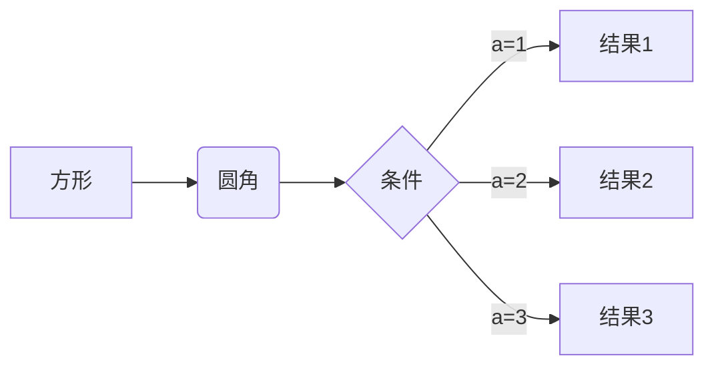
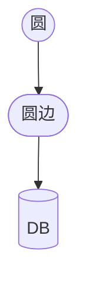
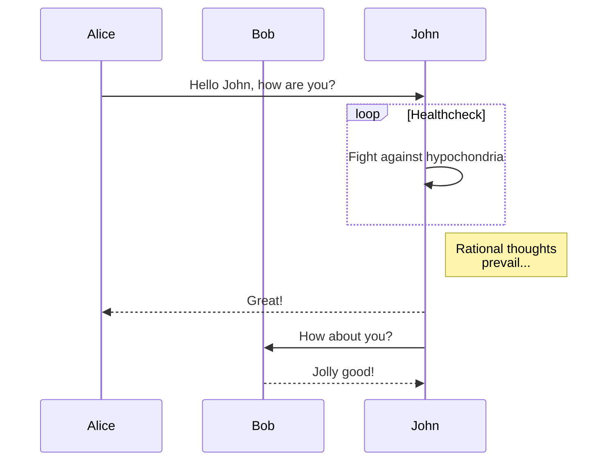

# 一级标题

## 二级标题

### 三级标题

#### 四级标题

##### 五级标题

###### 六级标题

**加粗**

*斜体*

_斜体2_

***加粗斜体***

**_加粗斜体2_**

~~删除线~~

==高亮==

> 引用

# 其他 MD 语法

## 代码块

`行内代码`

代码块高亮：

```python
# 代码块
def func_echo(s: str):
    print(s)


class HelloPrinter:
    printer: Callable[[str]]

    def __init__(self, printer: Callable[[str]]):
        self.printer = printer
    
    def call(self, s: str):
        self.printer(s)


p = HelloPrinter(func_echo)
p.call("hello world!")
```

大围栏

````markdown
```
def func_echo(s: str):
    print(s)
```
````

行内反引号围栏： `` ` `` 或者 ``` `` ``` 的模式
  
```markdown
`段落反引号内的行内反引号`
```

## 列表

- 无序列表
  - 无序列表
    - 无序列表
    - 无序列表

1. 有序列表
2. 有序列表
3. 有序列表
   1. 有序列表
   2. 有序列表
      1. 有序列表
      2. 有序列表

- [ ] 未完成
- [x] 已完成
  - [x] 已完成
    - [ ] 未完成

- 交叉嵌套
  - [ ] 未完成
  - [x] 已完成
    1. 有序列表
    2. 有序列表

- [ ] 交叉嵌套2
  1. 有序列表
  2. 有序列表
     - 无序列表
     - 无序列表

1. 交叉嵌套
2. 交叉嵌套
   - 无序列表
   - 无序列表
     - [ ] 未完成
     - [x] 已完成

## 链接

[链接](https://blog.ryo-okami.xyz)

[站内链接](/ideas/using-chart-js)

## 图片

图片：


站内图片：


## 表格

| 表头 | 表头 | 表头 |
| ---- | ---- | ---- |
| 单元 | 单元 | 单元 |
| 单元 | 单元 | 单元 |

## 脚注

下标[^1]

[^1]: 注释

# 插件

## Katex

行间公式

$$
\begin{aligned}
\dot{x} & = \sigma(y-x) \\
\dot{y} & = \rho x - y - xz \\
\dot{z} & = -\beta z + xy
\end{aligned}
$$

行内公式 $E=mc^2$

## Mermaid

mermaid 流程图



另一个 mermaid 流程图，同样类型不会冲突




mermaid 时序图



## Heading 引用

点击能够跳转：

[文章内标题引用](#一级标题)

[跨文章标题引用](/ideas/using-chart-js#react-chartjs-2)

# Obsidian

## Wikilink

### 站内短引用

[[2022-08-13-introduction-for-k8s]]

可以去掉路径中的日期 [[introduction-for-k8s]] 作为 page path 引用

带 label [[2022-08-13-introduction-for-k8s|其他文章]]

带路径 [[articles/2022-08-13-introduction-for-k8s|其他文章]]

Page path 全路径 [[/articles/introduction-for-k8s|其他文章]]

file path 全路径 [[public/content/articles/2022-08-13-introduction-for-k8s|其他文章]]

一行多个 [[2022-08-13-introduction-for-k8s|其他文章]] [[2022-08-20-introduction-for-k8s-2|其他文章2]]


## Rich Content 短引用

### 图片短引用

短引用图片，纯文件名

![[test-img-show-image.png]]

短引用图片，带注释

![[test-img-show-image.png|这是一张图片]]

短引用图片，带路径

![[blog-syntax/test-img-show-image.png]]

短引用图片，带路径和注释

![[blog-syntax/test-img-show-image.png|这是一张图片]]

短引用图片，全路径

![[/content/ideas/blog-syntax/test-img-show-image.png]]

### Excalidraw 短引用

短引用 Excalidraw

![[Drawing 2024-04-13 17.33.27.excalidraw]]

## Callouts

> [!note]
>
> Note 级

> [!info]
>
> Callout 里是正常的 markdown 语法
> ```markdown
> > [!info]
> >
> > Callout 里是正常的 markdown 语法
> ```

> [!tip] 标题
>
> Tip 级带标题

> [!faq]- 可折叠 Callout
>
> 是的，这是 faq 级 callout 。可折叠 Callout 在折叠时隐藏内容。

> [!faq]+ 默认打开的可折叠 Callout
>
> 可折叠 Callout 也可以设置为默认打开。

> [!question] 可以嵌套吗？
>
> > [!todo] 是的，可以。
> > > [!example] 你可以使用多层嵌套。
> > > 在最里面也可以使用 markdown 语法
>
> > [!tip]- 还可以嵌套其他 Obsidian 语法
> > 也可以嵌套 wikilink [[introduction-for-k8s]]
> >
> > 或者嵌套 Embeded 图片
> >
> > ![[test-img-show-image.png]]
> >
> > 也可以嵌套 mermaid 图表
> >
> > ```mermaid
> > graph TD
> > A[Start] --> B[Process]
> > B --> C[End]
> > ```
> >
> > 也可以嵌套 Excalidraw
> >
> > ![[Drawing 2024-04-13 17.33.27.excalidraw]]
> >
> > 也可以是 Tag #Tag1 #Tag2
> >
> > #单行Tag
>

> [!abstract]-
> Abstract 级

> [!summary]-
> Summary 级, 是 abstract 的 alias

> [!tldr]-
> TL;DR 级, 是 summary 的 alias

> [!info]-
> Info 级

> [!todo]-
> Todo 级

> [!tip]-
> Tip 级

> [!hint]-
> Hint 级, 是 tip 的 alias

> [!important]-
> Important 级, 是 tip 的 alias

> [!success]-
> Success 级

> [!check]-
> Check 级, 是 success 的 alias

> [!done]-
> Done 级, 是 success 的 alias

> [!question]-
> Question 级

> [!help]-
> Help 级, 是 question 的 alias

> [!faq]-
> Faq 级, 是 question 的 alias

> [!warning]-
> Warning 级

> [!caution]-
> Caution 级, 是 warning 的 alias

> [!attention]-
> Attention 级, 是 caution 的 alias

> [!failure]-
> Failure 级

> [!fail]-
> Fail 级, 是 failure 的 alias

> [!missing]-
> Missing 级, 是 failure 的 alias

> [!danger]-
> Danger 级

> [!error]-
> Error 级, 是 danger 的 alias

> [!bug]-
> Bug 级

> [!example]-
> Example 级

> [!quote]-
> Quote 级

> [!cite]-
> Cite 级, 是 quote 的 alias

自定义 callout 类型

> [!reasoning]
> LLM Reasoning

> [!query]
> User Query

> [!ai]
> AI Generated Content

> [!think]
> Further thinking by writer

> [!idea]
> Idea 级, 是 think 的 alias

## 标签

文字里可以有 #Tag ， 会被渲染成标签。

#Tag

#Tag/Tag2 #Tag3 #Tag4

> [!info] Tag 可以与其他组件结合
> 就像 #Tag 这样


