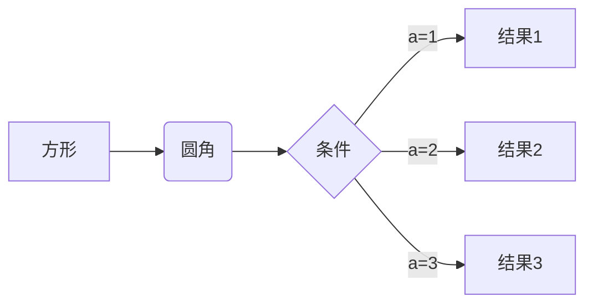
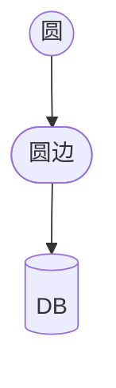
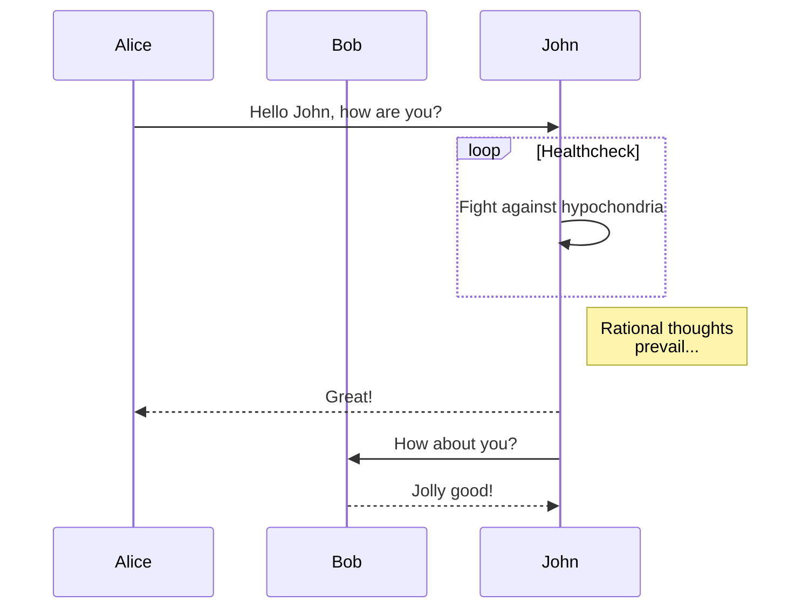

# 一级标题

## 二级标题

### 三级标题

#### 四级标题

##### 五级标题

###### 六级标题

**加粗**

*斜体*

***加粗斜体***

~~删除线~~

> 引用

# 其他 MD 语法

## 代码块

`行内代码`

代码块高亮：

```python
# 代码块
def func_echo(s: str):
    print(s)


class HelloPrinter:
    printer: Callable[[str]]

    def __init__(self, printer: Callable[[str]]):
        self.printer = printer
    
    def call(self, s: str):
        self.printer(s)


p = HelloPrinter(func_echo)
p.call("hello world!")
```

大围栏

````markdown
```
def func_echo(s: str):
    print(s)
```
````

行内反引号围栏： `` ` `` 或者 ``` `` ``` 的模式
  
```markdown
`段落反引号内的行内反引号`
```

## 列表

- 无序列表
  - 无序列表
    - 无序列表
    - 无序列表

1. 有序列表
2. 有序列表
3. 有序列表

## 链接

[链接](https://blog.ryo-okami.xyz)

[站内链接](/ideas/blog-syntax)

## 图片

图片：


站内图片：


## 表格

| 表头 | 表头 | 表头 |
| ---- | ---- | ---- |
| 单元 | 单元 | 单元 |
| 单元 | 单元 | 单元 |

## 脚注

下标[^1]

[^1]: 注释

# 插件

## Katex

行间公式

$$
\begin{aligned}
\dot{x} & = \sigma(y-x) \\
\dot{y} & = \rho x - y - xz \\
\dot{z} & = -\beta z + xy
\end{aligned}
$$

行内公式 $E=mc^2$

## Mermaid

mermaid 流程图



另一个 mermaid 流程图，同样类型不会冲突




mermaid 时序图



## Heading 引用

点击能够跳转：

[文章内标题引用](#一级标题)

[跨文章标题引用](/ideas/blog-syntax#一级标题)

# Obsidian 短引用

## 图片

短引用图片，纯文件名

![[test-img-show-image.png]]

短引用图片，带注释

![[test-img-show-image.png|这是一张图片]]

短引用图片，带路径

![[blog-syntax/test-img-show-image.png]]

短引用图片，带路径和注释

![[blog-syntax/test-img-show-image.png|这是一张图片]]

短引用图片，全路径

![[/content/ideas/blog-syntax/test-img-show-image.png]]

## Excalidraw

短引用 Excalidraw

![[Drawing 2024-04-13 17.33.27.excalidraw]]


