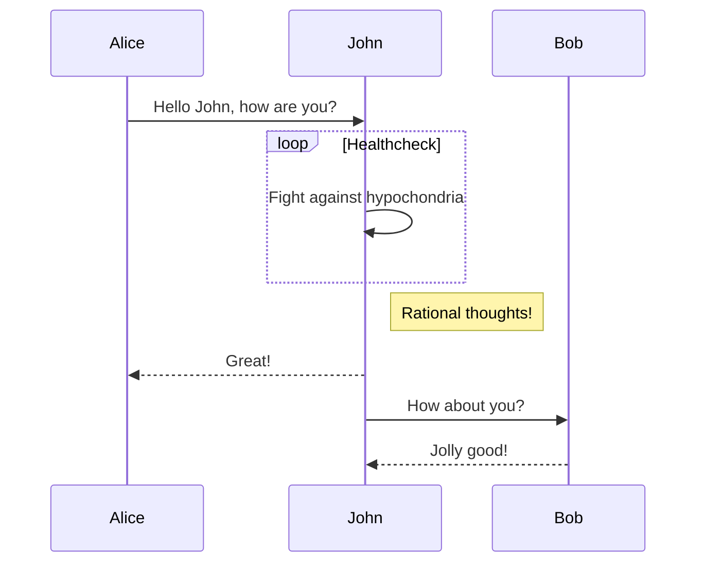
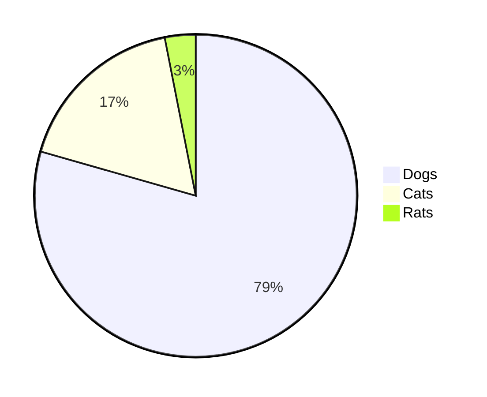

这里是第一行，
然后这里是第二行。

这里是一些内容。
再来一行。
第三行。

| 名称空间      | 隔离内容                      | 内核版本 |
| :------------ | :---------------------------- | :------- |
| Mount         | 文件系统与路径等              | 2.4.19   |
| UTS           | 主机的 Hostname、Domain names | 2.6.19   |
| IPC           | 进程间通信管道                | 2.6.19   |
| PID           | 独立的进程编号空间            | 2.6.24   |
| Network       | 网卡、IP 地址、端口等网络资源 | 2.6.29   |
| User          | 进程独立的用户和用户组        | 3.8      |
| Cgroup        | CPU 时间片，内存分页等        | 4.6      |
| Time \<- New! | 进程独立的系统时间            | 5.6      |

new lines!
