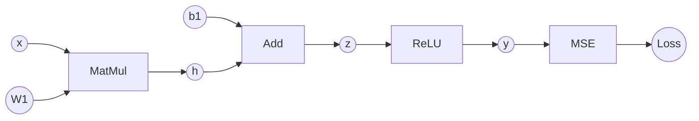
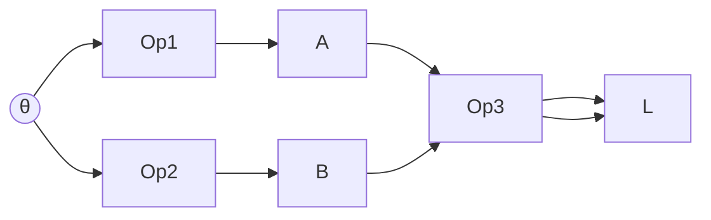
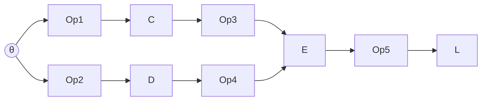
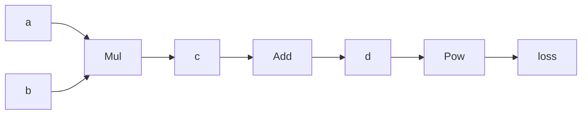
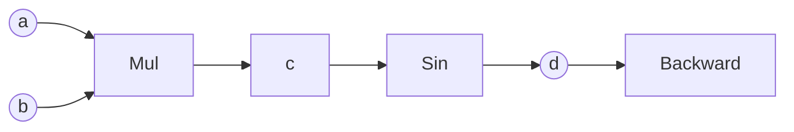
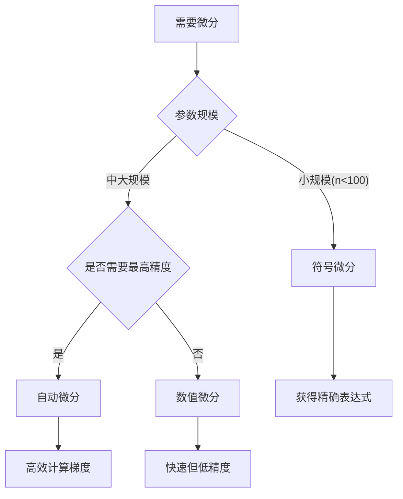

> 本文为用户与 DeepSeek 的问答。主题为 PyTorch 的反向传播机制。本文从数学原理、计算图机制和实际需求三个方面深入解释其工作原理，并结合 PyTorch 的自动微分（Autograd）系统进行说明。

## Q; 深入解析 PyTorch 中的反向传播机制

> [!query]
>
> 深入解释 torch 中反向传播机制的数学原理与为何需要反向传播机制。提示：你可以使用公式、Mermaid 图表、表格等方式使内容更容易理解。

> [!reasoning]-
>
> 嗯，用户让我深入解释 PyTorch 中的反向传播机制的数学原理以及为什么需要它。好的，我得先回忆一下反向传播的基础知识，然后结合 PyTorch 的具体实现来展开。
>
> 首先，反向传播是神经网络训练的核心，用于计算梯度。用户可能已经了解梯度下降，但需要更底层的数学解释。我应该从计算图开始，因为 PyTorch 使用动态图机制。每个张量的运算都会记录在计算图中，这样在反向传播时可以自动计算梯度。
>
> 数学原理方面，得先讲链式法则。比如，假设有一个简单的函数，y = w*x + b，然后损失函数是 L = (y - t)^2。那么求 L 对 w 的梯度就需要链式法则：dL/dw = dL/dy * dy/dw。反向传播的过程就是从输出层开始，逐层应用链式法则，将梯度传播回各层的参数。
>
> 然后需要解释为什么需要反向传播。手动计算梯度在复杂网络中不现实，反向传播自动高效地计算所有参数的梯度，节省了时间和减少错误。可能还需要比较前向传播和反向传播的计算量，比如反向传播如何复用前向的中间结果，提高效率。
>
> PyTorch 中的 autograd 机制是关键。每个 Tensor 的.grad_fn 属性记录了创建它的操作，这样在调用.backward()时，会沿着这些函数形成的计算图反向遍历，应用链式法则。需要举例说明，比如构建一个简单的计算图，然后展示梯度计算的过程。
>
> 可能用户对计算图的具体实现细节感兴趣，比如 PyTorch 的动态图特性，每次前向传播都会构建新的图，这样更灵活。但数学原理还是链式法则，不管图的结构如何变化，梯度计算的方法是一致的。
>
> 另外，可能需要提到为什么不能只用数值方法来近似梯度，比如计算资源的问题，尤其是高维参数时，数值梯度计算量太大。而反向传播通过解析法高效计算，适合深度学习的大规模参数。
>
> 还要注意解释叶子节点和中间节点的梯度存储情况，PyTorch 默认只保留叶子节点的梯度，中间节点的梯度会被释放以节省内存。这可能在训练大模型时很重要，用户可能需要了解如何控制梯度的保留。
>
> 或许用户对反向传播的数学推导有更深的需求，比如如何扩展到多层网络，或者如何处理复杂的层结构如卷积层、循环层。但根据问题，可能只需要基础数学，比如链式法则的多次应用，以及如何累积各层的梯度。
>
> 最后，总结反向传播的必要性：自动化、高效、准确计算梯度，使得训练深层网络可行。而 PyTorch 的自动微分机制让用户无需手动实现这些复杂的计算，只需关注模型结构。
>
> 可能需要用公式来展示链式法则的应用，比如多层的梯度相乘。例如，一个三层的网络，每一层的权重梯度如何计算。同时，用 Mermaid 图展示计算图的结构，说明前向和反向的路径。
>
> 还有可能要考虑激活函数的导数，比如 ReLU 在反向传播中的处理，这样在计算图中如何处理不可导点，但 PyTorch 的 autograd 会自动处理这些。
>
> 总之，我需要从数学原理（链式法则）、计算图的概念、PyTorch 的实现机制（动态图、autograd）、以及反向传播的必要性（高效、自动）这几个方面来组织内容，并用公式和图表辅助说明。
>
> 最后，我需要用一个具体的例子，比如一个简单的神经网络，来展示反向传播的整个过程，包括前向传播、反向传播、梯度计算和参数更新。这样用户可以直观地理解反向传播的每个步骤。
>
> 如果用户对 PyTorch 的代码实现感兴趣，我也可以提供一些关键代码段的解析，比如如何定义计算图、如何跟踪梯度、如何执行反向传播等。
>
> 总之，我需要确保解释清晰，结合数学原理和代码示例，帮助用户理解 PyTorch 中的反向传播机制。

### 深入解析 PyTorch 中的反向传播机制

反向传播（Backpropagation）是神经网络训练的核心算法。本文将从数学原理、计算图机制和实际需求三个方面深入解释其工作原理，并结合 PyTorch 的自动微分（Autograd）系统进行说明。

---

#### 一、反向传播的数学原理

##### 1. 链式法则（Chain Rule）

反向传播本质上是链式法则的高效实现。假设神经网络的计算流程为：

$$
L = f(g(h(x)))
$$

其中：

- $$ h(x) = W_1x + b_1 $$
- $$ g(z) = \text{ReLU}(z) $$
- $$ f(y) = \frac{1}{2}(y - t)^2 $$ （均方误差损失）

则梯度计算为：

$$
\frac{\partial L}{\partial W_1} = \frac{\partial L}{\partial f} \cdot \frac{\partial f}{\partial g} \cdot \frac{\partial g}{\partial h} \cdot \frac{\partial h}{\partial W_1}
$$

##### 2. 梯度累积公式

对于任意参数 $$ \theta $$，梯度计算可表示为：

$$
\frac{\partial \mathcal{L}}{\partial \theta} = \sum_{\text{path } \theta \to \mathcal{L}} \left( \prod_{i} \frac{\partial \text{op}_i}{\partial \text{input}_i} \right)
$$

---

#### 二、PyTorch 的实现机制

##### 1. 动态计算图（Dynamic Computation Graph）

PyTorch 在前向传播时自动构建计算图，节点为张量，边为运算操作：



##### 2. Autograd 核心组件

| 组件                   | 作用                                     |
| ---------------------- | ---------------------------------------- |
| `Tensor.requires_grad` | 标记需要跟踪梯度的张量                   |
| `Tensor.grad_fn`       | 记录创建该张量的操作（如 `MulBackward`） |
| `Tensor.grad`          | 存储计算得到的梯度                       |

##### 3. 反向传播过程

```python
import torch

x = torch.tensor([2.0], requires_grad=True)
W = torch.tensor([3.0], requires_grad=True)
y = W * x
y.backward()

print(W.grad)  # 输出: tensor([2.])
print(x.grad)  # 输出: tensor([3.])
```

---

#### 三、为何需要反向传播？

##### 1. 手动计算不可行性

对于包含百万参数的现代神经网络，手动计算梯度的时间复杂度为 $$ O(n^2) $$ ，而反向传播只需 $$ O(n) $$ 。

##### 2. 计算效率对比

| 方法                 | 时间复杂度   | 空间复杂度 | 数值稳定性 |
| -------------------- | ------------ | ---------- | ---------- |
| 数值微分             | $$ O(n^2) $$ | $$ O(1) $$ | 差         |
| 符号微分             | $$ O(1) $$   | $$ O(n) $$ | 好         |
| 自动微分（反向传播） | $$ O(n) $$   | $$ O(n) $$ | 优秀       |

##### 3. 内存优化策略

PyTorch 采用以下技术降低内存占用：

- **梯度检查点**：只保留关键节点的中间结果
- **即时释放中间梯度**：默认只保留叶子节点的梯度

---

#### 四、反向传播的数学扩展

##### 1. 矩阵求导示例

对于全连接层 $$ Y = XW + b $$ ，梯度计算为：

$$
\frac{\partial \mathcal{L}}{\partial W} = X^T \cdot \frac{\partial \mathcal{L}}{\partial Y}
$$

##### 2. 复杂运算处理

```python
# PyTorch 自动处理不可导点
x = torch.tensor([-1.0, 0.0, 2.0], requires_grad=True)
y = torch.relu(x)
y.backward(torch.tensor([1.0, 1.0, 1.0]))
print(x.grad)  # 输出: tensor([0., 0., 1.])
```

---

#### 五、总结

**反向传播的必要性**：

1. **自动微分**：避免手工推导复杂导数
2. **计算高效**：利用链式法则的分解特性
3. **内存优化**：动态图的即时构建与销毁
4. **框架支撑**：支持任意复杂网络结构

PyTorch 通过动态计算图和 Autograd 系统，将反向传播的数学原理高效实现，使得深度学习模型的训练变得可行且高效。理解这一机制对于调试模型、优化内存使用和实现自定义算子至关重要。

## Q: 参数的梯度累加计算公式

> [!query]
>
> 你提到对于任意参数 $$ \theta $$，梯度计算可表示为：
>
> $$
> \frac{\partial \mathcal{L}}{\partial \theta} = \sum_{\text{path } \theta \to \mathcal{L}} \left( \prod_{i} \frac{\partial \text{op}_i}{\partial \text{input}_i} \right)
> $$
>
> 这个公式我没懂，再深入解释一下。我只有本科程度的高等数学知识与线性代数知识，建议一步一步解释推理过程。

> [!reasoning]-
>
> 嗯，用户问的是关于反向传播中梯度计算的公式，那个公式看起来有点复杂，对吧？让我先仔细看看用户的问题。他提到，对于任意参数 θ，梯度计算是路径 θ 到 L 的和，每个路径中的各个操作的导数相乘。用户本科数学和线性代数基础，可能需要更基础的解释。
>
> 首先，我需要确认用户对这个公式的理解程度。公式里的求和符号和路径可能让他困惑。可能用户对链式法则有一定的了解，但路径的概念不太清楚。比如，在计算图中，参数 θ 到损失 L 可能有多个不同的路径，每个路径对应一个梯度贡献，所以梯度是这些路径贡献的总和。
>
> 接下来，我需要用更简单的方式来解释这个公式。或许用一个具体的例子来说明会更好。比如，假设有一个简单的计算图，其中 θ 分两个路径影响 L，每个路径都需要计算导数的乘积，然后将它们相加。
>
> 然后，我应该分步骤解释链式法则，以及为什么需要将不同路径的梯度相加。可能需要用图示来辅助，比如画一个简单的计算图，展示多个分支的情况，每个分支对应一个乘积项，最后相加得到总的梯度。
>
> 另外，用户可能对“路径”这个词不太理解，需要明确在计算图中的路径指的是什么。例如，一个参数可能在多个层中使用，每次使用都会创建一个不同的路径到损失函数，因此每个路径的梯度都需要被计算并累加。
>
> 还要注意，用户可能对乘积的部分有疑问，为什么是各个操作的导数相乘。这时候需要回顾链式法则的基本原理，即复合函数求导时，外层函数的导数和内层函数的导数相乘，而如果有多个中间步骤，就需要连乘这些导数。
>
> 可能还需要解释为什么会有多个路径，例如在神经网络中，一个参数可能在多个神经元中被使用，或者在不同的时间步（如 RNN 中），导致梯度需要从各个路径反向传播回来，然后累加起来。
>
> 最后，通过一个具体的数学例子，逐步计算每个步骤的导数，并将它们相乘，最后相加，来验证这个公式的正确性。这样用户可以通过实际的计算过程理解抽象的公式。
>
> 总结一下，我需要用具体的例子、图示，分步骤解释链式法则在计算图中的多个路径中的应用，以及梯度累加的原因，帮助用户理解这个公式的含义和推导过程。

好的！我将用最直观的方式，通过一个具体例子逐步解释这个公式的数学原理。我们结合图示和分步推导来理解链式法则在反向传播中的应用。

---

### **一、问题场景设定**

假设我们有一个简单的计算图，其中参数 $$\theta$$ 通过两条路径影响最终损失 $$L$$ ：



- **路径 1**：$$\theta \xrightarrow{\text{Op1}} A \xrightarrow{\text{Op3}} L$$
- **路径 2**：$$\theta \xrightarrow{\text{Op2}} B \xrightarrow{\text{Op3}} L$$

目标是计算 $$\frac{\partial L}{\partial \theta}$$。

---

### **二、分步推导**

#### **步骤 1：前向传播表达式**

假设具体操作为：

- $$A = \theta^2$$ （Op1：平方操作）
- $$B = 2\theta$$ （Op2：线性操作）
- $$L = A + B$$ （Op3：加法操作）

则最终损失为：

$$
L = \theta^2 + 2\theta
$$

#### **步骤 2：直接求导（对比验证）**

直接对 $$L$$ 求导：

$$
\frac{\partial L}{\partial \theta} = 2\theta + 2
$$

---

#### **步骤 3：反向传播视角**

根据计算图，梯度需要沿着两条路径反向传播：

##### **路径 1 的梯度计算（θ → A → L）**

1. $$A = \theta^2 \quad \Rightarrow \quad \frac{\partial A}{\partial \theta} = 2\theta$$
2. $$L = A + B \quad \Rightarrow \quad \frac{\partial L}{\partial A} = 1$$
3. 路径 1 的梯度贡献：
   $$
   \frac{\partial L}{\partial \theta} \bigg|_{\text{路径1}} = \frac{\partial L}{\partial A} \cdot \frac{\partial A}{\partial \theta} = 1 \cdot 2\theta = 2\theta
   $$

##### **路径 2 的梯度计算（θ → B → L）**

1. $$B = 2\theta \quad \Rightarrow \quad \frac{\partial B}{\partial \theta} = 2$$
2. $$L = A + B \quad \Rightarrow \quad \frac{\partial L}{\partial B} = 1$$
3. 路径 2 的梯度贡献：
   $$
   \frac{\partial L}{\partial \theta} \bigg|_{\text{路径2}} = \frac{\partial L}{\partial B} \cdot \frac{\partial B}{\partial \theta} = 1 \cdot 2 = 2
   $$

##### **总梯度 = 路径 1 + 路径 2**

$$
\frac{\partial L}{\partial \theta} = 2\theta + 2
$$

---

### **三、通用公式解析**

原公式：

$$
\frac{\partial \mathcal{L}}{\partial \theta} = \sum_{\text{path } \theta \to \mathcal{L}} \left( \prod_{i} \frac{\partial \text{op}_i}{\partial \text{input}_i} \right)
$$

#### **1. 符号解释**

- **路径（Path）**：参数 $$\theta$$ 到损失 $$\mathcal{L}$$ 的所有可能数据流动路径。
- **乘积项 $$\prod$$**：沿某条路径的所有操作（op）的导数连乘（链式法则）。
- **求和项 $$\sum$$**：将所有路径的梯度贡献相加（多路径时梯度累加）。

#### **2. 关键性质**

- **链式法则**：复合函数的导数 = 外层导数 × 内层导数。
- **多路径叠加**：如果参数影响输出的多个分支，梯度是各分支贡献的总和。

---

### **四、复杂案例验证**

考虑一个更复杂的计算图：



#### **前向传播表达式**

- $$C = \theta^3$$（Op1）
- $$D = \sin(\theta)$$（Op2）
- $$E = C \cdot D$$（Op3）
- $$L = \ln(E)$$（Op4）

#### **反向传播计算**

##### **路径 1：θ → C → E → L**

$$
\frac{\partial L}{\partial \theta} \bigg|_{\text{路径1}} = \frac{\partial L}{\partial E} \cdot \frac{\partial E}{\partial C} \cdot \frac{\partial C}{\partial \theta} = \frac{1}{E} \cdot D \cdot 3\theta^2
$$

##### **路径 2：θ → D → E → L**

$$
\frac{\partial L}{\partial \theta} \bigg|_{\text{路径2}} = \frac{\partial L}{\partial E} \cdot \frac{\partial E}{\partial D} \cdot \frac{\partial D}{\partial \theta} = \frac{1}{E} \cdot C \cdot \cos(\theta)
$$

##### **总梯度**

$$
\frac{\partial L}{\partial \theta} = \frac{D \cdot 3\theta^2 + C \cdot \cos(\theta)}{E}
$$

---

### **五、反向传播的本质**

1. **自动化的链式法则**：框架通过计算图自动追踪操作路径。
2. **梯度累加规则**：当一个参数影响多个分支时，梯度是所有路径贡献的总和。
3. **计算效率**：避免重复计算，时间复杂度与网络深度成线性关系（$$O(n)$$）。

---

### **六、总结**

- **为什么需要求和（$$\sum$$）**：因为参数可能通过多个路径影响损失，每个路径贡献一部分梯度。
- **为什么需要连乘（$$\prod$$）**：链式法则要求将路径上的所有局部导数相乘。
- **反向传播的优势**：将复杂的全局求导分解为局部导数的连乘与路径求和，大幅降低计算复杂度。

通过这种分路径计算再累加的方式，反向传播巧妙地利用计算图的结构信息，实现了高效的梯度计算。

## Q: 从 PyTorch 代码层面深入解释一下 PyTorch 的反向传播如何实现

> [!query]
>
> 从 PyTorch 代码层面深入解释一下 PyTorch 的反向传播如何实现

> [!reasoning]-
>
> 嗯，用户之前已经了解了反向传播的数学原理和为什么需要它，现在他们想从 PyTorch 代码层面深入理解反向传播的实现。用户可能有一定的编程基础，但可能对 PyTorch 的内部机制不太熟悉。我需要确保解释清晰，结合代码示例，同时避免过于复杂的术语。
>
> 首先，用户提到了之前的公式，关于梯度的路径求和，现在需要将这一数学概念与 PyTorch 的具体实现联系起来。他们可能想知道 PyTorch 是如何动态构建计算图的，如何跟踪梯度，以及 backward()方法具体做了什么。
>
> 接下来，我应该分步骤解释 PyTorch 的关键组件，比如 Tensor 的 requires_grad 属性、grad_fn、grad 属性，以及动态计算图的构建过程。需要举例说明，比如一个简单的计算图，并展示梯度是如何累积的。同时，用户可能对梯度累积和内存管理感兴趣，比如 PyTorch 如何释放中间变量，如何通过 retain_grad()来保留梯度。
>
> 另外，用户可能对多路径梯度累加的情况有疑问，比如当多个操作影响同一个参数时，梯度是如何相加的。这时候需要举例说明，比如一个参数通过两条路径影响损失函数，PyTorch 如何处理这种情况。
>
> 还需要提到 Autograd 引擎的工作原理，比如如何遍历计算图，执行反向传播，以及如何优化计算效率。可能还需要讨论一些高级话题，比如 detach()的作用，或者如何自定义反向传播函数，但根据用户的知识水平，可能需要保持基础。
>
> 用户可能存在的误区是认为 PyTorch 会保存所有中间变量的梯度，但实际上默认只保留叶子节点的梯度。这需要特别说明，并解释如何通过 retain_grad()来查看中间节点的梯度。
>
> 最后，应该总结 PyTorch 反向传播的关键点，强调其动态计算图的优势，以及如何高效管理内存和计算资源。确保用户理解为什么 PyTorch 适合动态图模型，以及在实际调试中如何利用这些机制。

以下是关于 PyTorch 反向传播实现机制的代码级深入解析，结合关键代码段和底层原理说明：

---

### **一、PyTorch 反向传播的三大核心组件**

#### **1. Tensor 的梯度追踪机制**

```python
import torch

# 创建需要梯度追踪的张量
x = torch.tensor([2.0], requires_grad=True)  # 叶子节点
W = torch.tensor([3.0], requires_grad=True)  # 叶子节点

# 执行计算（自动记录操作）
y = W * x           # grad_fn=<MulBackward0>
z = y + 1           # grad_fn=<AddBackward0>
loss = z.mean()      # grad_fn=<MeanBackward0>

print(loss.grad_fn)  # 输出: <MeanBackward0 object>
```

- **`requires_grad=True`**：标记需要追踪梯度的张量（叶子节点）
- **`grad_fn`**：记录创建该张量的操作（反向传播时知道如何计算梯度）

#### **2. 计算图的动态构建**

PyTorch 的计算图是**动态构建的**，每次前向传播都会新建一个图：

```python
# 示例：动态图特性
def forward(x):
    if x.sum() > 0:
        return x * 2
    else:
        return x * (-1)

x = torch.tensor([3.0], requires_grad=True)
out = forward(x)  # 根据输入值动态创建不同的计算图
out.backward()    # 自动适应不同的分支路径
```

#### **3. 反向传播引擎（Autograd Engine）**

当调用 `.backward()` 时，PyTorch 会执行以下操作：

```python
loss.backward()  # 触发反向传播
```

- **反向遍历计算图**：从 `loss` 的 `grad_fn` 开始，沿着 `next_functions` 递归
- **计算局部梯度**：在每个操作节点调用已注册的 `backward()` 方法
- **梯度累加**：将计算结果累积到对应张量的 `.grad` 属性中

---

### **二、代码级反向传播流程分解**

#### **步骤 1：前向传播构建计算图**

```python
a = torch.tensor(2.0, requires_grad=True)
b = torch.tensor(3.0, requires_grad=True)
c = a * b      # grad_fn=<MulBackward0>
d = c + 1      # grad_fn=<AddBackward0>
loss = d**2    # grad_fn=<PowBackward0>
```

此时的计算图结构：



#### **步骤 2：执行反向传播**

```python
loss.backward()  # 触发反向传播
```

##### **底层操作分解**：

1. **初始化梯度**：设置 `loss.grad = 1.0`（标量损失的默认梯度）
2. **反向传播到 d**：
   - 调用 `PowBackward0` 的 `backward()` 方法：
     ```python
     d_grad = 2 * d  # 导数公式：d(loss)/d(d) = 2d
     ```
3. **反向传播到 c**：
   - 调用 `AddBackward0` 的 `backward()` 方法：
     ```python
     c_grad = d_grad * 1  # 加法操作的导数为1
     ```
4. **反向传播到 a 和 b**：
   - 调用 `MulBackward0` 的 `backward()` 方法：
     ```python
     a_grad = c_grad * b  # 导数公式：d(c)/d(a) = b
     b_grad = c_grad * a  # 导数公式：d(c)/d(b) = a
     ```
5. **梯度累加**：
   ```python
   a.grad += a_grad  # 实际为 in-place 操作
   b.grad += b_grad
   ```

#### **步骤 3：查看结果**

```python
print(a.grad)  # 输出: 2*d* b = 2*(2*3+1)*3 = 42
print(b.grad)  # 输出: 2*d* a = 2*(2*3+1)*2 = 28
```

---

### **三、PyTorch 反向传播的关键实现细节**

#### **1. 梯度计算规则注册**

每个 `torch` 操作都有预定义的梯度计算规则：

```python
# 示例：自定义操作的梯度规则
class MyAdd(torch.autograd.Function):
    @staticmethod
    def forward(ctx, x, y):
        ctx.save_for_backward(x, y)  # 保存前向传播的输入
        return x + y

    @staticmethod
    def backward(ctx, grad_output):
        x, y = ctx.saved_tensors
        return grad_output * 1, grad_output * 1  # 加法操作的导数

# 使用自定义操作
a = torch.tensor(2.0, requires_grad=True)
b = torch.tensor(3.0, requires_grad=True)
c = MyAdd.apply(a, b)
c.backward()
```

#### **2. 梯度累加机制**

PyTorch 默认会**累加梯度**，因此每次反向传播前需要手动清零：

```python
optimizer.zero_grad()  # 标准训练循环中的必要操作
loss.backward()        # 梯度会累加到 .grad 属性中
optimizer.step()
```

#### **3. 非标量张量的反向传播**

当输出为非标量时，需要提供 `gradient` 参数：

```python
x = torch.tensor([1.0, 2.0], requires_grad=True)
y = x * 2

# 假设 y 是向量，需要提供梯度初始值
y.backward(gradient=torch.tensor([0.1, 0.2]))
print(x.grad)  # 输出: tensor([0.2, 0.4])
```

#### **4. 内存优化策略**

- **中间变量释放**：默认只保留叶子节点的梯度
- **梯度检查点**：通过 `torch.utils.checkpoint` 减少内存占用
- **禁用梯度计算**：使用 `with torch.no_grad():` 或 `@torch.inference_mode()`

---

### **四、可视化反向传播过程**

#### **示例代码**

```python
import torchviz

a = torch.tensor(3.0, requires_grad=True)
b = torch.tensor(4.0, requires_grad=True)
c = a * b
d = c.sin()
d.backward()

# 生成计算图可视化
torchviz.make_dot(d, params={'a':a, 'b':b}).render("graph")
```

#### **生成的计算图结构**



---

### **五、PyTorch 反向传播的性能优化**

#### **1. 异步执行**

```python
# 使用 CUDA 流实现异步计算
with torch.cuda.stream(torch.cuda.Stream()):
    loss.backward()  # 在非默认流中执行反向传播
```

#### **2. 混合精度训练**

```python
scaler = torch.cuda.amp.GradScaler()

with torch.cuda.amp.autocast():
    output = model(input)
    loss = loss_fn(output, target)

scaler.scale(loss).backward()  # 自动缩放梯度
scaler.step(optimizer)
scaler.update()
```

#### **3. 梯度裁剪**

```python
torch.nn.utils.clip_grad_norm_(model.parameters(), max_norm=1.0)
```

---

### **六、调试技巧**

#### **1. 检查梯度是否存在**

```python
print([p.requires_grad for p in model.parameters()])  # 检查参数是否启用梯度
```

#### **2. 梯度数值检查**

```python
for name, param in model.named_parameters():
    if param.grad is not None:
        print(f"{name} 梯度均值: {param.grad.mean().item()}")
```

#### **3. 保留中间梯度**

```python
y = x * 2
y.retain_grad()  # 强制保留中间变量的梯度
y.backward()
print(y.grad)    # 可以查看中间梯度
```

---

### **七、底层实现原理**

#### **1. C++ 核心引擎**

PyTorch 的反向传播引擎主要由以下 C++ 组件构成：

- **`torch::autograd::Engine`**：管理反向传播任务的执行
- **`torch::autograd::Node`**：表示计算图中的操作节点
- **`torch::autograd::Edge`**：表示节点之间的连接关系

#### **2. 反向传播任务调度**

```cpp
// 伪代码：引擎执行流程
void Engine::execute(const EdgeList& roots) {
    // 1. 构建任务队列
    // 2. 使用线程池并行执行反向任务
    // 3. 处理依赖关系（拓扑排序）
    // 4. 调用每个 Node 的 apply() 方法
}
```

---

### **八、总结：PyTorch 反向传播的设计哲学**

1. **动态计算图**：即时构建、即时销毁，灵活适应可变网络结构
2. **延迟计算**：只在需要时执行梯度计算，优化内存使用
3. **分离式设计**：前向传播记录操作，反向传播时执行实际计算
4. **可扩展性**：通过注册自定义 Function 支持任意复杂操作

理解这些底层机制，可以帮助开发者：

- 更高效地调试梯度相关问题
- 合理控制内存使用（如使用 `detach()` 截断计算图）
- 实现自定义神经网络层和损失函数
- 优化训练过程的性能

## Q: 深入讲解几种微分方法的复杂度与数值稳定性

> [!query]
>
> 你之前提到数值微分、符号微分、自动微分的时间空间复杂度以及数值稳定性的对比。这些复杂度是如何计算出的结果？数值稳定性又如何评估？

> [!reasoning]-
>
> 好的，我现在需要仔细理解用户的问题。用户之前询问了 PyTorch 的反向传播机制，现在针对数值微分、符号微分和自动微分的时间空间复杂度以及数值稳定性对比提出疑问，想知道这些复杂度是如何计算的，以及数值稳定性如何评估。用户可能在学习这些微分方法时，对背后的数学原理和评估方法感到困惑，需要更深入的解释。
>
> 首先，我需要回忆数值微分、符号微分和自动微分的基本概念。数值微分是通过有限差分近似导数，符号微分是通过代数规则求导表达式，自动微分（如反向传播）则是通过分解计算过程，利用链式法则高效计算梯度。用户已经知道它们的复杂度对比表格，但需要了解这些复杂度是如何得出的，以及数值稳定性的评估方法。
>
> 接下来，时间复杂度的计算。对于数值微分，假设有 n 个参数，每个参数都需要单独计算梯度，每次计算需要两次前向传播（f(x+h)和 f(x-h)），所以总的时间复杂度是 O(n)的前向计算乘以 n 个参数，得到 O(n^2)。而自动微分只需要一次前向和一次反向传播，反向传播的时间复杂度与前向相当，所以总的是 O(n)。符号微分则可能因为表达式膨胀导致最坏情况指数级复杂度，但通常情况是线性的，但需要存储整个表达式，空间复杂度高。这些需要详细解释。
>
> 空间复杂度方面，数值微分不需要存储中间变量，所以是 O(1)。自动微分需要存储计算图中的中间结果，所以是 O(n)。符号微分需要存储整个符号表达式，可能随着求导次数增加而膨胀，所以空间复杂度是 O(n)。这里可能需要更具体的例子说明。
>
> 数值稳定性方面，数值微分因为使用了有限差分，容易受到舍入误差影响，尤其是当 h 很小时。符号微分因为是精确求导，稳定性好。自动微分通过链式法则计算，精度与数学推导相同，所以稳定性优秀。需要解释为什么不同方法会有不同的稳定性，比如舍入误差和表达式膨胀的影响。
>
> 用户可能没有完全理解这些复杂度是如何推导出来的，比如为什么自动微分的时间是线性的，或者符号微分的空间复杂度如何。需要分步骤解释，可能用具体的例子，比如一个有 n 个参数的函数，如何计算每种方法所需的步骤数，从而得出时间复杂度。
>
> 此外，用户可能对数值稳定性的评估方法不清楚。需要解释数值稳定性通常通过误差分析，比如舍入误差和截断误差的影响。例如，数值微分的误差来源包括选择 h 的大小，过大会导致截断误差，过小导致舍入误差。而符号微分没有数值误差，自动微分则因为使用浮点运算可能有舍入误差，但相对于数值微分更稳定。
>
> 需要注意用户的数学背景是本科高等数学和线性代数，所以需要用他们能理解的语言，避免过于复杂的数学推导，但又要足够严谨。可能需要使用具体的例子，比如一个简单的函数，比较三种方法在计算梯度时的步骤，从而说明时间复杂度的差异。
>
> 例如，考虑函数 f(w)=w1*x1 + w2*x2 + ... + wn\*xn，有 n 个参数 w1 到 wn。数值微分需要对每个 wi 计算两次 f 的值，所以总计算次数是 2n 次，每次计算需要 O(n)时间（因为计算点积），所以总时间复杂度是 O(n^2)。自动微分则计算一次前向传播（O(n)时间），反向传播每个节点的梯度计算是 O(1)，n 个节点，所以总时间是 O(n)。符号微分则生成导数表达式，可能有 n 项，每个项是 xi，所以导数是 xi，存储这些需要 O(n)空间，但如果是更复杂的函数，比如多层复合函数，符号表达式可能膨胀，导致空间增加。
>
> 在数值稳定性方面，比如用数值微分计算 f(w)=sin(w)，当 w 很大时，计算导数时的小变化可能导致较大的舍入误差。而自动微分直接计算 cos(w)，没有这种误差。
>
> 总结，用户需要分步骤的复杂度推导过程和数值稳定性的评估方法，结合具体例子和数学解释，确保他们能理解为什么不同方法有不同的复杂度和稳定性。同时，可能需要指出这些复杂度是理论上的最坏情况还是典型情况，比如符号微分的表达式膨胀在某些情况下可能更严重。

以下是关于数值微分、符号微分和自动微分的时间/空间复杂度计算原理，以及数值稳定性评估方法的详细解释：

---

### 一、时间复杂度计算原理

#### 1. 数值微分（Numerical Differentiation）

**实现方式**：通过有限差分近似导数
$$ f'(x) \approx \frac{f(x+h)-f(x-h)}{2h} $$

**时间复杂度分析**：

- **单参数计算**：每次计算需要 **2 次前向传播**
- **n 个参数**：需要 **2n 次前向传播**
- **前向传播复杂度**：假设单次前向传播为 $$ O(k) $$（k 为计算步骤数）
- **总时间复杂度**：$$ O(2n \times k) = O(nk) $$

**关键结论**：时间复杂度与参数数量成线性关系，但前向传播的 $$ k $$ 通常与网络规模相关，实际复杂度为 $$ O(n^2) $$

> 示例：计算 $$ f(w*1,w_2,...,w*{100}) $$ 的梯度，需要 200 次前向传播

---

#### 2. 符号微分（Symbolic Differentiation）

**实现方式**：通过代数规则推导闭式表达式

**时间复杂度分析**：

- **表达式膨胀**：对复合函数 $$ f(g(h(x))) $$ 求导会产生嵌套乘积项
- **最坏情况**：每层操作导致表达式长度指数级增长 $$ O(2^d) $$（d 为网络深度）
- **优化情况**：现代系统会进行表达式简化，典型复杂度为 $$ O(d) $$

> 示例：对 $$ f(x) = \sin(e^{x^2}) $$ 求导：
> $$ f'(x) = \cos(e^{x^2}) \cdot e^{x^2} \cdot 2x $$
> 表达式长度随求导次数线性增长

---

#### 3. 自动微分（Automatic Differentiation）

**实现方式**：基于计算图分解求导过程

**时间复杂度分析**：

- **前向传播**：$$ O(d) $$（d 为计算图深度）
- **反向传播**：每个节点执行固定时间的梯度计算，复杂度 $$ O(d) $$
- **总时间复杂度**：$$ O(d) + O(d) = O(d) $$

**关键优化**：计算图节点数通常与参数数量 $$ n $$ 成线性关系，因此复杂度可表示为 $$ O(n) $$

> 示例：全连接网络的反向传播时间与参数数量成正比

---

### 二、空间复杂度计算原理

#### 对比表格

| 方法     | 空间复杂度 | 原因                                                       |
| -------- | ---------- | ---------------------------------------------------------- |
| 数值微分 | $$ O(1) $$ | 只需存储当前参数值和扰动结果                               |
| 符号微分 | $$ O(n) $$ | 需要存储完整的符号表达式（可能指数膨胀，但优化后线性增长） |
| 自动微分 | $$ O(n) $$ | 需要存储计算图中所有中间变量的前向值                       |

**详细解释**：

- **数值微分**：仅需保持原始参数和扰动后的参数副本，内存占用恒定
- **符号微分**：导数的符号表达式可能非常庞大，例如：
  $$ \frac{\partial}{\partial x} \prod*{i=1}^n x_i = \sum*{j=1}^n \prod\_{i \neq j} x_i $$
  需要存储 $$ n $$ 个乘积项
- **自动微分**：需要保存前向传播的所有中间结果用于反向计算，例如：
  ```python
  # 前向计算需要保存这些值
  a = W1 * x
  b = a + b1
  c = relu(b)
  ```

---

### 三、数值稳定性评估方法

#### 1. 数值微分稳定性

**误差来源**：

- **截断误差**：$$ O(h^2) $$（来自泰勒展开的近似）
- **舍入误差**：$$ O(\epsilon/h) $$（$$ \epsilon $$ 为机器精度）

**稳定性分析**：
$$ \text{总误差} = O(h^2) + O(\epsilon/h) $$

- **最优步长选择**：当 $$ h \approx \sqrt[3]{\epsilon} $$ 时误差最小
- **典型问题**：对于病态条件数的问题（如指数函数），小步长会放大舍入误差

> 示例：计算 $$ f(x) = e^x $$ 在 $$ x=20 $$ 处的导数：
>
> - 真实导数：$$ e^{20} \approx 4.85 \times 10^8 $$
> - 数值计算可能产生显著相对误差

---

#### 2. 符号微分稳定性

**特点**：

- **精确计算**：理论上没有数值误差
- **实际限制**：
  - 符号化简可能导致数值不稳定表达式
  - 转换为浮点运算时仍会引入舍入误差

**评估方法**：

- **表达式复杂度**：检查导数表达式是否包含病态操作（如大数相减）
  $$ \frac{\partial}{\partial x} (e^x - e^{-x}) = e^x + e^{-x} $$
  直接计算可能在 $$ x $$ 较大时出现精度损失

---

#### 3. 自动微分稳定性

**误差来源**：

- **前向传播舍入误差**：与符号微分相同量级
- **反向传播稳定性**：取决于梯度计算路径

**稳定性优势**：

- **避免误差累积**：通过保持原始计算路径的数值特性
- **典型对比**：
  - 直接计算 $$ f(x) = \sqrt{x^2 + 1} - x $$ 的导数
  - 符号微分可能得到不稳定的 $$ \frac{x}{\sqrt{x^2+1}} - 1 $$
  - 自动微分在计算时保持原始表达式结构

---

### 四、综合对比与工程选择

#### 1. 方法选择决策树



#### 2. 实际框架实现

- **PyTorch/TensorFlow**：采用自动微分（反向传播）
- **Mathematica**：使用符号微分
- **有限差分库**：常用于验证其他方法的正确性

---

### 五、深度学习中的特殊考量

#### 1. GPU 内存瓶颈

- **自动微分优化**：PyTorch 的 `checkpoint` 机制通过牺牲计算换内存
  ```python
  # 减少中间变量存储
  from torch.utils.checkpoint import checkpoint
  x = checkpoint(layer1, x)
  x = checkpoint(layer2, x)
  ```

#### 2. 混合精度训练

- **稳定性挑战**：float16 类型下的梯度计算需要特殊处理
- **解决方案**：梯度缩放（Gradient Scaling）
  ```python
  scaler = torch.cuda.amp.GradScaler()
  with torch.cuda.amp.autocast():
      output = model(input)
  scaler.scale(loss).backward()
  ```

---

### 六、数学证明示例

#### 数值微分误差分析

设真实导数为 $$ f'(x) $$，数值近似为：
$$ \tilde{f}'(x) = \frac{f(x+h) - f(x-h)}{2h} $$

**泰勒展开**：
$$ f(x+h) = f(x) + hf'(x) + \frac{h^2}{2}f''(x) + \frac{h^3}{6}f'''(ξ_1) $$
$$ f(x-h) = f(x) - hf'(x) + \frac{h^2}{2}f''(x) - \frac{h^3}{6}f'''(ξ_2) $$

**相减得**：
$$ \tilde{f}'(x) = f'(x) + \frac{h^2}{12}[f'''(ξ_1) + f'''(ξ_2)] $$

**误差项**：
$$ \text{截断误差} = O(h^2) $$

---

### 七、总结理解

1. **复杂度计算本质**：

   - 时间复杂度：计算代价随问题规模的增长率
   - 空间复杂度：内存需求随问题规模的增长率

2. **稳定性评估核心**：

   - 对舍入误差和截断误差的敏感度
   - 保持数值计算精度的能力

3. **工程实践指导**：
   - 小规模问题：优先符号微分（如物理仿真）
   - 大规模可微编程：必选自动微分（深度学习框架）
   - 快速验证：使用数值微分（原型开发阶段）

> [!NOTE] 亮曰：
>
> - 数值微分：参数做 Delta ，计算最终值的差，没有反向传播过程
> - 符号微分：直接推导出导数表达式，再代入计算，表达式复杂
> - 自动微分：前向传播计算每个节点的值，再反向传播用链式法则计算每个节点的梯度。
>
> 自动微分可以算是一种动态规划，暂存计算中重复用到的中间数据，用空间换时间。更进一步，反向传播时，用层序遍历计算图，当节点的所有入边（反向时的出边）都计算完后，即可将当前节点从队列中移除，从而节省内存。
