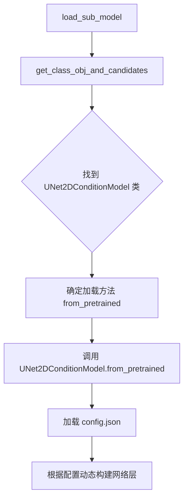
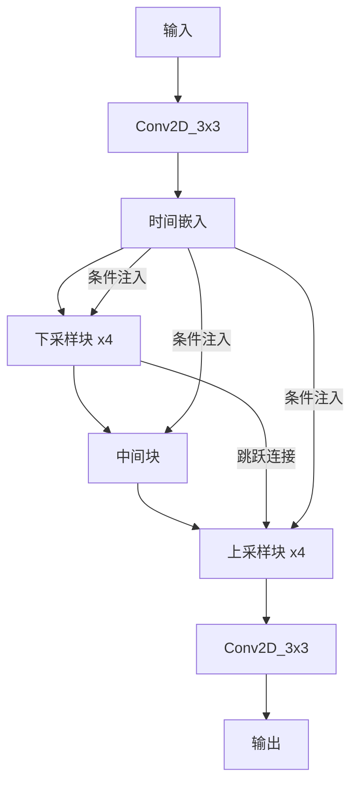

> [!summary]
> 以下内容为 Cursor 中拥有 codebase 上下文的情况下与 claude-3.7-sonnet 的对话记录

# Q: @train_text_to_image_lora.py 这段代码中如何体现 LoRA “使用两个低秩矩阵进行微调” 的步骤？

在 `train_text_to_image_lora.py` 脚本中，LoRA（Low-Rank Adaptation）通过在模型的特定层中插入低秩矩阵来实现微调。这种方法通过添加两个低秩矩阵来调整模型的权重，而不改变原始权重，从而实现参数高效的微调。

以下是脚本中如何体现 LoRA 使用两个低秩矩阵进行微调的步骤：

### 1. LoRA 配置

在脚本中，LoRA 的配置通常通过 `LoraConfig` 类来定义。这个配置包括低秩矩阵的秩（`rank`）和其他参数：

```python
unet_lora_config = LoraConfig(
    r=args.rank,  # 低秩矩阵的秩
    lora_alpha=args.rank,  # LoRA 的缩放因子
    init_lora_weights="gaussian",  # 初始化权重的方法
    target_modules=["to_k", "to_q", "to_v", "to_out.0"],  # 目标模块
)
```

### 2. 添加 LoRA 层

在模型中插入 LoRA 层是通过调用 `add_adapter` 方法实现的：

```python
unet.add_adapter(unet_lora_config)
```

这个方法会在指定的目标模块中插入两个低秩矩阵 \(A\) 和 \(B\)，用于调整模型的权重。具体来说，LoRA 在模型的注意力层中插入这些矩阵，以便在不改变原始权重的情况下进行微调。

### 3. 训练过程中的权重更新

在训练过程中，只有 LoRA 插入的低秩矩阵的参数是可训练的。原始模型的权重保持冻结状态。这是通过以下代码实现的：

```python
# freeze parameters of models to save more memory
unet.requires_grad_(False)
vae.requires_grad_(False)
text_encoder.requires_grad_(False)
```

通过这种方式，训练过程只会更新 LoRA 层的参数，而不会影响原始模型的权重。

### 4. 参数更新

在训练循环中，反向传播和参数更新步骤只会影响 LoRA 层的参数：

```python
# Backpropagate
accelerator.backward(loss)
if accelerator.sync_gradients:
    params_to_clip = lora_layers
    accelerator.clip_grad_norm_(params_to_clip, args.max_grad_norm)
optimizer.step()
lr_scheduler.step()
optimizer.zero_grad()
```

这里的 `lora_layers` 是一个过滤器，只包含 LoRA 层的可训练参数。

### 总结

通过在模型的特定层中插入两个低秩矩阵，LoRA 实现了参数高效的微调。这种方法允许在不改变原始模型权重的情况下，通过调整低秩矩阵来适应新的数据分布，从而实现高效的模型微调。

# Q: unet 是个什么样的结构？

UNet 是一种常用于图像生成和分割任务的神经网络架构。它最初是在医学图像分割领域中引入的，但由于其强大的特性和灵活性，UNet 也被广泛应用于其他计算机视觉任务，包括图像生成、去噪和超分辨率等。

### UNet 的基本结构

UNet 的结构可以分为两个主要部分：编码器（下采样路径）和解码器（上采样路径），中间通过跳跃连接（skip connections）相连。

1. **编码器（下采样路径）**：

   - 由一系列卷积层和池化层组成。
   - 每个卷积层通常后接一个激活函数（如 ReLU）。
   - 池化层用于逐步减少特征图的空间维度，同时增加特征的抽象程度。

2. **解码器（上采样路径）**：

   - 由一系列上采样层（如反卷积或上采样）和卷积层组成。
   - 逐步恢复特征图的空间维度。
   - 使用跳跃连接将编码器中相应层的特征图与解码器中的特征图连接，以保留细节信息。

3. **跳跃连接（Skip Connections）**：
   - 将编码器中的特征图直接连接到解码器中相应层的特征图。
   - 这种连接方式有助于保留输入图像的细节信息，改善生成结果的质量。

### UNet 在 Stable Diffusion 中的应用

在 Stable Diffusion 模型中，UNet 作为核心组件用于处理图像的潜在表示。具体来说，UNet 在扩散模型中用于预测噪声残差，从而逐步生成高质量的图像。

- **输入**：UNet 接收一个带有噪声的潜在表示（通常是一个低维的特征图）。
- **输出**：UNet 输出一个与输入相同大小的特征图，表示对噪声的预测。
- **训练目标**：通过最小化预测噪声与真实噪声之间的差异，UNet 学会如何去除噪声，从而生成清晰的图像。

### UNet 的优势

- **高效的特征提取**：通过编码器提取多尺度特征。
- **细节保留**：通过跳跃连接保留输入图像的细节信息。
- **灵活性**：可以适应不同的输入尺寸和任务需求。

UNet 的这种结构使其在图像生成任务中表现出色，特别是在需要高分辨率输出和细节保留的场景中。

# Q: 为什么这里 unet、 vae 、 tokenizer 等几个模型都是从同一个路径加载的？

在这个代码片段中，`unet`、`vae`、`tokenizer` 和其他组件都是从同一个路径加载的，这是因为它们都是 Stable Diffusion 模型的一部分。Stable Diffusion 是一个复杂的生成模型，通常由多个子模块组成，每个子模块负责不同的任务。以下是这些组件的作用和为什么它们从同一路径加载的原因：

### 1. 统一的模型路径

- **路径一致性**：所有这些组件都从同一个路径加载，因为它们通常被打包在一个预训练模型中。这个路径通常指向一个包含所有必要文件的目录或一个 Hugging Face Hub 上的模型仓库。
- **版本控制**：通过从同一个路径加载，确保所有组件使用的是同一个版本的模型，避免版本不匹配导致的兼容性问题。

### 2. 各个组件的作用

- **UNet (`unet`)**：

  - 负责处理图像的潜在表示，预测噪声残差。
  - 在扩散模型中用于逐步生成高质量的图像。

- **VAE (`vae`)**：

  - 自动编码器，用于将图像编码为潜在空间表示，并从潜在空间解码回图像。
  - 在 Stable Diffusion 中，VAE 用于将输入图像转换为潜在表示，供 UNet 处理。

- **Tokenizer (`tokenizer`)**：

  - 用于将文本输入（如生成图像的描述）转换为模型可理解的标记。
  - 在文本到图像生成任务中，tokenizer 将文本描述转换为输入 ID，供文本编码器使用。

- **Text Encoder (`text_encoder`)**：

  - 将文本输入编码为特征向量，供 UNet 使用。
  - 在生成过程中，文本编码器提供条件信息，指导图像生成。

- **Noise Scheduler (`noise_scheduler`)**：
  - 控制扩散过程中的噪声添加和去除。
  - 在训练和推理过程中，调度器决定在每个时间步添加多少噪声。

### 3. 统一加载的好处

- **简化管理**：从同一位置加载所有组件简化了模型管理和部署。
- **一致性**：确保所有组件在同一训练配置下工作，避免不兼容问题。
- **便捷性**：用户只需指定一个路径或模型标识符，即可加载整个模型的所有必要部分。

通过这种方式，用户可以方便地使用预训练的 Stable Diffusion 模型进行微调或推理，而不必单独管理每个组件的版本和路径。

# Q: 这些是 Stable Diffusion 的内部设计对吧？这些都在哪篇论文里提出的？ @Web

Stable Diffusion 是一种基于扩散模型的图像生成技术，其核心组件和设计在多篇论文中得到了详细描述。以下是与 Stable Diffusion 相关的关键论文：

1. **扩散模型的基础**：

   - **论文**：_Denoising Diffusion Probabilistic Models_ by Jonathan Ho, Ajay Jain, Pieter Abbeel (2020)
   - **链接**：[arXiv:2006.11239](https://arxiv.org/abs/2006.11239)
   - **内容**：这篇论文介绍了扩散模型的基本原理和去噪过程，是 Stable Diffusion 的理论基础。

2. **Stable Diffusion 的具体实现**：

   - **论文**：_High-Resolution Image Synthesis with Latent Diffusion Models_ by Robin Rombach, Andreas Blattmann, Dominik Lorenz, Patrick Esser, Björn Ommer (2021)
   - **链接**：[arXiv:2112.10752](https://arxiv.org/abs/2112.10752)
   - **内容**：这篇论文详细描述了 Stable Diffusion 的架构，包括使用潜在空间的扩散模型、VAE 的应用以及如何在高分辨率图像生成中实现高效计算。

3. **CLIP 模型的使用**：
   - **论文**：_Learning Transferable Visual Models From Natural Language Supervision_ by Alec Radford, Jong Wook Kim, Chris Hallacy, Aditya Ramesh, Gabriel Goh, Sandhini Agarwal, Girish Sastry, Amanda Askell, Pamela Mishkin, Jack Clark, Gretchen Krueger, Ilya Sutskever (2021)
   - **链接**：[arXiv:2103.00020](https://arxiv.org/abs/2103.00020)
   - **内容**：CLIP 模型用于将文本和图像结合在一起进行训练，Stable Diffusion 使用 CLIP 作为文本编码器来处理文本输入。

这些论文共同构成了 Stable Diffusion 的理论和技术基础，描述了其内部设计和实现细节。通过结合扩散模型、VAE 和 CLIP，Stable Diffusion 实现了高效的文本到图像生成。

# Q: 解释 StableDiffusionPipeline 的结构 @pipeline_stable_diffusion.py

`StableDiffusionPipeline` 是一个用于实现 Stable Diffusion 模型的核心类，负责将多个组件组合在一起以实现文本到图像的生成。以下是对 `StableDiffusionPipeline` 结构的详细解释：

### 继承关系

`StableDiffusionPipeline` 继承了多个类，这些类为其提供了不同的功能：

- **DiffusionPipeline**: 提供了基本的扩散模型功能。
- **StableDiffusionMixin**: 包含与 Stable Diffusion 相关的特定功能。
- **TextualInversionLoaderMixin**: 支持文本反转加载功能。
- **StableDiffusionLoraLoaderMixin**: 支持 LoRA（低秩适应）加载功能。
- **IPAdapterMixin**: 提供 IP 适配器功能。
- **FromSingleFileMixin**: 支持从单个文件加载模型。

### 初始化方法

`__init__` 方法用于初始化 `StableDiffusionPipeline` 的各个组件：

- **VAE (`vae`)**: 自动编码器，用于将图像编码为潜在空间表示，并从潜在空间解码回图像。
- **Text Encoder (`text_encoder`)**: 使用 CLIP 模型将文本输入编码为特征向量。
- **Tokenizer (`tokenizer`)**: 将文本输入转换为模型可理解的标记。
- **UNet (`unet`)**: 负责处理图像的潜在表示，预测噪声残差。
- **Scheduler (`scheduler`)**: 控制扩散过程中的噪声添加和去除。
- **Safety Checker (`safety_checker`)**: 用于检查生成图像的安全性。
- **Feature Extractor (`feature_extractor`)**: 用于从图像中提取特征。
- **Image Encoder (`image_encoder`)**: 可选组件，用于图像编码。

### 功能和方法

- **Deprecation Warnings**: 在初始化过程中，检查 `scheduler` 和 `unet` 的配置是否过时，并提供相应的弃用警告。
- **Module Registration**: 使用 `register_modules` 方法将各个组件注册到管道中，便于统一管理。
- **Safety Checks**: 提供安全检查功能，确保生成的图像符合安全标准。
- **Guidance Scale**: 提供指导比例的计算和应用，用于控制生成图像的风格和内容。
- **Image Processing**: 包含图像处理方法，如 `decode_latents`，用于将潜在表示转换为图像。

### 属性

- **Guidance Scale**: 控制生成图像的风格和内容。
- **Cross Attention**: 提供交叉注意力机制的参数。
- **Timesteps**: 控制扩散过程的时间步数。

### 设计目的

`StableDiffusionPipeline` 的设计目的是将 Stable Diffusion 模型的各个组件整合在一起，提供一个统一的接口来进行文本到图像的生成。通过继承和组合多个功能模块，`StableDiffusionPipeline` 能够灵活地支持不同的生成任务和配置需求。

# Q: @pipeline_utils.py 解释 DiffusionPipeline 的结构，以及 from_pretrained 在做什么

`DiffusionPipeline` 是一个用于管理和执行扩散模型的核心类，提供了加载、配置和运行模型的基本功能。以下是对 `DiffusionPipeline` 结构和 `from_pretrained` 方法的详细解释：

### DiffusionPipeline 的结构

`DiffusionPipeline` 是一个抽象基类，定义了扩散模型的基本接口和功能。其主要结构包括：

1. **模块注册**：

   - `register_modules` 方法用于注册模型的各个组件（如 VAE、UNet、调度器等），便于统一管理和调用。

2. **模型加载**：

   - 提供从预训练模型加载各个组件的功能，通常通过 `from_pretrained` 方法实现。

3. **推理接口**：

   - 定义了模型推理的基本接口，用户可以通过调用这些接口生成图像或其他输出。

4. **配置管理**：

   - 提供配置加载和保存功能，便于模型的复用和共享。

5. **实用工具**：
   - 包含一些实用工具方法，如检查版本、处理设备映射等。

### from_pretrained 方法

`from_pretrained` 是 `DiffusionPipeline` 中的一个关键方法，用于从预训练模型加载管道的各个组件。其主要功能包括：

1. **模型路径解析**：

   - 接受一个模型标识符（如 Hugging Face Hub 上的模型 ID）或本地路径，解析并定位模型文件。

2. **组件加载**：

   - 从指定路径加载模型的各个组件（如 VAE、UNet、调度器等），并将它们注册到管道中。
   - 支持加载不同版本和变体的模型组件。

3. **配置加载**：

   - 加载模型的配置文件，设置模型的超参数和其他配置选项。

4. **设备映射**：

   - 根据用户指定的设备映射策略，将模型组件分配到合适的计算设备（如 CPU、GPU）。

5. **安全检查**：

   - 在加载过程中，检查模型的安全性和兼容性，确保加载的模型符合预期。

6. **返回实例**：
   - 完成加载后，返回一个配置好的 `DiffusionPipeline` 实例，用户可以直接使用该实例进行推理。

### 设计目的

`DiffusionPipeline` 的设计目的是提供一个统一的接口来管理和执行扩散模型。通过 `from_pretrained` 方法，用户可以方便地加载和配置预训练模型，快速进行推理和生成任务。这种设计使得扩散模型的使用更加简便和高效，适合各种应用场景。

# Q: @train_text_to_image_lora.py 里，从 DiffusionPipeline.from_pretrained 加载到了 @pipeline_stable_diffusion.py 中 StableDiffusionPipeline 类的实例，我理解的对吗？

是的，你的理解是正确的。在 `train_text_to_image_lora.py` 中，`DiffusionPipeline.from_pretrained` 方法用于加载预训练的模型管道实例。在这个过程中，它会根据指定的模型路径和配置，实例化一个 `StableDiffusionPipeline` 类的对象。

### 具体过程如下：

1. **调用 `from_pretrained` 方法**：

   - 在 `train_text_to_image_lora.py` 中，`DiffusionPipeline.from_pretrained` 被调用来加载预训练的模型。
   - 这个方法会根据提供的路径或模型标识符，从 Hugging Face Hub 或本地文件系统加载模型的权重和配置。

2. **实例化 `StableDiffusionPipeline`**：

   - `from_pretrained` 方法会识别模型的类型，并根据配置文件中的信息选择合适的管道类进行实例化。
   - 在这个例子中，由于加载的是 Stable Diffusion 模型，因此会实例化 `StableDiffusionPipeline` 类。

3. **加载组件**：

   - `StableDiffusionPipeline` 的 `__init__` 方法会被调用，加载模型的各个组件（如 VAE、UNet、调度器等）。
   - 这些组件会根据预训练的权重进行初始化，并注册到管道中。

4. **返回实例**：
   - 完成加载后，`from_pretrained` 方法返回一个配置好的 `StableDiffusionPipeline` 实例。
   - 这个实例可以用于进一步的推理或微调任务。

通过这种方式，`train_text_to_image_lora.py` 脚本能够方便地加载和使用预训练的 Stable Diffusion 模型进行微调和生成任务。

# Q: 解读 @pipeline_utils.py 中 from_pretrained 代码，详细说明如何识别模型类型选择管道类。 @Codebase

在 `pipeline_utils.py` 中，`from_pretrained` 方法负责从预训练模型加载管道实例。以下是该方法如何识别模型类型并选择合适的管道类的详细说明：

### 识别模型类型并选择管道类的步骤

1. **下载和缓存模型文件**：

   - 首先，`from_pretrained` 方法会检查 `pretrained_model_name_or_path` 是否是一个本地路径。如果不是，它会调用 `cls.download` 方法从 Hugging Face Hub 下载模型文件，并将其缓存到本地。
   - 相关代码行：
     ```python
     startLine: 763
     endLine: 788
     ```

2. **加载配置文件**：

   - 使用 `cls.load_config` 方法加载模型的配置文件，该文件包含模型的超参数和其他配置信息。
   - 相关代码行：
     ```python
     startLine: 812
     endLine: 818
     ```

3. **识别模型变体**：

   - 通过 `_identify_model_variants` 方法识别模型的变体（如 `fp16`、`ema` 等），以便加载正确的模型文件。
   - 相关代码行：
     ```python
     startLine: 820
     endLine: 827
     ```

4. **解析自定义管道和类**：

   - 使用 `_resolve_custom_pipeline_and_cls` 方法解析自定义管道和类名。如果用户指定了自定义管道，则从 Hub 加载相应的模块。
   - 相关代码行：
     ```python
     startLine: 831
     endLine: 833
     ```

5. **获取管道类**：

   - 调用 `_get_pipeline_class` 方法，根据配置文件和用户指定的选项，确定要实例化的管道类。
   - 相关代码行：
     ```python
     startLine: 834
     endLine: 842
     ```

6. **加载管道组件**：

   - 根据管道类的签名，加载并实例化各个组件（如 VAE、UNet、调度器等），并将它们注册到管道中。
   - 相关代码行：
     ```python
     startLine: 857
     endLine: 980
     ```

7. **实例化管道**：
   - 使用加载的组件和配置，实例化最终的管道对象。
   - 相关代码行：
     ```python
     startLine: 1021
     endLine: 1028
     ```

通过这些步骤，`from_pretrained` 方法能够识别模型类型并选择合适的管道类，确保加载的模型能够正确地进行推理和生成任务。

# Q: 如果我只有一个 sd_xl_base_1.0.safetensors 文件，是否无法使用 from_pretrained 方法得到具体的 Pipeline 实例？

如果你只有一个 `sd_xl_base_1.0.safetensors` 文件，直接使用 `from_pretrained` 方法可能会遇到一些困难，因为 `from_pretrained` 通常期望从一个包含完整模型配置和权重的目录或 Hugging Face Hub 仓库中加载模型。

### 解决方案

1. **手动加载权重**：

   - 你可以手动加载 `safetensors` 文件中的权重，并将它们分配给相应的模型组件（如 UNet、VAE 等）。
   - 这需要你对模型的架构有深入的了解，以便正确地将权重映射到模型的各个部分。

2. **创建配置文件**：

   - `from_pretrained` 方法依赖于配置文件来确定如何构建模型管道。你可以尝试创建一个与模型匹配的配置文件，通常是一个 JSON 文件，描述模型的架构和超参数。
   - 这个配置文件需要放在与 `safetensors` 文件相同的目录中。

3. **使用自定义加载逻辑**：

   - 如果你熟悉模型的架构，可以编写自定义的加载逻辑，将 `safetensors` 文件中的权重加载到模型中。
   - 这可能涉及使用 `safetensors` 库来读取权重，并手动将它们分配给模型的各个层。

4. **检查社区资源**：
   - 有时，社区会提供工具或脚本来帮助加载特定格式的模型文件。你可以在相关的 GitHub 仓库或论坛中查找是否有适合的工具。

### 总结

虽然 `from_pretrained` 方法提供了便捷的加载方式，但它通常需要完整的模型目录或 Hub 仓库。如果只有一个 `safetensors` 文件，你可能需要手动处理权重加载和配置，以便正确地构建和使用模型管道。

# Q: 如果我只需要进行推理，是否仍需配置文件？

在进行推理时，配置文件仍然是非常有用的，尽管在某些情况下你可能能够在没有完整配置文件的情况下进行推理。以下是一些考虑因素：

### 为什么需要配置文件

1. **模型架构信息**：

   - 配置文件通常包含模型的架构信息，如层数、隐藏单元数、激活函数等。这些信息对于正确构建模型至关重要。

2. **超参数设置**：

   - 配置文件中可能包含一些超参数设置，如学习率、优化器设置等，虽然这些在推理时不直接使用，但了解这些信息有助于理解模型的行为。

3. **组件初始化**：
   - 在复杂模型（如 Stable Diffusion）中，配置文件用于初始化各个组件（如 VAE、UNet、调度器等）。这些组件需要正确的参数来进行推理。

### 没有配置文件时的推理

如果你没有配置文件，但仍希望进行推理，可以考虑以下方法：

1. **手动构建模型**：

   - 如果你对模型的架构有深入了解，可以手动构建模型，并使用 `safetensors` 文件中的权重进行初始化。

2. **使用默认设置**：

   - 在某些情况下，你可以使用一些默认的设置来初始化模型组件，但这可能会导致性能不佳或结果不准确。

3. **社区支持**：
   - 查找社区提供的工具或脚本，这些工具可能已经解决了如何在没有完整配置文件的情况下进行推理的问题。

### 总结

虽然在某些情况下可以在没有配置文件的情况下进行推理，但拥有配置文件通常会使过程更简单、更可靠。如果可能，尝试获取或创建一个与模型匹配的配置文件，以确保推理的准确性和效率。

# Q: 以你上面举的例子为例，@pipeline_loading_utils.py load_sub_model 中，实例化的是 @unet_2d_condition.py 中的 UNet2DConditionModel 类吗？ load_sub_model 是怎么找到这个类并实例化的？

Deepseek R-1:

<think>

好的，我需要仔细分析用户的问题。用户问的是在`pipeline_loading_utils.py`中的`load_sub_model`函数是否实例化了`unet_2d_condition.py`中的`UNet2DConditionModel`类，以及这个过程是如何找到并实例化该类的。

首先，我需要回忆`load_sub_model`函数的作用。根据之前的讨论，这个函数负责动态加载模型的各个子组件，比如 UNet、VAE 等。用户提供的代码片段显示，`load_sub_model`通过`class_obj`来实例化具体的类，而`class_obj`是通过`get_class_obj_and_candidates`函数获取的。

接下来，我需要查看`get_class_obj_and_candidates`函数的逻辑。这个函数会根据`library_name`和`class_name`来查找对应的类。例如，当`library_name`是"diffusers"，`class_name`是"UNet2DConditionModel"时，应该会导入`diffusers.models.unets.unet_2d_condition`模块中的`UNet2DConditionModel`类。

然后，我需要确认`unet_2d_condition.py`中的`UNet2DConditionModel`类是否被正确注册到`ALL_IMPORTABLE_CLASSES`中。在 Diffusers 库中，通常会有全局的类注册机制，确保各个组件可以被动态发现和加载。

此外，`load_sub_model`函数中的`load_method`是通过`_get_load_method`获取的，这可能涉及到从预训练权重加载模型的方法，比如`from_pretrained`。需要检查`UNet2DConditionModel`类是否实现了相应的类方法，以支持从配置文件或预训练文件加载。

最后，需要验证实例化的过程是否正确，包括参数传递和配置的应用。例如，`UNet2DConditionModel`的`__init__`方法需要接收正确的参数来构建模型结构，而这些参数可能来自配置文件或默认值。

总结来说，`load_sub_model`通过类名和库名找到对应的类，利用其加载方法（如`from_pretrained`）实例化对象，而`UNet2DConditionModel`作为可导入的类被正确注册和引用，从而完成实例化。
</think>

是的，`pipeline_loading_utils.py` 中的 `load_sub_model` 函数最终会实例化 `unet_2d_condition.py` 中的 `UNet2DConditionModel` 类。以下是完整的加载逻辑解析：

---

### **核心加载流程**

```python
# pipeline_loading_utils.py 中的关键代码段
def load_sub_model(...):
    # 1. 获取类对象和候选类
    class_obj, class_candidates = get_class_obj_and_candidates(
        library_name,
        class_name,
        importable_classes,
        pipelines,
        is_pipeline_module,
        component_name=name,
        cache_dir=cached_folder,
    )

    # 2. 确定加载方法（如 from_pretrained）
    load_method_name = None
    for candidate_name, candidate_class in class_candidates.items():
        if issubclass(class_obj, candidate_class):
            load_method_name = importable_classes[candidate_name][1]  # 通常是 "from_pretrained"

    # 3. 获取具体的加载方法
    load_method = _get_load_method(class_obj, load_method_name, is_dduf=dduf_entries is not None)

    # 4. 执行加载
    loaded_sub_model = load_method(cached_folder, **loading_kwargs)
```

---

### **具体步骤解析**

#### **1. 类对象获取 (get_class_obj_and_candidates)**

- **作用**：根据 `library_name` 和 `class_name` 动态导入对应的 Python 类。
- **实现**：
  ```python
  # 通过 library_name 定位模块路径
  # 例如 library_name="diffusers", class_name="UNet2DConditionModel"
  # 会导入 diffusers.models.unets.unet_2d_condition 模块
  module = importlib.import_module(library_name)
  class_obj = getattr(module, class_name)  # 获取 UNet2DConditionModel 类
  ```

#### **2. 加载方法匹配**

- **候选类**：`class_candidates` 来自 `ALL_IMPORTABLE_CLASSES`，包含所有可加载的基类（如 `ModelMixin`）。
- **方法选择**：通过 `issubclass` 检查 `class_obj` 是否继承自候选类，从而确定使用哪个基类的加载方法（如 `ModelMixin.from_pretrained`）。

#### **3. 加载方法绑定**

- **动态绑定**：`_get_load_method` 会将 `class_obj.from_pretrained` 方法绑定为实际加载函数。
- **特殊处理**：如果是 DDUF 格式（HuggingFace 的分布式格式），会使用特定的加载逻辑。

#### **4. 实例化 UNet**

- **参数传递**：`loading_kwargs` 包含模型路径、设备映射、精度设置等。
- **最终调用**：
  ```python
  # 等效于执行：
  UNet2DConditionModel.from_pretrained(
      pretrained_model_name_or_path=cached_folder,
      subfolder=name,  # 如 "unet"
      torch_dtype=torch_dtype,
      device_map=device_map,
      ...
  )
  ```

---

### **UNet2DConditionModel 的注册机制**

在 `diffusers` 的全局注册表 `ALL_IMPORTABLE_CLASSES` 中，`UNet2DConditionModel` 被注册为可导入类：

```python
# 在某个初始化模块中（如 src/diffusers/__init__.py）
ALL_IMPORTABLE_CLASSES = {
    "UNet2DConditionModel": ("diffusers.models.unets.unet_2d_condition", "UNet2DConditionModel"),
    ...
}
```

这使得 `get_class_obj_and_candidates` 能通过名称匹配找到该类。

---

### **架构参数如何生效**

当调用 `from_pretrained` 时：

1. **配置加载**：从 `config.json` 中读取 `down_block_types`、`up_block_types` 等参数。
2. **动态构建**：`UNet2DConditionModel.__init__` 根据这些参数，通过 `get_down_block` 和 `get_up_block` 动态构建网络层。

例如：

```python
# 根据 config.json 中的 down_block_types 创建下采样块
down_block_type = "CrossAttnDownBlock2D"
down_block = get_down_block(
    down_block_type,
    num_layers=layers_per_block[i],
    in_channels=input_channel,
    out_channels=output_channel,
    ...
)
```

---

### **总结流程图**



通过这种动态加载机制，Diffusers 库实现了高度模块化的模型管理，能够灵活支持不同结构的 UNet 变体。

> [!info-太史公曰]
> 应当不是。正确来说，是上层（ `DiffusionPipeline.from_pretained` ）从 importable_classes 参数中传入 `ALL_IMPORTABLE_CLASSES` ， `get_class_obj_and_candidates` 中从 `diffuser` 中加载到 `ModelMixin` ，调用 `ModelMixin.from_pretrained` 才实例化 `UNet2DConditionModel` 类。
>
> 因此估计往 `load_sub_model` 中传入的是 `diffuser` 与 `ModelMixin`

# Q: 解析代码，详解@modeling_utils.py 的 from_pretrained 如何实例化 @unet_2d_condition.py 中的 `UNet2DConditionModel` ？

<think>
我需要详细解析 `modeling_utils.py` 中的 `from_pretrained` 方法如何实例化 `UNet2DConditionModel`。根据提供的代码，我可以看到整个加载流程。

首先，`from_pretrained` 是 `ModelMixin` 类的一个类方法，而 `UNet2DConditionModel` 继承自 `ModelMixin`，所以它继承了这个方法。

加载流程大致如下：

1. 首先获取配置文件和模型文件路径
2. 加载配置文件
3. 使用配置创建模型实例
4. 加载权重到模型中
5. 处理设备映射等高级功能
6. 返回加载好的模型

具体来看，`from_pretrained` 方法首先会确定模型文件的位置，然后加载配置文件。接着，它会使用 `cls.from_config(config, **unused_kwargs)` 创建一个模型实例。这里的 `cls` 就是 `UNet2DConditionModel`，所以实际上是调用 `UNet2DConditionModel.from_config` 来创建模型实例。

然后，它会加载权重文件，并将权重加载到模型中。这个过程通过 `_load_pretrained_model` 方法完成。最后，它会处理设备映射等高级功能，并返回加载好的模型。

我需要详细解释这个过程，特别是如何从配置创建模型实例，以及如何加载权重到模型中。
</think>

# `from_pretrained` 如何实例化 UNet2DConditionModel 的详细流程

`modeling_utils.py` 中的 `from_pretrained` 方法负责实例化 `UNet2DConditionModel`，整个过程可分为以下关键步骤：

## 1. 加载配置文件

```python
# 确定模型路径并加载配置
config_dict = cls.load_config(
    pretrained_model_name_or_path,
    cache_dir=cache_dir,
    force_download=force_download,
    # 其他参数...
)
```

这一步从模型目录或 Hub 加载 `config.json`，包含了 UNet 的所有配置参数（如通道数、注意力头数等）。

## 2. 创建空模型实例

```python
# 使用上下文管理器创建空模型
with ContextManagers(init_contexts):
    model = cls.from_config(config, **unused_kwargs)
```

这里的关键是 `cls.from_config`，它调用 `UNet2DConditionModel.from_config` 方法，该方法由 `ConfigMixin` 提供。

`from_config` 会：

- 解析配置参数
- 调用 `UNet2DConditionModel.__init__` 构造函数
- 创建所有子模块（如下采样块、上采样块、注意力层等）

## 3. 加载权重文件

```python
# 加载权重文件
state_dict = load_state_dict(resolved_model_file[0], disable_mmap=disable_mmap, dduf_entries=dduf_entries)
```

这一步加载预训练权重文件（如 `diffusion_pytorch_model.bin` 或 `.safetensors`）。

## 4. 将权重加载到模型中

```python
model, missing_keys, unexpected_keys, mismatched_keys, offload_index, error_msgs = cls._load_pretrained_model(
    model,
    state_dict,
    # 其他参数...
)
```

`_load_pretrained_model` 方法负责：

- 将权重映射到模型参数
- 处理可能的形状不匹配
- 支持低内存加载
- 处理量化和设备映射

## 5. 设备分配和后处理

```python
# 如果指定了设备映射，将模型分配到不同设备
if device_map is not None:
    dispatch_model(model, **device_map_kwargs)
```

这一步处理模型在多 GPU 或 CPU/GPU 混合环境下的分配。

## 6. 返回实例化的模型

```python
model.eval()  # 设置为评估模式
return model
```

最终返回完全加载好的 `UNet2DConditionModel` 实例。

## 关键实现细节

1. **动态类型处理**：

   ```python
   if torch_dtype is not None:
       dtype_orig = cls._set_default_torch_dtype(torch_dtype)
   ```

   支持不同精度（如 fp16、bf16）的模型加载

2. **低内存加载**：

   ```python
   if low_cpu_mem_usage:
       init_contexts.append(accelerate.init_empty_weights())
   ```

   通过 accelerate 库实现大模型的高效加载

3. **权重修复**：

   ```python
   model._fix_state_dict_keys_on_load(state_dict)
   ```

   处理不同版本模型间的键名差异

4. **设备映射**：
   ```python
   device_map = _determine_device_map(model, device_map, max_memory, ...)
   ```
   智能分配模型层到不同设备

整个过程实现了从预训练权重到可用模型实例的无缝转换，同时处理了各种高级功能如设备管理、精度控制和内存优化。

# Q: 详细解释 @unet_2d_condition.py 中 UNet2DConditionModel 的结构

<think>

嗯，用户想让我详细解释 `unet_2d_condition.py` 中的 `UNet2DConditionModel` 结构。首先，我需要回忆一下 UNet 的基本结构，特别是 Stable Diffusion 中的 UNet。Stable Diffusion 的 UNet 是一个条件模型，结合了文本嵌入作为输入，所以这个 UNet2DConditionModel 应该是在传统 UNet 的基础上增加了对条件输入的处理，比如文本嵌入或时间步信息。

接下来，我需要考虑用户可能的背景。用户可能在使用或修改 Diffusers 库，或者在尝试理解 Stable Diffusion 的工作原理。他们可能遇到了问题，比如模型加载错误，或者想自定义 UNet 的结构，因此需要了解其内部组件。用户可能已经看过代码，但需要更清晰的解释，特别是各个模块的作用和连接方式。

我需要检查用户提供的代码片段，特别是`UNet2DConditionModel`的`__init__`方法，看看有哪些组件被初始化。比如，`conv_in`、`time_embedding`、`down_blocks`、`mid_block`、`up_blocks`、`conv_out`等。这些部分对应了 UNet 的不同阶段，下采样、中间层、上采样等。

然后，我需要考虑如何将这些组件组织成一个连贯的结构解释。可能需要分块讲解，比如输入处理、时间嵌入、下采样块、中间块、上采样块、输出处理等。同时，条件输入（如文本嵌入）是如何被整合到模型中的，比如通过交叉注意力机制。

另外，用户可能对某些参数或配置选项感兴趣，比如`attention_head_dim`、`cross_attention_dim`等，这些参数如何影响模型结构。需要解释这些参数的作用，以及它们在模型中的具体应用位置。

还要注意代码中的一些特定处理，比如`class_embeddings_concat`如何处理类别嵌入，`resnet_time_scale_shift`的不同模式对残差块的影响，以及`attention_type`的选择（如默认的交叉注意力或其他类型）。

最后，可能需要提供一个结构图或流程图，帮助用户更直观地理解数据在模型中的流动路径，特别是条件信息如何在不同层中被整合。如果用户需要进一步的代码示例或调试帮助，也需要在解释中提及可能的常见问题或配置错误。
</think>

以下是 `UNet2DConditionModel` 的详细结构解析，该模型是 Stable Diffusion 的核心组件，负责噪声预测和条件控制：

---

### **整体架构**



---

### **核心组件**

#### 1. 输入处理

```python
self.conv_in = nn.Conv2d(
    in_channels,
    block_out_channels[0],
    kernel_size=3,
    padding=1
)
```

- 作用：将输入图像（latent space）映射到初始特征空间
- 参数：
  - `in_channels`：输入通道数（通常为 4）
  - `block_out_channels[0]`：首层输出通道数（通常为 320）

---

#### 2. 时间嵌入系统

```python
self.time_embedding = TimestepEmbedding(
    timestep_input_dim,  # 时间步编码维度
    time_embed_dim,       # 嵌入维度（通常1280）
    act_fn=act_fn         # 激活函数（如silu）
)
```

- 功能：将时间步信息编码为条件向量
- 流程：
  1. 通过正弦位置编码生成时间特征
  2. 经过全连接层和非线性激活
  3. 与文本嵌入等条件信息融合

---

#### 3. 下采样模块

```python
self.down_blocks = nn.ModuleList([
    DownBlock2D(
        in_channels=320,
        out_channels=320,
        temb_channels=1280,
        num_layers=2,
        resnet_eps=1e-5,
        resnet_act_fn="silu",
        cross_attention_dim=768  # 文本嵌入维度
    ),
    # 其他下采样块...
])
```

- 结构特点：
  - 每个下采样块包含：
    - 多个残差块（ResNet）
    - 交叉注意力层（处理文本条件）
    - 可能的降采样卷积
  - 典型配置：4 个下采样块，通道数逐级增加（320→640→1280→1280）

---

#### 4. 中间模块

```python
self.mid_block = UNetMidBlock2DCrossAttn(
    in_channels=1280,
    temb_channels=1280,
    resnet_eps=1e-5,
    resnet_act_fn="silu",
    attn_num_head_channels=8
)
```

- 核心组成：
  - 残差块
  - 自注意力机制
  - 交叉注意力机制
- 作用：在最低分辨率层进行全局特征整合

---

#### 5. 上采样模块

```python
self.up_blocks = nn.ModuleList([
    UpBlock2D(
        in_channels=1280,
        prev_output_channel=1280,
        out_channels=1280,
        temb_channels=1280,
        num_layers=3,
        resnet_eps=1e-5,
        resnet_act_fn="silu"
    ),
    # 其他上采样块...
])
```

- 关键特性：
  - 包含残差块和交叉注意力层
  - 通过跳跃连接融合下采样特征
  - 使用转置卷积或插值进行上采样

---

#### 6. 输出处理

```python
self.conv_norm_out = nn.GroupNorm(32, 320)
self.conv_act = nn.SiLU()
self.conv_out = nn.Conv2d(320, 4, 3, padding=1)
```

- 流程：
  1. 归一化处理
  2. 激活函数
  3. 最终卷积将特征映射到输出空间（4 通道）

---

### **条件控制机制**

#### 交叉注意力层

```python
class CrossAttention(nn.Module):
    def __init__(self, query_dim, context_dim, heads=8):
        super().__init__()
        self.to_q = nn.Linear(query_dim, query_dim)
        self.to_k = nn.Linear(context_dim, query_dim)
        self.to_v = nn.Linear(context_dim, query_dim)

    def forward(self, x, context):
        q = self.to_q(x)
        k = self.to_k(context)
        v = self.to_v(context)
        # 计算注意力权重...
        return output
```

- 作用：将文本嵌入（context）注入到图像特征中
- 位置：每个下采样和上采样块中都包含该层

---

### **关键参数说明**

| 参数                      | 典型值    | 作用                                      |
| ------------------------- | --------- | ----------------------------------------- |
| `cross_attention_dim`     | 768       | 文本嵌入的维度（CLIP 文本编码器输出维度） |
| `attention_head_dim`      | 8/16      | 注意力头的维度                            |
| `layers_per_block`        | 2         | 每个块中的残差层数                        |
| `num_attention_heads`     | 8         | 注意力头数量                              |
| `resnet_time_scale_shift` | "default" | 时间条件注入方式（add/scale）             |

---

### **数据流动示例**

```python
def forward(self, x, timestep, encoder_hidden_states):
    # 1. 输入处理
    x = self.conv_in(x)

    # 2. 时间嵌入
    t_emb = self.time_embedding(timestep)

    # 3. 下采样
    down_samples = []
    for down_block in self.down_blocks:
        x = down_block(x, t_emb, encoder_hidden_states)
        down_samples.append(x)

    # 4. 中间处理
    x = self.mid_block(x, t_emb, encoder_hidden_states)

    # 5. 上采样
    for up_block in self.up_blocks:
        x = up_block(x, down_samples.pop(), t_emb, encoder_hidden_states)

    # 6. 输出
    x = self.conv_norm_out(x)
    x = self.conv_act(x)
    return self.conv_out(x)
```

如果需要更详细的某个组件解析（如下采样块的具体实现），可以进一步展开说明。

# Q: 详细解释下采样快的细节

好的，下面是 `UNet2DConditionModel` 中下采样块的详细结构和实现细节：

---

### **下采样块概述**

下采样块的主要功能是逐步降低特征图的空间分辨率，同时增加通道数，以便在更低的分辨率上进行更复杂的特征提取。每个下采样块通常包含多个残差块和一个降采样操作。

---

### **下采样块的结构**

#### 1. 残差块（ResNet Block）

每个下采样块包含多个残差块，负责特征提取和非线性变换。

```python
class ResNetBlock(nn.Module):
    def __init__(self, in_channels, out_channels, temb_channels, resnet_eps, resnet_act_fn):
        super().__init__()
        self.norm1 = nn.GroupNorm(32, in_channels, eps=resnet_eps)
        self.act1 = getattr(nn, resnet_act_fn)()
        self.conv1 = nn.Conv2d(in_channels, out_channels, kernel_size=3, padding=1)

        self.norm2 = nn.GroupNorm(32, out_channels, eps=resnet_eps)
        self.act2 = getattr(nn, resnet_act_fn)()
        self.conv2 = nn.Conv2d(out_channels, out_channels, kernel_size=3, padding=1)

        self.temb_proj = nn.Linear(temb_channels, out_channels)

    def forward(self, x, temb):
        h = self.norm1(x)
        h = self.act1(h)
        h = self.conv1(h)

        h = self.norm2(h)
        h = self.act2(h)
        h = self.conv2(h)

        # 时间嵌入注入
        h += self.temb_proj(temb)[:, :, None, None]

        return h + x  # 残差连接
```

- **特征归一化**：使用 `GroupNorm` 进行归一化，稳定训练过程。
- **激活函数**：通常使用 `SiLU` 或 `ReLU`。
- **卷积层**：两个 3x3 卷积层，保持特征图大小不变。
- **时间嵌入**：通过全连接层将时间嵌入注入到特征图中。

---

#### 2. 交叉注意力层

在处理条件输入（如文本嵌入）时，交叉注意力层用于将条件信息注入到特征图中。

```python
class CrossAttention(nn.Module):
    def __init__(self, query_dim, context_dim, heads=8):
        super().__init__()
        self.to_q = nn.Linear(query_dim, query_dim)
        self.to_k = nn.Linear(context_dim, query_dim)
        self.to_v = nn.Linear(context_dim, query_dim)
        self.scale = query_dim ** -0.5

    def forward(self, x, context):
        q = self.to_q(x)
        k = self.to_k(context)
        v = self.to_v(context)

        attn_weights = torch.einsum('bqd,bkd->bqk', q, k) * self.scale
        attn_weights = attn_weights.softmax(dim=-1)

        out = torch.einsum('bqk,bvd->bqd', attn_weights, v)
        return out
```

- **查询、键、值**：通过线性变换生成查询、键和值向量。
- **注意力计算**：使用缩放点积注意力机制。
- **条件注入**：将文本嵌入等条件信息注入到特征图中。

---

#### 3. 降采样操作

通常使用卷积或池化操作来降低特征图的空间分辨率。

```python
class Downsample(nn.Module):
    def __init__(self, in_channels, out_channels):
        super().__init__()
        self.conv = nn.Conv2d(in_channels, out_channels, kernel_size=3, stride=2, padding=1)

    def forward(self, x):
        return self.conv(x)
```

- **卷积降采样**：通过步长为 2 的卷积实现降采样，减少特征图的宽高。
- **通道数增加**：通常在降采样时增加通道数，以便在更低的分辨率上进行更复杂的特征提取。

---

### **下采样块的完整实现**

```python
class DownBlock2D(nn.Module):
    def __init__(self, in_channels, out_channels, temb_channels, num_layers, resnet_eps, resnet_act_fn, cross_attention_dim):
        super().__init__()
        self.resnets = nn.ModuleList([
            ResNetBlock(in_channels if i == 0 else out_channels, out_channels, temb_channels, resnet_eps, resnet_act_fn)
            for i in range(num_layers)
        ])
        self.attention = CrossAttention(out_channels, cross_attention_dim)
        self.downsample = Downsample(out_channels, out_channels)

    def forward(self, x, temb, context):
        for resnet in self.resnets:
            x = resnet(x, temb)
        x = self.attention(x, context)
        x = self.downsample(x)
        return x
```

- **残差块**：多个残差块串联，进行特征提取。
- **交叉注意力**：在特征提取后注入条件信息。
- **降采样**：降低特征图的空间分辨率。

---

### **总结**

下采样块在 `UNet2DConditionModel` 中起到了关键作用，通过多层次的特征提取和条件注入，逐步将输入图像的特征压缩到更低的分辨率，为后续的中间块和上采样块提供丰富的特征信息。

# Q: 详细讲解上采样块的细节

好的，下面是 `UNet2DConditionModel` 中上采样块的详细结构和实现细节：

---

### **上采样块概述**

上采样块的主要功能是逐步恢复特征图的空间分辨率，同时结合下采样块的特征，通过跳跃连接（skip connections）实现特征的融合。每个上采样块通常包含多个残差块和一个上采样操作。

---

### **上采样块的结构**

#### 1. 残差块（ResNet Block）

每个上采样块包含多个残差块，负责特征提取和非线性变换。

```python
class ResNetBlock(nn.Module):
    def __init__(self, in_channels, out_channels, temb_channels, resnet_eps, resnet_act_fn):
        super().__init__()
        self.norm1 = nn.GroupNorm(32, in_channels, eps=resnet_eps)
        self.act1 = getattr(nn, resnet_act_fn)()
        self.conv1 = nn.Conv2d(in_channels, out_channels, kernel_size=3, padding=1)

        self.norm2 = nn.GroupNorm(32, out_channels, eps=resnet_eps)
        self.act2 = getattr(nn, resnet_act_fn)()
        self.conv2 = nn.Conv2d(out_channels, out_channels, kernel_size=3, padding=1)

        self.temb_proj = nn.Linear(temb_channels, out_channels)

    def forward(self, x, temb):
        h = self.norm1(x)
        h = self.act1(h)
        h = self.conv1(h)

        h = self.norm2(h)
        h = self.act2(h)
        h = self.conv2(h)

        # 时间嵌入注入
        h += self.temb_proj(temb)[:, :, None, None]

        return h + x  # 残差连接
```

- **特征归一化**：使用 `GroupNorm` 进行归一化，稳定训练过程。
- **激活函数**：通常使用 `SiLU` 或 `ReLU`。
- **卷积层**：两个 3x3 卷积层，保持特征图大小不变。
- **时间嵌入**：通过全连接层将时间嵌入注入到特征图中。

---

#### 2. 交叉注意力层

在处理条件输入（如文本嵌入）时，交叉注意力层用于将条件信息注入到特征图中。

```python
class CrossAttention(nn.Module):
    def __init__(self, query_dim, context_dim, heads=8):
        super().__init__()
        self.to_q = nn.Linear(query_dim, query_dim)
        self.to_k = nn.Linear(context_dim, query_dim)
        self.to_v = nn.Linear(context_dim, query_dim)
        self.scale = query_dim ** -0.5

    def forward(self, x, context):
        q = self.to_q(x)
        k = self.to_k(context)
        v = self.to_v(context)

        attn_weights = torch.einsum('bqd,bkd->bqk', q, k) * self.scale
        attn_weights = attn_weights.softmax(dim=-1)

        out = torch.einsum('bqk,bvd->bqd', attn_weights, v)
        return out
```

- **查询、键、值**：通过线性变换生成查询、键和值向量。
- **注意力计算**：使用缩放点积注意力机制。
- **条件注入**：将文本嵌入等条件信息注入到特征图中。

---

#### 3. 上采样操作

通常使用转置卷积或插值操作来增加特征图的空间分辨率。

```python
class Upsample(nn.Module):
    def __init__(self, in_channels, out_channels):
        super().__init__()
        self.conv = nn.ConvTranspose2d(in_channels, out_channels, kernel_size=3, stride=2, padding=1, output_padding=1)

    def forward(self, x):
        return self.conv(x)
```

- **转置卷积上采样**：通过转置卷积实现上采样，增加特征图的宽高。
- **通道数减少**：通常在上采样时减少通道数，以便恢复到输入图像的通道数。

---

### **上采样块的完整实现**

```python
class UpBlock2D(nn.Module):
    def __init__(self, in_channels, prev_output_channel, out_channels, temb_channels, num_layers, resnet_eps, resnet_act_fn, cross_attention_dim):
        super().__init__()
        self.resnets = nn.ModuleList([
            ResNetBlock(in_channels if i == 0 else out_channels, out_channels, temb_channels, resnet_eps, resnet_act_fn)
            for i in range(num_layers)
        ])
        self.attention = CrossAttention(out_channels, cross_attention_dim)
        self.upsample = Upsample(out_channels, out_channels)

    def forward(self, x, res_samples, temb, context):
        for resnet in self.resnets:
            x = resnet(x, temb)
        x = self.attention(x, context)
        x = self.upsample(x)
        return x
```

- **残差块**：多个残差块串联，进行特征提取。
- **交叉注意力**：在特征提取后注入条件信息。
- **上采样**：增加特征图的空间分辨率。

---

### **总结**

上采样块在 `UNet2DConditionModel` 中起到了关键作用，通过多层次的特征提取和条件注入，逐步将特征图的分辨率恢复到输入图像的大小，并结合下采样块的特征实现特征的融合。

# Q: 详细讲解中间模块细节

好的，下面是 `UNet2DConditionModel` 中中间模块（Mid Block）的详细结构和实现细节：

---

### **中间模块概述**

中间模块位于下采样和上采样块之间，负责在最低分辨率的特征图上进行全局特征整合。它通常包含残差块和注意力机制，以便在特征图的最小空间维度上进行复杂的特征交互。

---

### **中间模块的结构**

#### 1. 残差块（ResNet Block）

中间模块通常包含一个或多个残差块，用于特征提取和非线性变换。

```python
class ResNetBlock(nn.Module):
    def __init__(self, in_channels, out_channels, temb_channels, resnet_eps, resnet_act_fn):
        super().__init__()
        self.norm1 = nn.GroupNorm(32, in_channels, eps=resnet_eps)
        self.act1 = getattr(nn, resnet_act_fn)()
        self.conv1 = nn.Conv2d(in_channels, out_channels, kernel_size=3, padding=1)

        self.norm2 = nn.GroupNorm(32, out_channels, eps=resnet_eps)
        self.act2 = getattr(nn, resnet_act_fn)()
        self.conv2 = nn.Conv2d(out_channels, out_channels, kernel_size=3, padding=1)

        self.temb_proj = nn.Linear(temb_channels, out_channels)

    def forward(self, x, temb):
        h = self.norm1(x)
        h = self.act1(h)
        h = self.conv1(h)

        h = self.norm2(h)
        h = self.act2(h)
        h = self.conv2(h)

        # 时间嵌入注入
        h += self.temb_proj(temb)[:, :, None, None]

        return h + x  # 残差连接
```

- **特征归一化**：使用 `GroupNorm` 进行归一化，稳定训练过程。
- **激活函数**：通常使用 `SiLU` 或 `ReLU`。
- **卷积层**：两个 3x3 卷积层，保持特征图大小不变。
- **时间嵌入**：通过全连接层将时间嵌入注入到特征图中。

---

#### 2. 自注意力层

自注意力层用于在特征图的最小空间维度上进行全局特征交互。

```python
class SelfAttention(nn.Module):
    def __init__(self, dim, heads=8):
        super().__init__()
        self.to_qkv = nn.Linear(dim, dim * 3, bias=False)
        self.to_out = nn.Linear(dim, dim)
        self.scale = dim ** -0.5

    def forward(self, x):
        b, n, _, h = *x.shape, self.heads
        qkv = self.to_qkv(x).chunk(3, dim=-1)
        q, k, v = map(lambda t: t.reshape(b, n, h, -1).transpose(1, 2), qkv)

        dots = torch.einsum('bhid,bhjd->bhij', q, k) * self.scale
        attn = dots.softmax(dim=-1)

        out = torch.einsum('bhij,bhjd->bhid', attn, v)
        out = out.transpose(1, 2).reshape(b, n, -1)
        return self.to_out(out)
```

- **查询、键、值**：通过线性变换生成查询、键和值向量。
- **注意力计算**：使用缩放点积注意力机制。
- **全局特征交互**：在特征图的最小空间维度上进行全局特征交互。

---

#### 3. 交叉注意力层

在处理条件输入（如文本嵌入）时，交叉注意力层用于将条件信息注入到特征图中。

```python
class CrossAttention(nn.Module):
    def __init__(self, query_dim, context_dim, heads=8):
        super().__init__()
        self.to_q = nn.Linear(query_dim, query_dim)
        self.to_k = nn.Linear(context_dim, query_dim)
        self.to_v = nn.Linear(context_dim, query_dim)
        self.scale = query_dim ** -0.5

    def forward(self, x, context):
        q = self.to_q(x)
        k = self.to_k(context)
        v = self.to_v(context)

        attn_weights = torch.einsum('bqd,bkd->bqk', q, k) * self.scale
        attn_weights = attn_weights.softmax(dim=-1)

        out = torch.einsum('bqk,bvd->bqd', attn_weights, v)
        return out
```

- **查询、键、值**：通过线性变换生成查询、键和值向量。
- **注意力计算**：使用缩放点积注意力机制。
- **条件注入**：将文本嵌入等条件信息注入到特征图中。

---

### **中间模块的完整实现**

```python
class UNetMidBlock2DCrossAttn(nn.Module):
    def __init__(self, in_channels, temb_channels, resnet_eps, resnet_act_fn, attn_num_head_channels):
        super().__init__()
        self.resnet1 = ResNetBlock(in_channels, in_channels, temb_channels, resnet_eps, resnet_act_fn)
        self.attn1 = SelfAttention(in_channels, heads=attn_num_head_channels)
        self.cross_attn = CrossAttention(in_channels, in_channels)
        self.resnet2 = ResNetBlock(in_channels, in_channels, temb_channels, resnet_eps, resnet_act_fn)

    def forward(self, x, temb, encoder_hidden_states, attention_mask=None, cross_attention_kwargs=None):
        x = self.resnet1(x, temb)
        x = self.attn1(x)
        x = self.cross_attn(x, encoder_hidden_states)
        x = self.resnet2(x, temb)
        return x
```

- **残差块**：两个残差块串联，进行特征提取。
- **自注意力**：在特征图的最小空间维度上进行全局特征交互。
- **交叉注意力**：在特征提取后注入条件信息。

---

### **总结**

中间模块在 `UNet2DConditionModel` 中起到了关键作用，通过多层次的特征提取和注意力机制，在最低分辨率的特征图上进行全局特征整合，为上采样块提供丰富的特征信息。

# Q: 详细讲解输入处理与输出处理模块细节

好的，下面是 `UNet2DConditionModel` 中输入处理和输出处理模块的详细结构和实现细节：

---

### **输入处理模块**

输入处理模块的主要功能是将输入的图像特征（通常是潜在空间表示）映射到模型的初始特征空间。

#### 1. 输入卷积层

```python
class InputProcessing(nn.Module):
    def __init__(self, in_channels, out_channels):
        super().__init__()
        self.conv_in = nn.Conv2d(
            in_channels,
            out_channels,
            kernel_size=3,
            padding=1
        )

    def forward(self, x):
        return self.conv_in(x)
```

- **卷积层**：使用一个 3x3 的卷积层，将输入的通道数映射到模型的初始通道数。
- **作用**：将输入图像的特征映射到更高维度的特征空间，以便后续的特征提取。

---

### **输出处理模块**

输出处理模块的主要功能是将模型的最终特征图映射回输入的通道数，通常是生成图像的潜在空间表示。

#### 1. 输出卷积层

```python
class OutputProcessing(nn.Module):
    def __init__(self, in_channels, out_channels):
        super().__init__()
        self.conv_norm_out = nn.GroupNorm(32, in_channels)
        self.conv_act = nn.SiLU()
        self.conv_out = nn.Conv2d(
            in_channels,
            out_channels,
            kernel_size=3,
            padding=1
        )

    def forward(self, x):
        x = self.conv_norm_out(x)
        x = self.conv_act(x)
        return self.conv_out(x)
```

- **归一化层**：使用 `GroupNorm` 对特征图进行归一化，稳定输出。
- **激活函数**：使用 `SiLU` 激活函数，增加非线性。
- **卷积层**：使用一个 3x3 的卷积层，将特征图映射回输入的通道数。

---

### **输入与输出处理的完整实现**

```python
class UNet2DConditionModel(nn.Module):
    def __init__(self, in_channels, out_channels, block_out_channels):
        super().__init__()
        # 输入处理
        self.input_processing = InputProcessing(in_channels, block_out_channels[0])

        # 其他模块（下采样、中间、上采样）

        # 输出处理
        self.output_processing = OutputProcessing(block_out_channels[-1], out_channels)

    def forward(self, x):
        # 输入处理
        x = self.input_processing(x)

        # 其他模块处理

        # 输出处理
        x = self.output_processing(x)
        return x
```

- **输入处理**：将输入图像的特征映射到模型的初始特征空间。
- **输出处理**：将模型的最终特征图映射回输入的通道数。

---

### **总结**

输入处理和输出处理模块在 `UNet2DConditionModel` 中起到了关键作用，分别负责将输入图像的特征映射到模型的初始特征空间，以及将模型的最终特征图映射回输入的通道数。这两个模块通过简单的卷积操作实现了特征的维度变换，为模型的特征提取和生成提供了基础。

# Q: 详细讲解时间嵌入系统的细节

时间嵌入系统在 `UNet2DConditionModel` 中起到了关键作用，它将时间步信息编码为条件向量，以便在模型的各个阶段中注入时间信息。下面是时间嵌入系统的详细结构和实现细节：

---

### **时间嵌入系统概述**

时间嵌入系统的主要功能是将时间步（timestep）信息转换为高维向量，这些向量在模型的残差块中被用作条件信息，以指导模型在不同时间步的特征提取和生成过程。

---

### **时间嵌入系统的结构**

#### 1. 正弦位置编码

时间嵌入系统通常使用正弦位置编码来生成初始时间特征。

```python
def get_timestep_embedding(timesteps, embedding_dim):
    half_dim = embedding_dim // 2
    emb = math.log(10000) / (half_dim - 1)
    emb = torch.exp(torch.arange(half_dim, dtype=torch.float32) * -emb)
    emb = timesteps[:, None] * emb[None, :]
    emb = torch.cat([torch.sin(emb), torch.cos(emb)], dim=-1)
    return emb
```

- **正弦和余弦函数**：使用正弦和余弦函数生成时间步的周期性表示。
- **维度扩展**：将时间步扩展为高维向量，维度为 `embedding_dim`。

---

#### 2. 时间嵌入层

时间嵌入层将正弦位置编码的输出进一步转换为模型所需的高维条件向量。

```python
class TimestepEmbedding(nn.Module):
    def __init__(self, timestep_input_dim, time_embed_dim, act_fn):
        super().__init__()
        self.linear1 = nn.Linear(timestep_input_dim, time_embed_dim)
        self.act = getattr(nn, act_fn)()
        self.linear2 = nn.Linear(time_embed_dim, time_embed_dim)

    def forward(self, timesteps):
        emb = get_timestep_embedding(timesteps, self.linear1.in_features)
        emb = self.linear1(emb)
        emb = self.act(emb)
        emb = self.linear2(emb)
        return emb
```

- **线性变换**：使用两个线性层将时间步嵌入转换为高维条件向量。
- **激活函数**：通常使用 `SiLU` 或 `ReLU` 激活函数，增加非线性。

---

### **时间嵌入系统的完整实现**

```python
class UNet2DConditionModel(nn.Module):
    def __init__(self, timestep_input_dim, time_embed_dim, act_fn):
        super().__init__()
        self.time_embedding = TimestepEmbedding(timestep_input_dim, time_embed_dim, act_fn)

    def forward(self, x, timesteps):
        # 时间嵌入
        t_emb = self.time_embedding(timesteps)

        # 其他模块处理
        return x
```

- **时间嵌入**：将时间步信息转换为高维条件向量。
- **注入到模型**：时间嵌入被注入到模型的各个阶段，指导特征提取和生成。

---

### **总结**

时间嵌入系统在 `UNet2DConditionModel` 中起到了关键作用，通过将时间步信息编码为高维条件向量，指导模型在不同时间步的特征提取和生成过程。这一系统通过正弦位置编码和线性变换实现了时间信息的高效编码，为模型的时间条件注入提供了基础。
