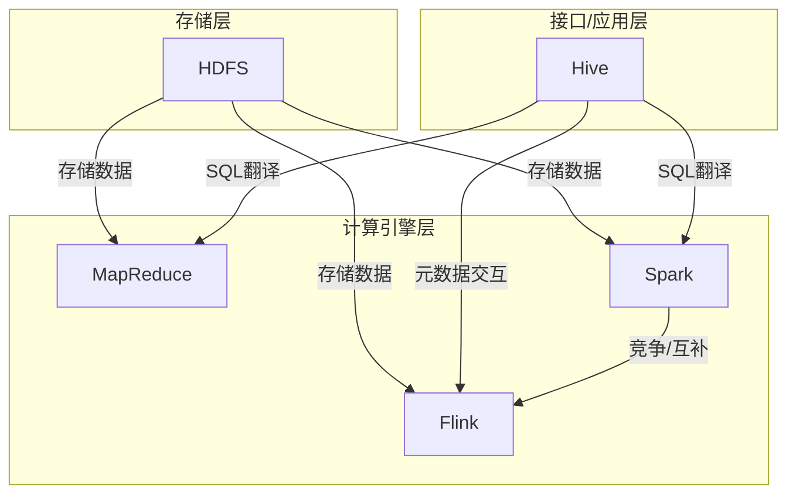
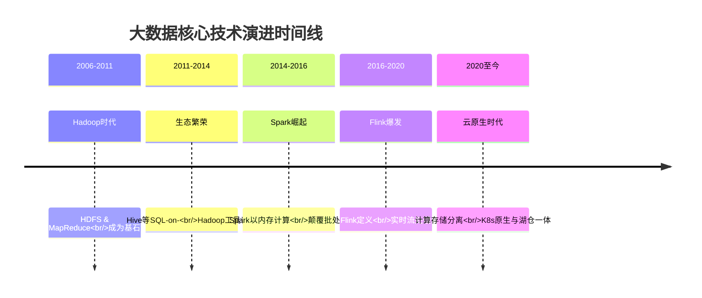
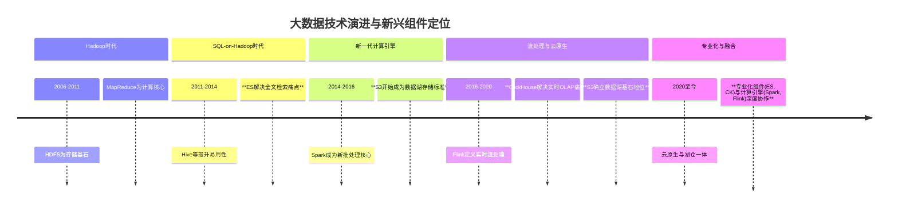
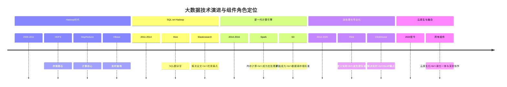
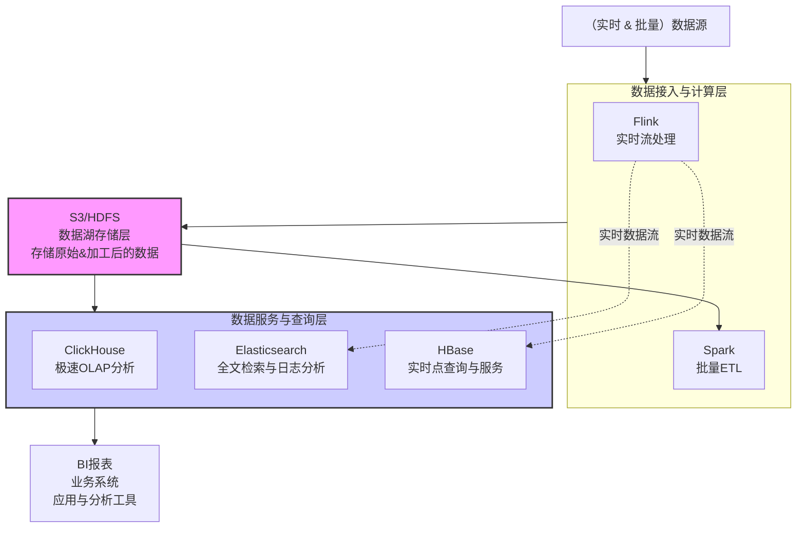
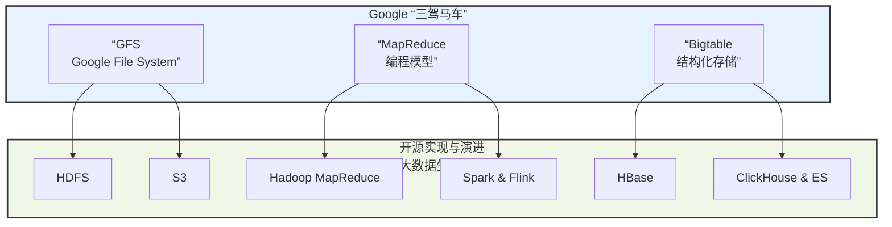

## Hadoop 、 HDFS 、 Hive 、 Spark 、 Flink 等有关系吗？如果有，有什么关系？

当然有关系！这些技术都属于大数据生态系统中的核心组成部分，它们之间有着非常紧密的演化、互补和协作关系。

简单来说，可以把它们的关系理解为一个**数据处理栈的演进过程**：

*   **HDFS** 是地基，负责存储海量数据。
*   **Hadoop MapReduce** 是第一个在这个地基上盖起来的“厂房”，负责批量处理数据，但效率较低。
*   **Hive** 是给这个厂房安装了一个“语音控制接口”（SQL），让不熟悉Java编程的人也能使用这个厂房。
*   **Spark** 是盖在旁边的一个更现代化、更快的“综合加工厂”，能进行批量、交互式甚至流式处理。
*   **Flink** 是另一个以“实时流水线”为设计初衷的先进工厂，尤其在流处理方面性能卓越。

下面我们来详细拆解它们各自的作用和关系。

### 1. 核心角色与定位

| 技术名称             | 核心定位                       | 类比                                                                     |
| :------------------- | :----------------------------- | :----------------------------------------------------------------------- |
| **HDFS**             | **分布式存储系统**             | 一个巨大的、可扩展的“硬盘”，用于存储海量数据。                           |
| **Hadoop MapReduce** | **分布式计算框架（批处理）**   | 第一代大规模数据批量处理的计算引擎。                                     |
| **Hive**             | **数据仓库工具**               | 一个将SQL转换为MapReduce/Spark/Tez任务的翻译器。                         |
| **Spark**            | **统一的分布式计算引擎**       | 一个更快、更通用的计算引擎，支持批处理、交互查询、流处理、机器学习。     |
| **Flink**            | **流处理优先的分布式计算引擎** | 一个以流处理为核心设计的计算引擎，同样支持批处理，特点是低延迟和高吞吐。 |

---

### 2. 演进与协作关系

#### **第一阶段：Hadoop 时代（以 HDFS + MapReduce 为核心）**

1.  **HDFS** 解决了海量数据“存不下”的问题。它将大文件切块，分散存储在廉价的服务器上，并提供冗余备份，实现了高可靠。
2.  **Hadoop MapReduce** 解决了海量数据“算不动”的问题。它提供了“分而治之”的编程模型，将计算任务分发到数据所在的各个服务器上进行并行处理，最后汇总结果。
3.  **此时的协作关系：**
    *   用户的数据存储在 **HDFS** 上。
    *   用户编写 **MapReduce** 程序来处理 **HDFS** 上的数据。

#### **第二阶段：Hive 的出现（提升易用性）**

*   **问题：** 编写 MapReduce 程序非常复杂，需要Java功底，学习成本高，对于数据分析师和SQL用户不友好。
*   **Hive 的解决方案：** Hive 定义了一种类似SQL的查询语言（HiveQL）。用户只需要写SQL，**Hive** 会将其“翻译”成底层的 **MapReduce** 任务来执行。
*   **此时的协作关系：**
    *   数据仍在 **HDFS**。
    *   **Hive** 作为接口，将SQL翻译成 **MapReduce** 任务。
    *   **MapReduce** 作为执行引擎，处理数据。

#### **第三阶段：Spark 的时代（提升计算速度）**

*   **问题：** MapReduce 的每个步骤（Map/Reduce）都需要读写磁盘，速度很慢，尤其是在迭代式计算（如机器学习）中性能很差。
*   **Spark 的解决方案：** Spark 引入了**内存计算** 和**有向无环图** 优化。它可以将中间结果缓存到内存中，极大减少了磁盘I/O，因此速度比 MapReduce 快10到100倍。
*   **协作关系的改变：**
    *   数据可以仍然来自 **HDFS**（Spark也支持多种数据源）。
    *   **Hive** 可以不再依赖 MapReduce，而是集成 **Spark** 作为其执行引擎（Hive on Spark），这样Hive的SQL查询就会跑在更快的Spark引擎上。
    *   Spark 本身也提供了类似Hive的SQL接口（Spark SQL），用户可以直接用Spark进行SQL查询。

#### **第四阶段：Flink 的崛起（流处理的深化）**

*   **问题：** 早期的Spark Streaming是“微批处理”，即把流数据切成一小批一小批来处理，这带来了延迟（通常秒级）。而真正的实时业务需要毫秒级的延迟。
*   **Flink 的解决方案：** Flink 是**真正的流处理引擎**，它采用“流是本质，批是特例”的设计哲学。它逐条处理数据，实现了极低的延迟和高吞吐。同时，它的批处理能力也非常强大。
*   **协作关系：**
    *   数据源可以是 **HDFS**（用于有界数据/批处理），也可以是Kafka等消息队列（用于无界数据/流处理）。
    *   Flink 与 Hive 也进行了集成（如 Flink Hive Catalog），可以读写Hive的元数据，实现流批一体的数据分析。
    *   Flink 和 Spark 现在是**竞争与合作并存**的关系，它们都是新一代通用计算引擎，但在设计理念和侧重点上有所不同。

---

### 总结与关系图

**核心关系总结：**

1.  **HDFS 是基石**：绝大多数情况下，它是这些计算引擎共同的数据存储底座。
2.  **Hive 是接口/翻译官**：它主要提供SQL接口，可以对接不同的计算引擎（MapReduce, Spark, Tez）。
3.  **MapReduce、Spark、Flink 是计算引擎**：它们是真正“干活”的，负责执行具体的计算任务。它们是演化和竞争的关系。
    *   **MapReduce -> Spark**：从慢到快，从只支持批处理到支持多种计算范式。
    *   **Spark -> Flink**：在流处理领域，从“微批”到“真流”，延迟进一步降低。

**关系示意图：**

**今天的选择：**

在现代大数据架构中：
*   **HDFS** 依然是重要的数据湖存储方案。
*   **Hadoop MapReduce** 已基本被 Spark 或 Flink 取代，很少在新项目中使用。
*   **Hive** 主要用于构建离线数据仓库，进行传统的ETL和批处理报表，现在多运行在 **Spark** 或 **Tez** 引擎上。
*   **Spark** 由于其生态成熟和一站式解决方案（Spark SQL, Structured Streaming, MLlib, GraphX），在批处理、交互式查询和机器学习领域占据主导地位。
*   **Flink** 在需要超低延迟、高一致性的实时流处理场景（如实时风控、实时推荐、CEP）中是事实上的标准，并且其批流一体的架构也越来越受欢迎。

## 你说的几个阶段，大概是从哪一年到哪一年？

好的，这是一个非常棒的问题。给这些发展阶段划定具体年份可以帮助我们更好地理解大数据技术的演进脉络。

需要强调的是，这些时间段**不是严格割裂的**，而是存在大量的重叠和过渡期。一个新技术的诞生和成熟，到被广泛采纳，需要时间。以下是基于主要版本发布和行业共识的一个大致时间线划分：

### 第一阶段：Hadoop 的诞生与奠定基石 (2006 - 2011年)

*   **起点标志：**
    *   **2006年**：Hadoop 从 Lucene 的子项目 Nutch 中分离出来，成为 Apache 的顶级项目。这标志着 Hadoop 正式登上了历史舞台。
    *   **HDFS** 和 **MapReduce** 作为 Hadoop 的核心组件，也随之成型。
*   **阶段特征：** 这个阶段是“青铜时代”。只有少数互联网巨头（如 Yahoo!, Facebook）在使用和贡献 Hadoop，社区初步形成。使用门槛极高，需要编写复杂的 MapReduce 程序。
*   **结束标志：** 围绕 Hadoop 的核心生态开始出现，为下一阶段的爆发做准备。

### 第二阶段：SQL-on-Hadoop 与生态繁荣 (2011 - 2014年)

*   **起点标志：**
    *   **2011年**左右，**Hive** 开始变得成熟和流行（虽然它早在2008年就已诞生）。它极大地降低了大数据的的使用门槛。
    *   同期，**HBase** (2008), **Pig** (2008) 等生态项目也日益成熟。
*   **阶段特征：** 这是“铁器时代”。大数据技术开始从互联网巨头走向更多的中型科技公司。**“Hadoop” 这个词从一个指代 MapReduce 的计算框架，扩展成了以 HDFS 为存储的整个生态圈**。数据的价值被广泛认识，但批处理是绝对的主流。
*   **结束标志：** 人们开始深刻认识到 MapReduce 的性能瓶颈，新一代计算引擎开始孕育和初步发布。

### 第三阶段：Spark 的崛起与内存计算 (2014 - 2016年)

*   **起点标志：**
    *   **2014年**，Spark 成为了 Apache 的顶级项目，并发布了具有里程碑意义的 **1.0 版本**。其“内存计算”的理念和卓越的性能引起了巨大轰动。
    *   Spark 提出了“**一站式**”解决批处理、交互式查询、流处理和机器学习的愿景。
*   **阶段特征：** 这是“蒸汽时代”。Spark 以其碾压性的性能优势，迅速成为批处理领域的新王。大量公司开始从 MapReduce 迁移到 Spark。Hive 也积极适配，推出了 `Hive on Spark` 的模式。
*   **结束标志：** Spark 在批处理和微批流处理上取得了巨大成功，但人们对“真正的”实时流处理有了更高的追求，为 Flink 的爆发留下了空间。

### 第四阶段：Flink 的爆发与流批一体 (2016年 - 2020年)

*   **起点标志：**
    *   **2015-2016年**，Flink 作为 Apache 顶级项目开始受到关注，其“**真正的流处理**”和“**流批一体**”的架构理念吸引了早期使用者。
    *   **2019年**，**Apache Flink 1.9** 版本的发布是一个重要节点，它大大增强了与 Hive 生态的集成，标志着其走向成熟。
*   **阶段特征：** 这是“电气时代”。实时计算的需求大爆发（如实时风控、实时推荐、实时监控）。Flink 凭借其在流处理上的天然优势（低延迟、高吞吐、精确一次状态一致性）迅速占领了实时计算领域。同时，Spark 的 `Structured Streaming` 也在持续改进，与 Flink 形成了激烈的竞争和并存的局面。

### 第五阶段：云原生与平台融合 (2020年 - 至今)

*   **起点标志：** 云计算成为绝对主流，**Kubernetes** 成为云原生操作系统的标准。
*   **阶段特征：** 这是“数字化时代”。技术的焦点从单一组件的性能，转向了如何在云上更高效、更弹性、更低成本地运行整个数据平台。
    *   **计算与存储分离**：HDFS 不再是唯一选择，计算引擎（Spark, Flink）可以直接读写云存储（如 S3, OSS）。
    *   **Kubernetes 原生**：Spark 和 Flink 都积极支持原生在 K8s 上运行，告别了对 YARN 的强依赖。
    *   **湖仓一体与流式数仓**：Hive、Spark、Flink 都在向这个方向演进，界限变得模糊。例如，**Flink** 和 **Spark Structured Streaming** 都在致力于实现流批一体的数据处理体验。

---

### 时间线总结图

为了更直观地展示这个演进过程，可以参考下面的时间线图：

这个演进过程完美地体现了技术发展的驱动力：**不断追求更高的性能、更低的延迟、更低的成本以及更便捷的使用体验**。

## HBase 与这些概念又是什么关系？在这些发展阶段中处于哪个阶段、担任什么角色？

HBase与Hadoop、HDFS、Hive、Spark、Flink这些技术同属大数据生态系统，但扮演着非常独特的角色。简单来说，如果说HDFS是提供了分布式的“硬盘”，那么HBase就是构建在这个硬盘之上，能够提供**海量数据随机读写**能力的“分布式数据库”。

为了让你快速把握HBase在整个大数据发展历程中的位置，下面这个表格梳理了它在不同阶段的角色和与其他组件的关系。

| **发展阶段**                | **大致时间**  | **HBase的角色与定位**                                                                                              | **与同期组件的关系**                                                                                                                                     |
| :-------------------------- | :------------ | :----------------------------------------------------------------------------------------------------------------- | :------------------------------------------------------------------------------------------------------------------------------------------------------- |
| **Hadoop时代**              | 约2006-2011年 | **Hadoop生态的实时查询解决方案**，弥补HDFS只能批量处理的不足，提供对海量数据的随机、实时访问能力。                 | ✅ **依赖HDFS**作为其底层的文件存储系统。 ✅ 与**MapReduce**可以协同工作，用于批量分析HBase中的数据。                                                  |
| **SQL-on-Hadoop与生态繁荣** | 约2011-2014年 | **大规模NoSQL数据库**，成为实时数据存储层，支持实时读写和随机访问。                                                | ✅ **Hive**适用于离线数据的批处理，而**HBase**适用于实时数据的处理。 ✅ 为**Spark**等新一代计算引擎提供实时数据源。                                    |
| **新一代计算引擎崛起**      | 约2014年至今  | **实时数据存储的核心**，与Spark、Flink等深度整合，形成“**HBase负责存储，Spark/Flink负责计算**”的流批一体架构。     | ✅ **Spark**可以通过SQL或API直接高效读取HBase数据，进行复杂分析或机器学习。 ✅ **Flink**在实时处理中，可将处理结果写入HBase，或利用HBase进行状态查询。 |
| **云原生时代**              | 约2020年至今  | **云原生化的分布式数据库**。通过容器化技术（如Kubernetes）部署，获得更好的资源弹性、运维自动化和更高的资源利用率。 | ✅ 与整个Hadoop生态解耦，计算与存储分离，可以更独立地与各类计算框架结合。                                                                                 |

### 🔗 HBase与其他组件的关系

- **与HDFS的关系**：HBase**依赖HDFS**作为其底层存储。它把数据文件（HFile）存储在HDFS上，从而获得了HDFS的高可靠性和可扩展性。二者的核心区别在于，HDFS擅长顺序访问和批量处理，而HBase专精于随机访问和实时操作。

- **与Hive的关系**：Hive和HBase是互补关系。Hive是数据仓库工具，用于对存储在HDFS（或HBase）中的静态数据进行复杂的批量SQL查询。而HBase是数据库，擅长处理高速涌入的实时数据更新和点查询。有时也会将HBase的表映射到Hive中，用Hive的SQL来查询HBase数据。

- **与Spark/Flink的关系**：HBase与它们是**紧密协作的伙伴关系**。作为高性能的分布式数据库，HBase非常适合充当Spark和Flink在流批一体架构中的**数据源或结果表**。例如，实时数据流经Flink处理后被存入HBase，随后Spark任务再读取HBase中的数据进行分析或模型训练。

希望这份梳理能帮你清晰地定位HBase在大数据生态系统中的坐标。如果你对HBase与某个特定组件（比如Spark）的合作细节特别感兴趣，我们可以继续深入探讨。

## ClickHouse 、 ElasticSearch 、 S3 等工具，与这些组件又有什么关系？在这些发展阶段中又担任什么角色？

当然可以。ClickHouse、Elasticsearch和S3同样是现代数据架构中至关重要的组件，它们与Hadoop生态既有竞争也有协作，共同构成了一个更加多元和专业的“后Hadoop”时代技术栈。

简单来说：
*   **S3** 是新时代的“数据湖基石”，取代了HDFS在很多场景下的位置。
*   **Elasticsearch** 是“专精日志搜索与分析的引擎”，解决了Hadoop生态不擅长的快速全文检索和可视化问题。
*   **ClickHouse** 是“极速OLAP分析数据库”，在交互式即席查询场景下，性能远超Hive和Spark SQL。

下面我们详细拆解它们的关系和角色演变。

### 核心角色与定位

| 技术名称          | 核心定位                   | 类比                                                                                   |
| :---------------- | :------------------------- | :------------------------------------------------------------------------------------- |
| **Amazon S3**     | **对象存储服务**           | 一个无限扩展的、云上的“超级硬盘”，成本低，持久性高。**计算与存储分离**架构的基石。     |
| **Elasticsearch** | **分布式搜索与分析引擎**   | 一个专为**全文检索**、日志处理和复杂聚合分析优化的NoSQL数据库。通常与Kibana组成ELK栈。 |
| **ClickHouse**    | **联机分析处理列式数据库** | 一个为**大规模数据分析**而生的数据库，查询速度极快，特别适合即席查询和固定报表。       |

---

### 演进阶段与角色担当

为了更直观地理解它们在技术演进中的位置，我们可以通过下图来观察：

#### **1. 与 Hadoop 生态组件的关系**

*   **S3 与 HDFS：竞争与演进关系**
    *   **HDFS** 是本地部署的、需要自己维护的分布式存储。
    *   **S3** 是云上的、托管的、无限扩展的对象存储。
    *   **关系**：S3 的出现，使得“**存算分离**”架构成为可能。计算集群（如Spark、Flink、Presto）可以在需要时启动，直接读取S3上的数据，用完即销毁，极大地降低了成本和运维复杂度。在今天，**S3 已经成为数据湖的事实标准存储**，在很多场景下取代了HDFS。

*   **Elasticsearch 与 HBase/Solr：竞争与替代关系**
    *   **HBase** 擅长随机键值查询，但**不擅长**全文检索和多维聚合分析。
    *   **Elasticsearch** 正是为了解决全文检索痛点而诞生。它底层基于Lucene，提供了强大的文本分析和查询能力。
    *   **关系**：在日志分析、产品搜索等场景，Elasticsearch 基本上是**HBase + Solr** 组合的更强力替代品。数据可以通过Logstash或Spark等工具从HDFS/Kafka导入ES。

*   **ClickHouse 与 Hive/Spark SQL：竞争与互补关系**
    *   **Hive/Spark SQL** 是通用的SQL查询引擎，功能强大，但面对海量数据的交互式查询时，响应速度可能达到分钟级。
    *   **ClickHouse** 是专为OLAP设计的数据库，通过列式存储、向量化执行引擎等极致优化，**查询速度比Hive/Spark SQL快10到100倍以上**。
    *   **关系**：在需要亚秒级响应的即席查询和固定报表场景，ClickHouse 是对Hive/Spark SQL的强有力的**替代**。但它们也常**协作**，即用Spark进行复杂的数据清洗和ETL，将结果集导入ClickHouse供业务人员快速查询。

#### **2. 与 Spark/Flink 的关系**

*   **Spark/Flink 与 所有存储/数据库**：**生产者与消费者的协作关系**。
    *   **Spark/Flink** 作为强大的**数据处理引擎**，可以轻松地**读写** S3、Elasticsearch、ClickHouse 和 HBase。
    *   **典型数据流**：
        1.  **数据入湖**：Spark/Flink 从Kafka等消息队列消费原始数据，进行清洗和转换，然后将**原始数据存入S3**（构建数据湖）。
        2.  **数据加工与分发**：Spark/Flink 读取S3上的数据，进行进一步的ETL。
        3.  **结果写入**：将处理后的结果：
            *   写入 **Elasticsearch**，用于日志查询或产品搜索。
            *   写入 **ClickHouse**，用于制作实时BI报表。
            *   写入 **HBase**，用于在线业务按Key查询。

---

### 总结：现代数据架构中的分工

我们可以将这些组件在一个典型的现代数据平台中进行分工：

1.  **数据湖存储层 (S3/HDFS)**：存放所有原始数据，成本低廉，格式多样。**S3是云上的首选**。
2.  **数据计算与处理层 (Spark/Flink)**：负责繁重的数据清洗、转换、特征计算等ETL工作。它们是数据流动的“心脏”。
3.  **专业数据服务层 (ClickHouse/Elasticsearch/HBase)**：承接计算层处理好的结果，为特定业务场景提供**优化的查询服务**。
    *   **ClickHouse**：服务于需要**极快速度**的**多维分析**和报表。
    *   **Elasticsearch**：服务于**全文检索**、日志查询和复杂的指标聚合。
    *   **HBase**：服务于在线业务的**随机键值查询**。

总而言之，ClickHouse、Elasticsearch和S3的出现，标志着大数据技术从Hadoop生态的“大一统”框架，向更加**专业化、云原生化、解耦合**的架构演进。它们与Spark/Flink等计算引擎一起，共同构建了更高效、更灵活、更强大的现代数据平台。

## 重新整理

> [!query]
> 重新整理上面提到的 Hadoop 、 HDFS 、HBase、 Hive 、 MapReduce、 Spark 、 Flink 、ClickHouse 、 ElasticSearch 、 S3 等工具的作用以及之间的关系。并重新整理各阶段中各工具的角色，与演进与协作关系。多用表格与 Mermaid 图表。

好的，我们来对您提到的大数据生态系统核心组件进行一次全面的梳理和整合，清晰地展示它们的作用、关系与发展脉络。

### 1. 核心组件作用与定位一览

下表是所有组件的核心定位与作用的总结，是理解它们之间关系的基础。

| 组件              | 核心定位             | 核心作用与描述                                                                                     |
| :---------------- | :------------------- | :------------------------------------------------------------------------------------------------- |
| **HDFS**          | 分布式文件系统       | 大数据生态的**存储基石**。将文件分块存储在廉价服务器上，提供高容错、高吞吐的数据存储能力。         |
| **S3**            | 对象存储             | 云上的**数据湖存储基石**。实现**存算分离**，具有无限扩展、高持久性和低成本的特点。                 |
| **MapReduce**     | 分布式计算框架       | 第一代大数据**批处理计算模型**。将计算任务分而治之，但中间结果写磁盘，速度慢。                     |
| **Spark**         | 统一分布式计算引擎   | 基于内存计算的**高速计算引擎**。支持批处理、流处理、交互式查询和机器学习，是**批处理领域的王者**。 |
| **Flink**         | 流处理优先的计算引擎 | **真正的流处理引擎**。提供低延迟、高吞吐、 Exactly-once 语义的流处理，是**流处理领域的标杆**。     |
| **Hive**          | 数据仓库工具         | **SQL-on-Hadoop 的翻译官**。将SQL转换为MapReduce/Spark等任务，降低大数据的使用门槛。               |
| **HBase**         | 分布式NoSQL数据库    | 基于HDFS的**实时读写数据库**。提供海量数据的随机、实时访问能力，弥补HDFS只能批处理的不足。         |
| **ClickHouse**    | OLAP分析型数据库     | **极速的交互式查询引擎**。专为大规模OLAP设计，列式存储与向量化引擎使其查询速度极快。               |
| **Elasticsearch** | 搜索与分析引擎       | **全文检索与日志分析专家**。专为全文搜索、复杂聚合和可视化分析优化，常与Kibana组成ELK栈。          |

---

### 2. 发展阶段与角色演进

大数据技术的发展并非一蹴而就，而是围绕“**如何更高效、更便捷、更低成本地存储和处理数据**”这一核心命题不断演进。下图清晰地展示了各组件在不同发展阶段中的兴起与定位：

**阶段解读：**

*   **Hadoop时代**：解决了“存不下”和“算不动”的基本问题，但难用。
*   **SQL-on-Hadoop**：解决了“易用性”问题，让SQL用户也能玩转大数据。
*   **新一代计算引擎**：解决了“计算速度”问题，Spark取代MapReduce。
*   **流处理与专业化**：解决了“实时性”和“专业化场景”问题，Flink定义了流处理，CK和ES等专业引擎解决特定场景瓶颈。
*   **云原生与融合**：解决“弹性、成本与融合”问题，所有组件向云原生演进，相互协作构成现代数据架构。

---

### 3. 协作关系与数据流

在现代数据架构中，这些组件并非孤立存在，而是相互协作，形成一个完整的数据流水线。下图展示了一个典型的现代数据平台中，这些组件是如何协同工作的：

**架构解读：**

1.  **数据湖存储层 (S3/HDFS)**：是整个数据平台的**基石**，所有原始数据和加工后的数据都存储于此。S3因其云原生和存算分离优势，成为现代数据湖的首选。
2.  **数据计算与处理层 (Spark/Flink)**：是数据流动的**心脏**。
    *   **Spark** 主要用于**批量ETL**，处理S3/HDFS中的数据，清洗转换后写回存储层或直接输出到服务层。
    *   **Flink** 主要用于**实时流处理**，直接处理Kafka等消息队列的实时数据，并将结果实时写入下游的数据服务层。
3.  **数据服务与查询层 (ClickHouse/ES/HBase)**：是面向业务的**前台**。
    *   **ClickHouse**：承接Spark批处理或Flink实时处理后的数据，为BI工具和即席查询提供**亚秒级**的极速分析响应。
    *   **Elasticsearch**：接收来自Flink的实时流数据或Spark的批量日志数据，提供**全文检索**和日志关键词查询，并可通过Kibana进行可视化。
    *   **HBase**：作为**在线数据库**，存储需要随机访问的明细数据，如用户画像、交易记录等，供业务系统实时查询。

通过这样的梳理，我们可以看到，大数据技术从Hadoop一体化的“根”，生长出了**存储、计算、服务**各司其职又紧密协作的“繁茂枝叶”，共同支撑起现代企业的数据驱动业务。

## 三驾马车与这些工具之间又是什么关系？

这是一个非常深刻的问题，它触及了整个大数据领域发展的“根”。“三驾马车”与这些工具之间是 **“理论蓝图”与“工程实现”** 的关系。

“三驾马车”指的是Google在2003年至2006年间发表的三篇奠基性论文，它们为现代大数据技术提供了核心的理论模型和设计思想。

1.  **《The Google File System》 (2003)** - 分布式存储的蓝图
2.  **《MapReduce: Simplified Data Processing on Large Clusters》 (2004)** - 分布式计算的蓝图
3.  **《Bigtable: A Distributed Storage System for Structured Data》 (2006)** - 分布式数据库的蓝图

下面我们通过图表和表格来详细阐述这种关系。

### 1. 理论蓝图与工程实现的对应关系

“三驾马车”的理论直接催生了Hadoop生态的早期核心组件，并影响了后续无数技术的发展。

**具体关系解读：**

| Google理论    | 核心思想                                                                            | 直接开源实现         | 思想演进与影响                                                                                                                                   |
| :------------ | :---------------------------------------------------------------------------------- | :------------------- | :----------------------------------------------------------------------------------------------------------------------------------------------- |
| **GFS**       | 将大文件分块，存储在多台廉价机器上，通过副本实现容错。                              | **HDFS**             | **S3** 继承了其“分布式存储”的思想，但将其发展为更通用、解耦的**对象存储**服务。                                                                  |
| **MapReduce** | 将计算任务拆分为 `Map` 和 `Reduce` 两个阶段，移动计算而非移动数据，并行处理。       | **Hadoop MapReduce** | **Spark** 和 **Flink** 继承了其“移动计算”和分而治之的思想，但通过内存计算、DAG优化等机制**超越了MR模型**，实现了更高的性能和更丰富的计算范式。   |
| **Bigtable**  | 构建在GFS之上的、面向列的、可扩展的分布式数据库，用于支持海量结构化数据的随机读写。 | **HBase**            | **ClickHouse** 继承了其**列式存储**的思想并极致优化用于分析。**Elasticsearch** 的倒排索引可以看作是一种特殊的列式存储。Cassandra等也深受其影响。 |

---

### 2. 发展阶段中的角色：从“实现”到“超越”

在整个技术演进史中，这些工具的角色正是从“对蓝图的实现”逐步走向“对蓝图的超越和扩展”。

| 发展阶段                                | 与“三驾马车”的关系               | 典型工具的角色                                                                                                                                                                                                      |
| :-------------------------------------- | :------------------------------- | :------------------------------------------------------------------------------------------------------------------------------------------------------------------------------------------------------------------ |
| **Hadoop时代 (2006-2011)**              | **开源实现落地**                 | **HDFS** 是 GFS 的开源实现。 **Hadoop MapReduce** 是 MapReduce 论文的开源实现。 **HBase** 是 Bigtable 的开源实现。 此时，生态紧密围绕这三篇论文构建。                                                   |
| **SQL-on-Hadoop与生态繁荣 (2011-2014)** | **提升易用性，但未脱离核心模型** | **Hive** 是在 MapReduce 模型之上套了一层SQL外壳，让用户无需直接编写MR代码，但底层执行引擎仍是MR。                                                                                                                   |
| **新一代计算引擎崛起 (2014-2016)**      | **挑战与超越**                   | **Spark** 提出**弹性分布式数据集（RDD）** 模型，通过内存计算和DAG优化，**超越了MapReduce模型的性能瓶颈**，但依然遵循“移动计算”的核心思想。                                                                          |
| **流处理与专业化 (2016-2020)**          | **模型革新与专业化**             | **Flink** 提出了**以流为核心**的计算模型，认为批是流的特例，这完全**颠覆了MapReduce的批处理优先**模型。 **ClickHouse, ES** 等则是在**Bigtable的列式思想**上，为了特定场景（OLAP、搜索）进行了极致的专业化发展。 |
| **云原生时代 (2020至今)**               | **架构解耦与思想融合**           | **S3** 作为存储层，实现了与GFS/HDFS“存算一体”架构的**解耦**，标志着**存算分离**成为新范式。 所有组件都在云上协作，**“三驾马车”的思想被融会贯通**，不再是僵化的固定组合。                                        |

### 总结

- **“三驾马车”是“道”**：它们提供了解决海量数据问题的根本性思想和理论模型（分而治之、移动计算、列式存储）。
- **Hadoop/Spark等工具是“术”**：它们是这些思想在工程上的具体实践和实现。
- **演进过程是“螺旋上升”**：技术发展始于对蓝图的模仿（Hadoop），然后在实践中发现其不足，进而提出新的、更优的模型（Spark的内存计算、Flink的流优先）来超越它，最终形成今天百花齐放、各专所长的局面。

因此，不理解“三驾马车”，就很难理解为什么大数据生态会是今天这个样子；而只理解“三驾马车”，不了解后续的演进，就无法把握当今大数据技术发展的最前沿。

