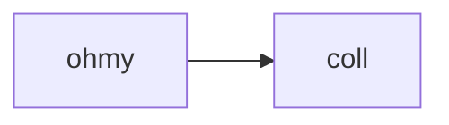

## 使用 hexo 搭建博客

最近使用 hexo 搭建了一个博客，并打算挂载在 github page 上。
对之前的那个博客进行替代，并将之前的文章逐渐搬移过来。

使用的[这个主题](https://github.com/Yue-plus/hexo-theme-arknights)功能还是比较完善的。

我们可以尝试一下代码块高亮：

```python
def func_echo(s: str):
    print(s)


class HelloPrinter:
    printer: Callable[[str]]

    def __init__(self, printer: Callable[[str]]):
        self.printer = printer
    
    def call(self, s: str):
        self.printer(s)


p = HelloPrinter(func_echo)
p.call("hello world!")
```

试试下标语法吧：

这是一句话。[^sub]

没想到还支持下标语法，还是比较惊艳的。

来几句 mermaid 吧



原本是不能渲染的， 这个主题渲染代码块时把 mermaid 代码当作普通代码，往里面里插换行符号了。
使用了 hexo-filter-mermaid-diagrams 插件，添加 mermaid 过滤器，解决问题。


来几句 LaTeX:

$$
\begin{aligned}
f(x) &= \sum_{i=2}^{\infty}{\Join} \\
&= \sum_{i=2}^{\infty}{\frac{1}{i}}
\end{aligned}
$$

原本是不能渲染的，因为与 hexo 的渲染器有冲突，需要转义。
我因为需要从以前的博客把文章转移过来觉得比较麻烦...
于是魔改了一下主题，用上 mathjax 插件，能渲染了，感觉挺不错的。
再改善一下推个 PR 吧。


[^sub]: 这是脚注