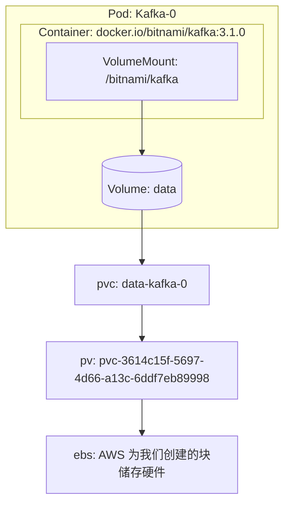

我们之前说的都是用于部署 Pod 的资源，我们接下来介绍与创建 Pod 不相关的资源：储存与网络。

# 储存

其实我们之前已经接触过储存相关的内容了：在讲 Stateful Set 时我们提过 Stateful Set 创建出来的 Pod 都会有相互独立的储存；而讲 Daemon Set 时我们提到 K8s 推荐只在 Daemon Set 的 Pod 中访问宿主机磁盘。但独立的储存具体指什么？除了访问宿主机磁盘以外还有什么其他的储存？

在 Docker 中，我们可以把宿主机磁盘上的一个路径作为一个 Volume 来给容器绑定，或者直接使用 Docker Engine 管理的 Volume 来提供持久化存储或是容器间共享文件。在 K8s 里面也沿用了 Volume 这个概念，可以通过 Mount 绑定到容器内的路径，并通过实现 CSI 的各种引擎来提供更多样的存储。

> CSI: Container Storage Interface ，容器储存接口标准，是 K8s 提出的一种规范。不管是哪种储存引擎，只要编写一个对应的插件实现 CSI ，都可以在 K8s 中使用。

### K8s 中使用 Volume 与可用的 Volume 类型

其实 K8s 中使用 Volume 的例子我们一开始就已经接触过了。还记得一开始介绍 Pod 时的 Nginx 例子吗？

```yaml
metadata:
  name: simple-webapp
spec:
  containers:
    - name: main-application
      image: nginx
      volumeMounts:
        - name: shared-logs
          mountPath: /var/log/nginx
    - name: sidecar-container
      image: busybox
      command: ["sh","-c","while true; do cat /var/log/nginx/access.log; sleep 30; done"]
      volumeMounts:
        - name: shared-logs
          mountPath: /var/log/nginx
  volumes:
    - name: shared-logs
      emptyDir: {}
```

这个 Pod 描述中声明了一个种类为 `emptyDir` 的，名为 `shared-logs` 的 Volume ，然后 Pod 中的两个容器都分别 Mount 了这个 Volume 。

K8s 中默认提供了几种 Volume ，比如：

- emptyDir ：一个简单的空目录，一般用于储存临时数据或是 Pod 的容器之间共享数据。
- hostPath ：绑定到节点宿主机文件系统上的路径，一般在 Daemon Set 中使用。
- gitRepo ：这种 Volume 其实相当于 emptyDir ，不过在 Pod 启动时会从 Git 仓库 clone 一份内容作为默认数据。
- configMap 、 secret ：一般用于配置文件加载，需要与 configMap 、 secret 这两种资源一同使用。会将 configMap 、 secret 中对应的内容拷贝一份作为 Volume 绑到容器。（下一节中会展开讨论）
- nfs 、 glusterfs 、 ……：可以通过各种网络存储协议直接挂载一个网络存储
- (deprecated!) gcePersistentDisk 、 awsElasticBlockStore ……：可以调用各个云平台的 API ，创建一个块储存硬件挂载到宿主机上，再将那个硬件挂载到容器中。
- persistentVolumeClaim ：持久卷声明，用于把实际储存方式抽象化，使得 Pod 不需要关心具体的储存类型。这种类型会在下面详细介绍。

我们可以注意到， Volume 的声明是 Pod 的一个属性，而不是一种单独的资源。 Volume 是 Pod 的一部分，因此不同的 Pod 之间永远不可能共享同一个 Volume 。

> 但是 Volume 所指向的位置可以相同，比如 HostPath 类型的 Volume 就可以两个 Pod 可以绑定到宿主机上同一个路径，因此 Volume 里的数据还是能通过一定方式在 Pod 间共享。但当然 K8s 不推荐这么做。

另外，由于 Volume 是 Pod 的一部分， Volume 的生命周期也是跟随 Pod 的，当一个 Pod 被销毁时， Volume 也会被销毁，因此最主要还是用于 Pod 内容器间的文件共享。如果需要持久化储存，需要使用 Persistent Volume 。

> Volume 会被销毁不代表 Volume 指向的内容会被销毁。比如 hostPath 、 NFS 等类型 Volume 中的内容就会继续保留在宿主机或是 NAS 上。下面提到的 Presistent Volume Claim 也是，拥有 `persistentVolumeClaim` 类型 Volume 的 Pod 被删除后对应的 PVC 不一定会被删除。

### Presistent Volume 、 Presistent Volume Claim 、 Storage Class

如果需要在 Pod 声明中直接指定 NFS 、 awsElasticBlockStore 之类的信息，就需要应用的开发人员对真实可用的储存结构有所理解，违背了 K8s 的理念。因此 K8s 就弄出了小标题中的三种资源来将储存抽象化。

一个 Persistent Volume (PV) 对应云平台提供的一个块存储，或是 NAS 上的一个路径。可以简单地理解为 **PV 直接描述了一块可用的物理存储** 。因为 PV 直接对应到硬件，因此 PV 跟节点一样，是名称空间无关的。

而一个 **Persistent Volume Claim (PVC) 则是描述了怎样去使用储存** ：使用多少空间、只读还是读写等。一个 PVC 被创建后会且只会对应到一个 PV 。 PVC 从属于一个名称空间，并能被该名称空间下的 Pod 指定为一个 Volume 。

PV 与 PVC 这两种抽象是很必要的。试想一下用自己的物理机搭建一个 K8s 集群的场景。你会提前给物理机插上许多个储存硬件，这时你就需要用 PV 来描述这些硬件，之后才能在 K8s 里利用这些硬件的储存。而实际将应用部署到 K8s 中时，你才需要用 PVC 来描述 Pod 中需要怎么样的储存卷，然后 K8s 就会自动挑一个合适 PV 给这个 PVC 绑定上。这样实际部署应用的时候就不用再特意跑去机房给物理机插硬件了。

但是现在都云原生时代了，各供应商都有提供 API 可以直接创建一个块储存，还要想办法提前准备 PV 实在是太蠢了。于是便需要 Storage Class 这种资源。

使用 Storage Class 前需要先安装各种云供应商提供的插件（当然使用云服务提供的 K8s 的话一般已经准备好了），然后再创建一个 Storage Class 类型的资源（当然一般也已经准备好了）。下面是 AWS 上的 EKS 服务中默认自带的 Storage Class ：

```yaml
apiVersion: storage.k8s.io/v1
kind: StorageClass
metadata:
  annotations:
    storageclass.kubernetes.io/is-default-class: "true"
  name: gp2
provisioner: kubernetes.io/aws-ebs
parameters:
  fsType: ext4
  type: gp2
# 当 PVC 被删除时会同时删除 PV
reclaimPolicy: Delete
# 只有当 PVC 被绑定为一个 Pod 的 Volume 时才会创建一个 PV
volumeBindingMode: WaitForFirstConsumer
```

可以看到 EKS 自带的 gp2 提供了一些默认的选项，我们也可以类似地去定义自己的 Storage Class 。有了 gp2 这个 Storage Class ，我们创建一个 PVC 后 K8s 就会调用 AWS 的 API ，创建一个块储存接到我们的节点上，然后 K8s 再自动创建一个 PV 并绑定到 PVC 上。

例如，我们部署 Kafka 时会创建一个这样的 PVC ：

```yaml
apiVersion: v1
kind: PersistentVolumeClaim
metadata:
  name: data-kafka-0
spec:
  accessModes:
  - ReadWriteOnce
  resources:
    requests:
      storage: 10Gi
  storageClassName: gp2
```

K8s 就会自动为我们创建出一个对应的 PV ：

```sh
# `pvc-` 开头这个是 AWS 自动给我们起的名字。它虽然是 `pvc-` 开头，但他其实是一个 PV 。
NAME                                       CAPACITY   ACCESS MODES   RECLAIM POLICY   STATUS   CLAIM                STORAGECLASS   REASON   AGE
pvc-3614c15f-5697-4d66-a13c-6ddf7eb89998   10Gi       RWO            Delete           Bound    kafka/data-kafka-0   gp2                     152d
```

要是打开 AWS Console 还会发现， K8s 调用了 AWS 的 API ，自动为我们创建了一个 EBS 块储存并绑定到了我们对应的宿主机上。

可以用下面这张图来表示 Pod 中的 Volume 、 PVC 、 PV 之间的关系：



而 Storage Class 在上图中则负责读取我们提交的 PVC ，然后创建 PV 与 EBS 。

### 再说回 Stateful Set

之前我们提到 Stateful Set 时说到 Stateful Set 创建的 Pod 拥有固定的储存，到底是什么意思呢？跟 Deployment 的储存又有什么区别呢？

我们先来看看，如果要给 Deployment 创建出来的 Pod 挂载 PVC 需要怎么做。下面是一个部署 Nginx 的 Deployment 清单，其中 html 目录下的静态文件存放在 NFS 里，通过 PVC 挂载到 Pod 中：

```yaml
# 这里省略了 Service 相关的内容
---
apiVersion: apps/v1
kind: Deployment
metadata:
  name: nginx-dpl-with-nfs-pvc
spec:
  replicas: 3
  selector:
    matchLabels:
      app: nginx
  template:
    metadata:
      labels:
        app: nginx
    spec:
      containers:
      - name: nginx
        image: nginx:alpine
        ports:
        - containerPort: 80
          name: web
        volumeMounts: #挂载容器中的目录到 pvc nfs 中的目录
        - name: www
          mountPath: /usr/share/nginx/html
      volumes:
      - name: www
        persistentVolumeClaim: #指定pvc
          claimName: nfs-pvc-for-nginx
---
apiVersion: v1
kind: PersistentVolumeClaim
metadata:
  name: nfs-pvc-for-nginx
  namespace: default
spec:
  storageclassname: "" # 指定使用现有 PV ，不使用 StorageClass 创建 PV
  accessModes:
  - ReadWriteMany
  resources:
    requests:
      storage: 1Gi
---
# 这个例子中需要挂载 NFS 上的特定路径，所以手动定义了一个 PV
# 一般情况下我们不会手动创建 PV，而是使用 StorageClass 自动创建
apiVersion: v1
kind: PersistentVolume
metadata:
  name: nfs-pv-for-nginx
spec:
  capacity: 
    storage: 1Gi
  accessModes:
  - ReadWriteMany
  persistentVolumeReclaimPolicy: Retain
  nfs:
    path: /nfs/sharefolder/nginx
    server: 81.70.4.171
```

这份清单我们主要关注前两个资源，我们可以看到除了一个 Deployment 资源以外我们还单独定义了一个 PVC 资源。然后在 Deployment 的 Pod 模板中声明并绑定了这个 PVC 。

可这样 apply 了之后会发生什么情况呢？因为我们只声明了一份 PVC ，当然我们只会拥有一个 PVC 资源。但这个 Deployment 的副本数是 3 ，因此我们会有 3 个相同的 Pod 去绑定同一个 PVC 。也就是最终会在 3 个容器里访问同一个 NFS 的同一个目录。如果我们在其中一个容器里对这个目录作修改，也会影响到另外两个容器。

> 注：这一现象不一定在任何情况下都适用。比如 AWS 的 EBS 卷只支持单个 AZ 内的绑定。如果 Pod 因为 Node Affinity 等设定被部署到了多个区，没法绑定同一个 EBS 卷，就会在 Scedule 的阶段报错。

很多时候我们都不希望多个 Pod 绑定到同一 PVC 。比如我们部署一个 DB 集群的时候，如果好不容易部署出来的多个实例居然用的是同一份储存，就会显得很呆。 Stateful Set 就是为了解决这种情况，会为其管理下的每个 Pod 都部署一个专用的 PVC 。

下面是给 Stateful Set 创建出来的 Pod 挂载 PVC 的一份清单：

```yaml
# 这里省略了 Service 相关的内容
---
apiVersion: apps/v1
kind: StatefulSet
metadata:
  name: web
spec:
  serviceName: "nginx"
  replicas: 2
  selector:
    matchLabels:
      app: nginx
  template:
    metadata:
      labels:
        app: nginx
    spec:
      containers:
      - name: nginx
        image: k8s.gcr.io/nginx-slim:0.8
        ports:
        - containerPort: 80
          name: web
        volumeMounts:
        - name: www
          mountPath: /usr/share/nginx/html
  volumeClaimTemplates:
  - metadata:
      name: www
    spec:
      accessModes: [ "ReadWriteOnce" ]
      resources:
        requests:
          storage: 1Gi
```

我们可以看到，部署 Stateful Set 时我们不能另外单独定义一份 PVC 了，只能作为 Stateful Set 定义的一部分，在 volumeClaimTemplates 字段中定义 PVC 的模板。这样一来， Stateful Set 会根据这个模板，为每个 Pod 创建一个对应的 PVC ，并作为 Pod 的 Volume 绑定上：

```bash
# Stateful Set 创建出来的 Pod ，名字都是按顺序的
$ kubectl get pods -l app=nginx
NAME      READY     STATUS    RESTARTS   AGE
web-0     1/1       Running   0          1m
web-1     1/1       Running   0          1m

# Stateful Set 创建出来的 PVC ，名字与 Pod 的名字一一对应
$ kubectl get pvc -l app=nginx
NAME        STATUS    VOLUME                                     CAPACITY   ACCESSMODES   AGE
www-web-0   Bound     pvc-15c268c7-b507-11e6-932f-42010a800002   1Gi        RWO           48s
www-web-1   Bound     pvc-15c79307-b507-11e6-932f-42010a800002   1Gi        RWO           48s
```

这样， Stateful Set 的多个 Pod 就会拥有自己的储存，不会相互打架了。另外，如果我们事先定义了 StorageClass ，还能根据 Stateful Set 的副本数动态配置 PV 。

### ConfigMap 与 Secret 挂载作为特殊的卷

有时候我们需要使用配置文件来配置应用（比如 Nginx 的配置文件），而且我们有时候会需要不重启 Pod 就热更新配置。如果用 PVC 来加载配置文件略微麻烦，这时候可以使用 Config Map 。

下面是 K8s 官网上 Config Map 的一个例子：

```yaml
apiVersion: v1
kind: ConfigMap
metadata:
  name: game-demo
data:
  # 一个 Key 可以对应一个值
  player_initial_lives: "3"
  ui_properties_file_name: "user-interface.properties"

  # 一个 Key 也可以对应一个文件的内容
  game.properties: |
    enemy.types=aliens,monsters
    player.maximum-lives=5    
  user-interface.properties: |
    color.good=purple
    color.bad=yellow
    allow.textmode=true    
---
apiVersion: v1
kind: Pod
metadata:
  name: configmap-demo-pod
spec:
  containers:
    - name: demo
      image: alpine
      command: ["sleep", "3600"]
      env:
        # ConfigMap 的 Key 可以作为环境变量引用
        - name: PLAYER_INITIAL_LIVES
          valueFrom:
            configMapKeyRef:
              name: game-demo           # 从这个 Config Map 里
              key: player_initial_lives # 拿到这个 key 的值
        - name: UI_PROPERTIES_FILE_NAME
          valueFrom:
            configMapKeyRef:
              name: game-demo
              key: ui_properties_file_name
      volumeMounts:
      - name: config
        mountPath: "/config"
        readOnly: true
  volumes:
    # 定义 Pod 的 Volume ，种类为 configMap
    - name: config
      configMap:
        name: game-demo # ConfigMap的名字
        # 需要作为文件放入 Volume 的 Key
        items:
        - key: "game.properties"
          path: "game.properties"
        - key: "user-interface.properties"
          path: "user-interface.properties"
```

我们可以看到 ConfigMap 里的 Key 可以作为文件或是环境变量加载到 Pod 中。另外，作为环境变量加载后其实还能作为命令行参数传入应用，实现各种配置方式。如果修改 Config map 的内容，也可以自动更新 Pod 中的文件。

然而， Config Map 的热更新有一些不太灵活的地方：

1. 作为环境变量加载的 Config Map 数据不会被热更新。想要更新这一部分数据需要重启 Pod。（当然，命令行参数也不能热更新）
2. 由于 Kubelet 会先将 Config Map 内容加载到本地作为缓存，因此修改 Config Map 后新的内容不会第一时间加载到 Pod 中。而且在旧版本的 K8s 中， Config Map 被更新直到缓存被刷新的时间间隔还会很长，新版本的 K8s 这一部分有了优化，可以设定刷新时间，但会导致 API Server 的负担加重。（这其实是一个 Known Issue ，被诟病多年： https://github.com/kubernetes/kubernetes/issues/22368 ）

除 Config Map 以外， K8s 还提供了一种叫 Secret 的资源，用法和 Config Map 几乎一样。对比 Config Map ，Secret 有以下几个特点：

1. 在 Pod 里， Secret 只会被加载到内存中，而永远不会被写到磁盘上。
2. 用 `kubectl get` 之类的命令显示的 Secret 内容会被用 base64 编码。（不过， well ，众所周知 base64 可不算是什么加密）
3. 可以通过 K8s 的 Service Account 等 RBAC 相关的资源来控制 Secret 的访问权限。

不过，由于 Secret 也是以明文的形式被存储在 K8s 的主节点中的，因此需要保证 K8s 主节点的安全。

> **Downward API 挂载作为特殊的卷**
> 
> 还有另外一种叫 Downward API 的东西，可以作为 Volume 或是环境变量被加载到 Pod 中。有一些参数我们很难事先在 Manifest 中定义（ e.g. Deployment 生成的 Pod 的名字），因此可以通过 Downward API 来实现。
> 
> ```yaml
> apiVersion: v1
> kind: Pod
> metadata:
>     name: test-volume-pod
>     namespace: kube-system
>     labels:
>         k8s-app: test-volume
>         node-env: test
> spec:
>     containers:
>     - name: test-volume-pod-container
>       image: busybox:latest
>       env:
>       - name: POD_NAME # 将 Pod 的名字作为环境变量 POD_NAME 加载到 Pod 中
>         valueFrom:
>           fieldRef:
>             fieldPath: metadata.name
>       command: ["sh", "-c"]
>       args:
>       - while true; do
>           cat /etc/podinfo/labels | echo;
>           env | sort | echo;
>           sleep 3600;
>         done;
>       volumeMounts:
>       - name: podinfo
>         mountPath: /etc/podinfo
>     volumes:
>     - name: podinfo
>       downwardAPI: # Downward API 类型的卷
>         items:
>         - path: "labels" # 将 Pod 的标签作为  labels 文件挂载到 Pod 中
>           fieldRef:
>             fieldPath: metadata.labels
> ```

# 网络

其实 Pod 只要部署好了，就会被分配到一个集群内部的 IP 地址，流量就可以通过 IP 地址来访问 Pod 了。然而通过可能会有很大问题： **Pod 随时会被杀死。** 虽然通过用 Deployment 等资源可以在挂掉后重新创建一个 Pod ，但那毕竟是不同的 Pod ， IP 已经改变。

另外， Deployment 等资源的就是为了能更方便的做到多副本部署及任意缩容扩容而存在的。如果在 K8s 中访问 Pod 还需要小心翼翼地去找到 Pod 的 IP 地址，或是去寻找 Pod 是否部署了新副本， Deployment 等资源就几乎没有存在价值了。

### Service

在古代，人们是通过注册中心、服务发现、负载均衡等中间件来解决上面这些问题的，但这样很不云原生。于是 K8s 引入了 Service 这种资源，来实现简易的服务发现、 DNS 功能。

下面是一个经典的例子，部署了一个 Service 和一个 Deployment：

```yaml
apiVersion: v1
kind: Service
metadata:
  name: auth-service
  labels:
    app: auth
spec:
  type: ClusterIP
  selector:
    app: auth # 指向 Deployment 创建的 Pod
  ports:
  - port: 80 # Service 暴露的端口
    targetPort: 8080 # Pod 的端口
---
apiVersion: apps/v1
kind: Deployment
metadata:
  name:  auth
  labels:
    app: auth
spec:
  replicas: 2
  selector:
    matchLabels:
      app: auth
  template:
    metadata:
      name: auth
      labels:
        app: auth
    spec:
      containers:
      - name: auth
        image: xxxxx.dkr.ecr.ap-northeast-1.amazonaws.com/auth:xxxxx
        ports:
        - containerPort: 8080
```

根据前面的知识我们知道，这份文件会部署 Deployment 会创建 2 个相同的 Pod 副本。另外还会部署一个名为 auth-service 的 Service 资源。这个 Service 暴露了一个 80 端口，并且指向那两个 Pod 的 8080 端口。

而这份文件部署后，集群内其他 Pod （为了辨别我们叫它 Client ）就可以通过相同 Service 的名称来访问 Deployment 部署的这 2 个 Pod ：

```sh
curl http://auth-service.<namespace>.svc.cluster.local:80
# 或者省略掉后面的一大串
curl http://auth-service.<namespace>:80
# 如果 Client 和 Service 在同一个 Namespace 中，还可以：
curl http://auth-service:80
```

像这样 Client 通过 Service 来访问时，会随机访问到其中一个 Pod ，这样一来无论 Deployment 到底创建了多少个副本，只要副本的标签相同，就能通过同一种方式来访问，还能自动实现一些简单的负载均衡。

> 为什么 DNS 名称可以简化？
> 
> Pod 被部署时， kubelet 会为每个 Pod 注入一个类似如下的 `/etc/resolv.conf` 文件：
> 
> ```
> nameserver 10.32.0.10
> search <namespace>.svc.cluster.local svc.cluster.local cluster.local
> options ndots:5
> ```
> 
> Pod 中进行 DNS 查询时，默认会先读取这个文件，然后按照 `search` 选项中的内容展开 DNS 。例如，在 test 名称空间中的 Pod ，访问 data 时的查询可能被展开为 data.test.svc.cluster.local 。
> 更多关于 `/etc/resolv.conf` 文件的内容可参考 https://www.man7.org/linux/man-pages/man5/resolv.conf.5.html

Service
- 域名解析
- 种类: 
    - ClusterIP
    - NodePort
    - LoadBalancer
    - ExternalName
    - Headless Service

本质上是一个通过 iptables 定义的虚拟地址

外部访问
- NodePort
- LB
- Ingress

### 第三次回到 Stateful Set

为什么说 Stateful Set 有唯一稳定的网络标识？

SRV 记录
Headless Service

# 更高级的部署方式（一）

- Helm Chart：其实是 go template 代码生成
  https://artifacthub.io/
- kustomize：k8s 推出的辅助工具（现在集成到 kubectl 里了），可以通过一些特殊类型的定义来生成资源定义（特殊类型的定义本身不是资源定义！不会提交给 API Server）

# Kubernetes 架构

- API Server ： 所有资源定义状态全部存在 etcd 中

关键：所有东西都是资源
可以通过 Controller 来管理资源
Pod 这种资源是特别的，只有 Pod 可以“跑”起来

- Controller Manager ： 负责事件分发，各个 Controller 只监听自己关心的事件
- Sceduler ： 监听集群中没有被 Schedule 的 Pod ，通过筛选、打分来找到最适合部署的 Node ，然后将 Node 信息写入 Pod 的资源定义中
- Kubelet ： 监听被 Scedule 到该 Node 上的 Pod ，与容器运行时交互创建容器
- kube-proxy, kube-dns, 等

# 更高级的部署方式（二）

- 自定义资源与自定义控制器与 Operator
  https://operatorhub.io/

# 基于 K8s 的云原生生态
云原生的定义 http://icyfenix.cn/immutable-infrastructure/msa-to-cn.html

### 可观察性 Observability

tracing:
- jaeger, zepkin

metrics:
- prometheus

logging:
- fluentd
- loki

Open Telemetry

### 云原生的 CI/CD

- Tekton
https://tekton.dev/

- Jenkins X
https://jenkins-x.io/

### GitOps

- Argo CD
- Flux2 CD

- Progressive Delivery: Flagger VS Argo Rollout
- 

### Service Mesh

- istio

### K8s 中的 FaaS

- Knative = Google Cloud Run

# k8s 与 AWS

- ELB Controller
- External DNS
- 卷储存 EBS
- IAM Profile
