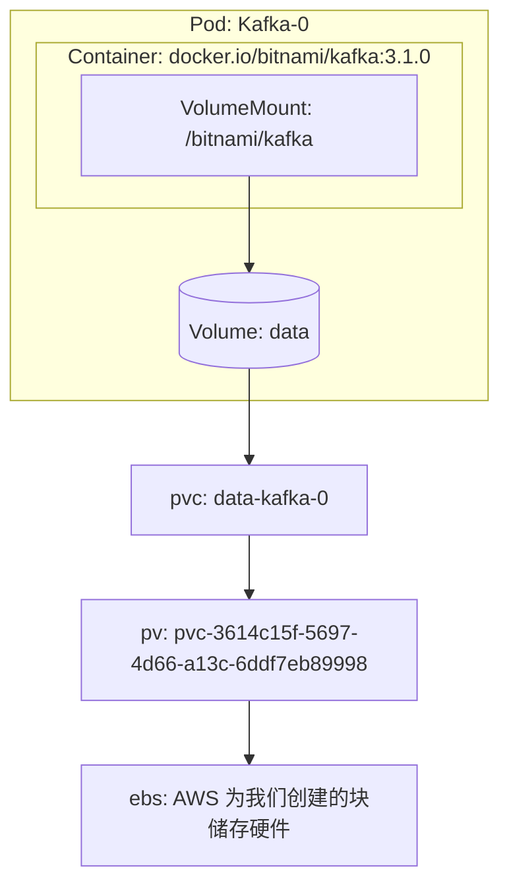

我们之前说的都是用于部署 Pod 的资源，我们接下来介绍与创建 Pod 不相关的资源：储存与网络。

# 储存

其实我们之前已经接触过储存相关的内容了：在讲 Stateful Set 时我们提过 Stateful Set 创建出来的 Pod 都会有相互独立的储存；而讲 Daemon Set 时我们提到 K8s 推荐只在 Daemon Set 的 Pod 中访问宿主机磁盘。但独立的储存具体指什么？除了访问宿主机磁盘以外还有什么其他的储存？

在 Docker 中，我们可以把宿主机磁盘上的一个路径作为一个 Volume 来给容器绑定，或者直接使用 Docker Engine 管理的 Volume 来提供持久化存储或是容器间共享文件。在 K8s 里面也沿用了 Volume 这个概念，可以通过 Mount 绑定到容器内的路径，并通过实现 CSI 的各种引擎来提供更多样的存储。

> CSI: Container Storage Interface ，容器储存接口标准，是 K8s 提出的一种规范。不管是哪种储存引擎，只要编写一个对应的插件实现 CSI ，都可以在 K8s 中使用。

### K8s 中使用 Volume 与可用的 Volume 类型

其实 K8s 中使用 Volume 的例子我们一开始就已经接触过了。还记得一开始介绍 Pod 时的 Nginx 例子吗？

```yaml
metadata:
  name: simple-webapp
spec:
  containers:
    - name: main-application
      image: nginx
      volumeMounts:
        - name: shared-logs
          mountPath: /var/log/nginx
    - name: sidecar-container
      image: busybox
      command: ["sh","-c","while true; do cat /var/log/nginx/access.log; sleep 30; done"]
      volumeMounts:
        - name: shared-logs
          mountPath: /var/log/nginx
  volumes:
    - name: shared-logs
      emptyDir: {}
```

这个 Pod 描述中声明了一个种类为 `emptyDir` 的，名为 `shared-logs` 的 Volume ，然后 Pod 中的两个容器都分别 Mount 了这个 Volume 。

K8s 中默认提供了几种 Volume ，比如：

- emptyDir ：一个简单的空目录，一般用于储存临时数据或是 Pod 的容器之间共享数据。
- hostPath ：绑定到节点宿主机文件系统上的路径，一般在 Daemon Set 中使用。
- gitRepo ：这种 Volume 其实相当于 emptyDir ，不过在 Pod 启动时会从 Git 仓库 clone 一份内容作为默认数据。
- configMap 、 secret ：一般用于配置文件加载，需要与 configMap 、 secret 这两种资源一同使用。会将 configMap 、 secret 中对应的内容拷贝一份作为 Volume 绑到容器。（下一节中会展开讨论）
- nfs 、 glusterfs 、 ……：可以通过各种网络存储协议直接挂载一个网络存储
- (deprecated!) gcePersistentDisk 、 awsElasticBlockStore ……：可以调用各个云平台的 API ，创建一个块储存硬件挂载到宿主机上，再将那个硬件挂载到容器中。
- persistentVolumeClaim ：持久卷声明，用于把实际储存方式抽象化，使得 Pod 不需要关心具体的储存类型。这种类型会在下面详细介绍。

我们可以注意到， Volume 的声明是 Pod 的一个属性，而不是一种单独的资源。 Volume 是 Pod 的一部分，因此不同的 Pod 之间永远不可能共享同一个 Volume 。

> 但是 Volume 所指向的位置可以相同，比如 HostPath 类型的 Volume 就可以两个 Pod 可以绑定到宿主机上同一个路径，因此 Volume 里的数据还是能通过一定方式在 Pod 间共享。但当然 K8s 不推荐这么做。

另外，由于 Volume 是 Pod 的一部分， Volume 的生命周期也是跟随 Pod 的，当一个 Pod 被销毁时， Volume 也会被销毁，因此最主要还是用于 Pod 内容器间的文件共享。如果需要持久化储存，需要使用 Persistent Volume 。

> Volume 会被销毁不代表 Volume 指向的内容会被销毁。比如 hostPath 、 NFS 等类型 Volume 中的内容就会继续保留在宿主机或是 NAS 上。下面提到的 Presistent Volume Claim 也是，拥有 `persistentVolumeClaim` 类型 Volume 的 Pod 被删除后对应的 PVC 不一定会被删除。

### Presistent Volume 、 Presistent Volume Claim 、 Storage Class

如果需要在 Pod 声明中直接指定 NFS 、 awsElasticBlockStore 之类的信息，就需要应用的开发人员对真实可用的储存结构有所理解，违背了 K8s 的理念。因此 K8s 就弄出了小标题中的三种资源来将储存抽象化。

一个 Persistent Volume (PV) 对应云平台提供的一个块存储，或是 NAS 上的一个路径。可以简单地理解为 **PV 直接描述了一块可用的物理存储** 。因为 PV 直接对应到硬件，因此 PV 跟节点一样，是名称空间无关的。

而一个 **Persistent Volume Claim (PVC) 则是描述了怎样去使用储存** ：使用多少空间、只读还是读写等。一个 PVC 被创建后会且只会对应到一个 PV 。 PVC 从属于一个名称空间，并能被该名称空间下的 Pod 指定为一个 Volume 。

PV 与 PVC 这两种抽象是很必要的。试想一下用自己的物理机搭建一个 K8s 集群的场景。你会提前给物理机插上许多个储存硬件，这时你就需要用 PV 来描述这些硬件，之后才能在 K8s 里利用这些硬件的储存。而实际将应用部署到 K8s 中时，你才需要用 PVC 来描述 Pod 中需要怎么样的储存卷，然后 K8s 就会自动挑一个合适 PV 给这个 PVC 绑定上。这样实际部署应用的时候就不用再特意跑去机房给物理机插硬件了。

但是现在都云原生时代了，各供应商都有提供 API 可以直接创建一个块储存，还要想办法提前准备 PV 实在是太蠢了。于是便需要 Storage Class 这种资源。

使用 Storage Class 前需要先安装各种云供应商提供的插件（当然使用云服务提供的 K8s 的话一般已经准备好了），然后再创建一个 Storage Class 类型的资源（当然一般也已经准备好了）。下面是 AWS 上的 EKS 服务中默认自带的 Storage Class ：

```yaml
apiVersion: storage.k8s.io/v1
kind: StorageClass
metadata:
  annotations:
    storageclass.kubernetes.io/is-default-class: "true"
  name: gp2
provisioner: kubernetes.io/aws-ebs
parameters:
  fsType: ext4
  type: gp2
# 当 PVC 被删除时会同时删除 PV
reclaimPolicy: Delete
# 只有当 PVC 被绑定为一个 Pod 的 Volume 时才会创建一个 PV
volumeBindingMode: WaitForFirstConsumer
```

可以看到 EKS 自带的 gp2 提供了一些默认的选项，我们也可以类似地去定义自己的 Storage Class 。有了 gp2 这个 Storage Class ，我们创建一个 PVC 后 K8s 就会调用 AWS 的 API ，创建一个块储存接到我们的节点上，然后 K8s 再自动创建一个 PV 并绑定到 PVC 上。

例如，我们部署 Kafka 时会创建一个这样的 PVC ：

```yaml
apiVersion: v1
kind: PersistentVolumeClaim
metadata:
  name: data-kafka-0
spec:
  accessModes:
  - ReadWriteOnce
  resources:
    requests:
      storage: 10Gi
  storageClassName: gp2
```

K8s 就会自动为我们创建出一个对应的 PV ：

```sh
# `pvc-` 开头这个是 AWS 自动给我们起的名字。它虽然是 `pvc-` 开头，但他其实是一个 PV 。
NAME                                       CAPACITY   ACCESS MODES   RECLAIM POLICY   STATUS   CLAIM                STORAGECLASS   REASON   AGE
pvc-3614c15f-5697-4d66-a13c-6ddf7eb89998   10Gi       RWO            Delete           Bound    kafka/data-kafka-0   gp2                     152d
```

要是打开 AWS Console 还会发现， K8s 调用了 AWS 的 API ，自动为我们创建了一个 EBS 块储存并绑定到了我们对应的宿主机上。

可以用下面这张图来表示 Pod 中的 Volume 、 PVC 、 PV 之间的关系：



而 Storage Class 在上图中则负责读取我们提交的 PVC ，然后创建 PV 与 EBS 。

### 再说回 Stateful Set

之前我们提到 Stateful Set 时说到 Stateful Set 创建的 Pod 拥有固定的储存，到底是什么意思呢？跟 Deployment 的储存又有什么区别呢？

我们先来看看，如果要给 Deployment 创建出来的 Pod 挂载 PVC 需要怎么做：

apply 后，会

而要给 Stateful Set 创建出来的 Pod 挂载 PVC ，可以：

这样一来，会为每个 Pod 创建一个对应的 PVC ：

# ConfigMap ，Secret ， Downward API


# 网络

为什么需要 Service： Pod 可能会挂掉，换成新的之后 IP 会变，找不到就会很尬。
Service 会根据选择器来不断更新指向的 IP

Service
- 域名解析
- 种类: 
    - ClusterIP
    - NodePort
    - LoadBalancer
    - ExternalName
    - Headless Service

外部访问
- NodePort
- LB
- Ingress

# Kubernetes 架构

- API Server
- Controller Manager
- Sceduler
- Kubelet ： 是 Kubelet 在对 Pod 做生存检测
- kube-proxy, kube-dns, 等

# 更高级的部署方式

- Helm Chart：其实是 go template 代码生成
- kustomize
- 自定义资源与自定义控制器与 Operator

# Furder More

### k8s 与 AWS

- ELB Controller
- External DNS
- 卷储存 EBS
- IAM Profile

### k8s 与云原生
云原生的定义 http://icyfenix.cn/immutable-infrastructure/msa-to-cn.html
- Service Mesh: istio
- GitOpts: argo CD 与 flux CD
- Progressive Delivery: Flagger
- Service Proxy: envoy
- Of course: etcd, jaeger, prometheus, fluentd, open telemetry
