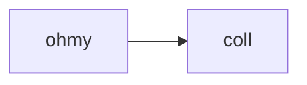

## 使用 hexo 搭建博客

最近使用 hexo 搭建了一个博客，并打算挂载在 github page 上，对之前的那个博客进行替代。

我们可以尝试一下代码块高亮：

```python
def func_echo(s: str):
    print(s)


class HelloPrinter:
    printer: Callable[[str]]

    def __init__(self, printer: Callable[[str]]):
        self.printer = printer
    
    def call(self, s: str):
        self.printer(s)


p = HelloPrinter(func_echo)
p.call("hello world!")
```

然后看看效果。总感觉不是很满意。

来几句 LaTeX:

$$
f(x) = \sum_{i=2}^\infin{\Join}
$$

根本显示不出来可还行。

试试下标语法吧：

这是一句话。[^sub]
[^sub]: 这是脚注

卧槽原样显示可还行。

用上 mathjax 插件了，能渲染了，感觉还行，就是比如无限符号等渲染不出来。

来几句 mermaid 吧



> <div class="mermaid">
> graph LR
> ohmy-->coll
> </div>

能渲染出来就有鬼了。

别说，还真被我渲染出来了。可是 syntax 怎么跟 vscode 插件 markdown preview enhanced 不一样呢？ vscode 里能渲染的东西，到了 hexo 里就不对劲了，真怪。

本还以为是 mermaid 版本问题，原来是代码块渲染时把 mermaid 代码当作普通代码，往里面里插换行符号了。

一看原作者，原来是使用 quoteblock 来渲染的（quoteblock 不会往其中插入换行符）。

使用了 hexo-filter-mermaid-diagrams 插件，添加 mermaid 过滤器，解决问题。