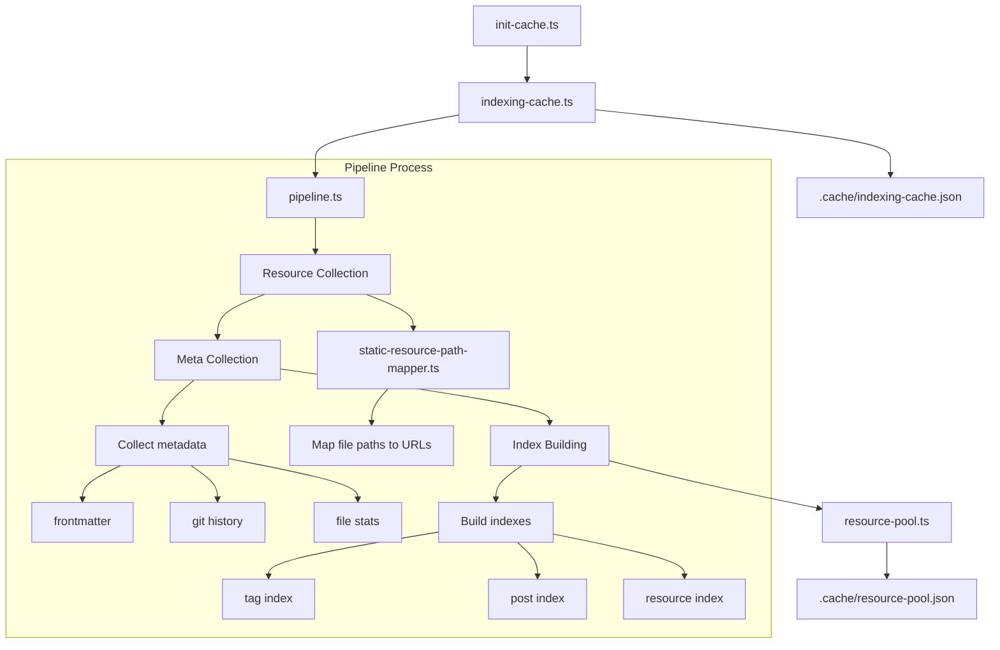

# `core/indexing`

Indexing responsible for:

- Collecting resources and metadata from file system.
- Building indexes from resources.

## Terms

example:

Consider an `.md` file `public/content/articles/2020-02-02-hello-world.md`:

- The page could be accessed by `https://xx.xx.x/articles/hello-world` is a `Page`. What this page shows is the content of the `Post`.
- `https://xx.xx.x/articles` is also a `Page`, but it is not a `Post`.
- The static resource could be accessed by `https://xx.xx.x/content/articles/2020-02-02-hello-world.md` is not a `Page`, but a static resource.
- The `filePath` is `public/content/articles/2020-02-02-hello-world.md`.
- The `pagePath` is `/articles/hello-world`.
- The `slug` is `hello-world`.

### Resource

Anything that could be accessed by the browser, including pages and static resources.
A resource would have a path mapping and a meta data.

### Page

Represent a page on the website. It should be rendered by a Next.js page component.
Not all pages related to a file. e.g. the article list page is not related to any file.

### Post

Represent a post, which can be an article or an idea.
A post should have a page to show it's content, and should have a file to store it's content.

### Static Resource

A file that could be accessed by the browser, but not rendered by a Next.js.
Mostly a static resource related to a file.
e.g. images, markdown files, etc.

### filePath

The path to a static file, should be available for `fs.readFileSync(filePath, "utf-8")`.

Mostly relative to the project root directory, start with `public/`.

### pagePath

The path of a page on the website, related from `SITE_BASE_PATH`. Always start with `/`.

Could be accessible from the browser by `${SITE_BASE_PATH}${pagePath}`.

### slug

The path argument used for a page.

e.g. For `src/pages/articles/[slug].tsx`, for the post of `/articles/hello-world`, the slug is `hello-world`.

For one type of post (article or ideas), the slug should be unique for a post.

Should have no any `/` in the slug.

Not only a post should could have a slug. e.g. a tag page could have a slug too.

### meta

One resource on the site may have it's own meta data.
Different types of resources may have different type of meta data.
Meta should only related to the resource itself, never care about the other resources.

### index

Any other things that needed for rendering pages.
Mostly depends on all metas and paths. Not related to one specific resource.
Mostly do not need to fetch extra data, but it could if needed.

Something should be an index:

- tag list and post list for a tag
- short alias reference to another resource
- reverse reference
- post list in order and prev/next post
- clip data list (need to fetch data)

Something should not be an index:

- post tag in frontmatter and in content
- post full path
- outgoing reference in a post content
- Any thing that could directly get from content should not be an index.

pipeline -> ResourceList

## Pipeline

Pipeline is a collection of resource chains.

Pipeline is responsible for:

- Collecting resources from file system.
- Building indexes from resources.

## Pipeline Process Explained

The indexing pipeline follows these steps:

1. **Entry Point**:

   - `init-cache.ts` triggers the indexing process during build
   - Calls `indexing-cache.ts` to manage the cache state

2. **Pipeline Process**:

   - **Resource Collection**:

     - Scans filesystem for content files (markdown, images, etc.)
     - Uses path mappers to establish file-to-URL relationships

   - **Meta Collection**:

     - Gathers metadata from multiple sources:
       - Frontmatter in markdown files
       - Git history information (dates, authors)
       - File system stats
     - Each resource type may have different metadata needs

   - **Index Building**:
     - Creates various indexes for site functionality:
       - Tag index for content categorization
       - Post index for blog posts
       - Resource index for static files
     - Indexes are derived from collected resources and metadata

3. **Cache Storage**:
   - Saves complete resource pool to `.cache/resource-pool.json`
   - Saves indexing cache to `.cache/indexing-cache.json`
   - Cache is used to speed up subsequent builds

The pipeline ensures all content is properly:

- Discovered (Resource Collection)
- Enriched with metadata (Meta Collection)
- Organized for access (Index Building)
- Cached for performance (Cache Storage)

This structured approach allows for efficient content management and fast page generation in the Next.js blog.

